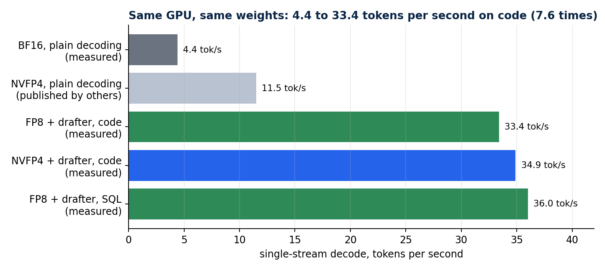
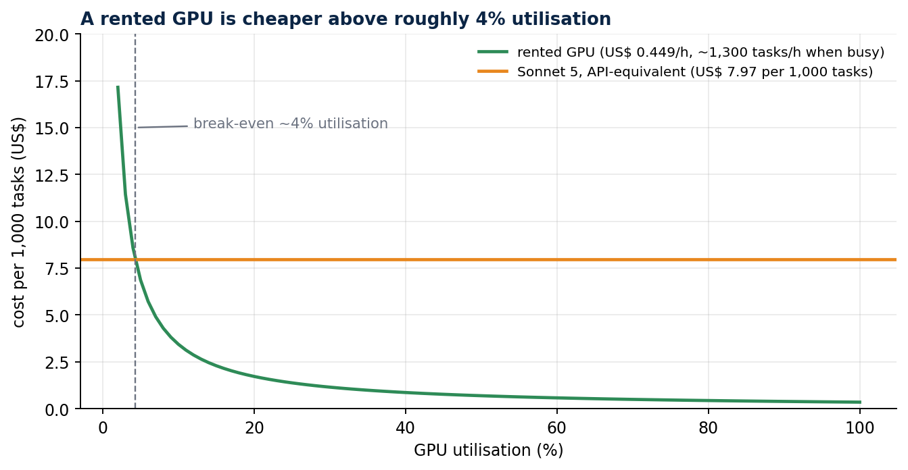
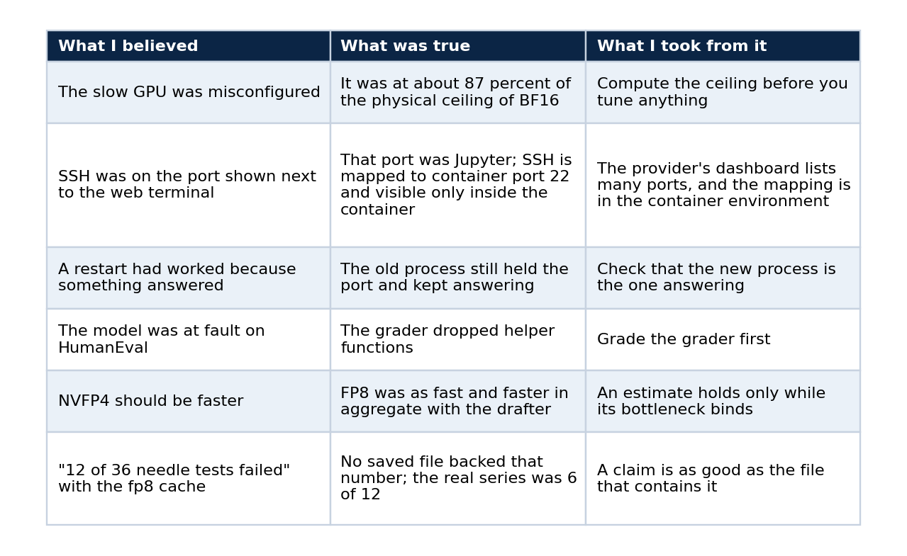

# My 27B model ran at 4.4 tokens per second. The GPU was fine.

### What memory-bandwidth arithmetic, speculative decoding, a paired benchmark and an audited grader taught me about serving an open model at interactive speed

I rented a GPU for US$ 0.45 an hour, loaded a 27-billion-parameter model, and watched it answer at 4.4 tokens per second. Everyone I asked said the machine was misconfigured. It was not.

A 27B model in 16-bit precision weighs about 54 GB. The GPU reads about 273 GB per second. Divide one by the other and you get roughly five. The machine was running at the physical ceiling of the wrong number format, and no amount of tuning was going to move it.

That arithmetic turned a vague complaint ("it's slow") into an engineering problem with a known lever, and it is the reason this article exists. It records how I took the same GPU to 33 to 35 tokens per second on code, what my tests could and could not show, and which claims I left out because I have no evidence for them. The model now words the answers in a public RAG chat I run, so the serving work is not a lab exercise. If you want the step-by-step version, the series that starts with [Serve a 27B open model on a rented GPU](https://rangeltech.net/medium/11-serve-a-27b-model-on-a-rented-gpu/) is the tutorial. This piece is the case study.

## The model, stated plainly

The checkpoint is `Blackfrost-AI/Qwen3.8-27B-ABLITERATED-BF16`, an "abliterated" variant of Qwen3.8-27B. The publisher produced it. I did not perform the ablation and I do not present it as my own work. Abliteration is a published technique that edits a model's weights to reduce refusals, and I have not verified how this publisher applied it.

This article is about serving, speed and task quality on standard benchmarks. Refusal behaviour has its own article in the series: a probe of 37 lawful prompts found 0 refusals from this model and 3 from Sonnet 5, and the difference is not statistically significant. Nothing in this article shows that the model answers more or fewer prompts than another one.

What is mine is everything around the weights: the deployment, the measurements, the decisions about precision and cache, the evaluator, and the operations.

## Decode is limited by bytes read per token

A dense model reads every weight once to produce one token. Decode speed is therefore bounded by memory bandwidth divided by weight size, and arithmetic throughput barely enters into it. The GPU here is a GB10 with 119 GB of unified memory and about 273 GB/s, which gives three ceilings:

BF16 weights, about 54 GB, allow roughly 5 tokens per second, and I measured 4.4. FP8 weights allow roughly 10 in plain decoding. NVFP4 weights allow roughly 13 to 14, although published numbers for plain NVFP4 decoding sit near 11.5.

Quantisation raises the ceiling by shrinking the bytes. It cannot lift it past what the format allows, which is why the next step mattered more than the first.

## Speculative decoding changes which format wins

A small drafter proposes several tokens and the large model verifies them in one pass, so a single read of the weights can confirm more than one token. I used the `z-lab/Qwen3.8-27B-DFlash2` drafter with seven speculative tokens on vLLM 0.30.0.

Single-stream code generation reached 33.4 tokens per second on FP8 in the final run and 34.9 on NVFP4. SQL landed at 36.0 and prose at 14.4. The spread says more about the method than any headline number does: the drafter is right far more often on predictable code and structured text than on free prose, so the same server feels fast or ordinary depending on the task.

*From 4.4 to 33.4 tokens per second on code, a factor of 7.6 on the same hardware and the same weights.*

I expected NVFP4 to win because it reads fewer bytes. On single streams FP8 was as fast, and in aggregate throughput it came out ahead: 98.6 and 90.6 tokens per second at four clients across two runs, against 78.5 for NVFP4. The FP8 figure moved about 8 percent between runs, so I call the aggregate gap suggestive. I have no verified mechanism to offer for it. The lesson I took is that an estimate from a model of the bottleneck holds only while that bottleneck is the binding one, and the drafter moves the work toward compute.

## A failure no short benchmark could see

To fit longer context I tried an fp8 KV cache next to the FP8 weights. Short prompts worked. Past about 24,500 prompt tokens every attempt failed, and the failures were not wrong answers to the question. The output began with strings like `duct Register Register R`.

A needle-in-a-haystack series found the needle in 6 of 12 attempts with the fp8 KV cache. Every success had a prompt of at most 20,900 tokens and every failure had at least 24,500. With the bf16 KV cache the same series passed 12 of 12, and an FP8-weights control with a bf16 cache passed at every size up to about 28,000 tokens. The two choices are independent: weight quantisation was fine and KV-cache quantisation broke.

*The fp8 cache failed from about 24,500 prompt tokens. The bf16 cache did not.*

The boundary is fuzzy between roughly 21,000 and 24,500 tokens and holds for this model, this prompt design and this vLLM version. I make no claim about fp8 KV caches in general. With the bf16 cache, long-context runs found the needle at about 30k, 60k, 93k and 140k tokens, and time to first token grew from 13 to 99 seconds on FP8.

The procedural lesson is cheap to apply. Test the context lengths you intend to serve on the first day, before the demo works, because a system that passes every short prompt can be silently corrupt at the lengths customers actually send.

## Quality, measured against a frontier model

I graded three configurations on the same 164 HumanEval problems (pass@1, greedy, code executed locally) and the first 200 GSM8K test problems (exact match), using one local grader. The yardstick was Sonnet 5 at medium effort, run without tools through Claude Code. Qwen ran with thinking off.

Every model saw the same problems, so I used 95 percent Wilson intervals and exact paired McNemar tests. On HumanEval, Sonnet 5 beat FP8 on 6 problems and lost on none (p = 0.031), and beat NVFP4 on 10 and lost on none (p = 0.002). On GSM8K no gap reached significance (p = 0.125 against FP8, 0.453 against NVFP4). The two Qwen precisions did not differ significantly from each other on either benchmark.

*Only the problems where the two models disagree carry information.*

The comparison has limits that belong on the page. The two systems differ in access path, settings and date. Sonnet 5 ran through Claude Code and its cost is API-equivalent. Problem counts of 164 and 200 leave wide intervals. And the benchmark says nothing about tool use or long-form writing.

## The evaluator was wrong before the model was

Before I trusted any of those percentages I audited the grader. It had two real bugs, helper functions missing from the executed code and an output limit of 1,024 tokens, plus one design flaw. I fixed all three and validated the fix in both directions. Re-running with the corrected evaluator moved totals by only minus 1 and plus 3 problems, where the bug counts had suggested plus 4 and plus 6.

That small shift taught me something about the whole exercise. Run-to-run variation at temperature 0 was of the same order, because batching and speculative decoding are not deterministic. It is why the table above rests on McNemar tests and not on who scored higher.

## Cost depends on utilisation

At US$ 0.449 per hour with four parallel requests, cost equals run seconds times price. 364 tasks cost about US$ 0.12 on FP8. The same 364 tasks cost US$ 2.90 through Claude Code at API-equivalent pricing. That is US$ 0.34 against US$ 7.97 per 1,000 tasks.

*Renting wins above about 4 percent utilisation of one instance and loses below it.*

A saturated GPU handles roughly 1,300 such tasks per hour. An idle rented GPU costs what a busy one does, so I keep the instance stopped when nobody is testing it. A stopped instance costs about US$ 0.007 per hour for disk.

## Operations that survive a power cycle

The deployment scripts are idempotent and a test suite checks it. Sixteen steps passed. Re-running configuration changed nothing, deliberate drift was repaired, two hard restarts came back without re-downloading weights, and a stop and start through the provider's API returned the same endpoint in about eight minutes with the weights intact. A Terraform module produces an empty plan after apply, and a workflow rebuilds the setup on another machine when only the address changes.

## What I got wrong on the way

The mistakes are the most reusable part of the story, so here they are in a table.

The last row came from an audit of my own notes before publishing. A headline figure had been typed interactively and never saved, so I removed it everywhere and re-ran the experiment so that the number exists in `reports/`.

## What this article does not claim

No refusal claim beyond the narrow probe described in part 4 of the series, and nothing about GPT models. No statement that the checkpoint is my modification of Qwen. No claim that FP8 beats NVFP4 in general, since the gap sits inside run-to-run noise. No claim that an fp8 KV cache is bad in general, only that it failed for this model and vLLM version. No capacity claim beyond one GPU and one benchmark run per cell.

## Reproduce

The repository holds the deployment scripts, the raw JSON reports behind every number, the script that generates the figures and the test suite behind the idempotency result. Each number in this article traces to one of those reports, and `docs/article/06-claims-ledger.md` lists the file for every claim.

## Code and links

- [qwen-abliterated-api](https://github.com/LucasRangelSSouza/qwen-abliterated-api): self-hosted Qwen endpoint, benchmarks, refusal probe, Terraform
- [rag-chat](https://github.com/LucasRangelSSouza/rag-chat): the public chat that uses this endpoint for wording
- [Kaggle datasets](https://www.kaggle.com/lucasrangelss/datasets): the public datasets behind these projects, with schemas and SHA-256 manifests
- [GitHub profile](https://github.com/LucasRangelSSouza): all repositories

My portfolio: [https://rangeltech.net](https://rangeltech.net)
