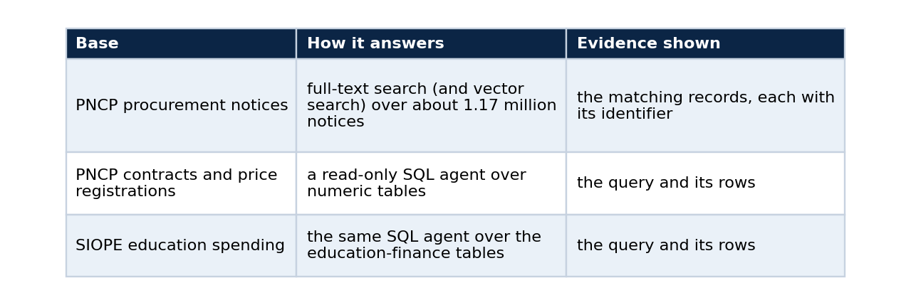
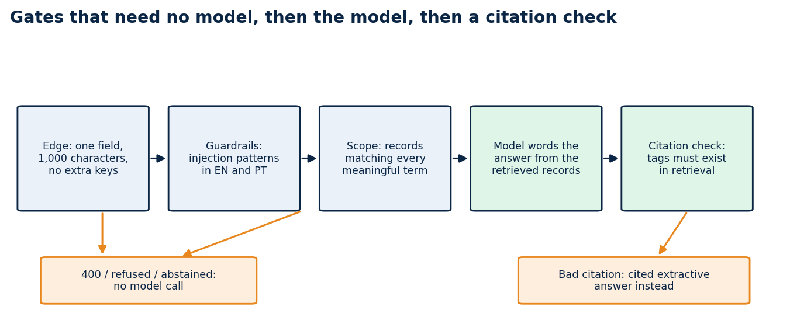

# The RAG chat that says "I can't answer" on purpose

### One rule, gates that run before any model call, and what broke on the first live runs

A retrieval chat is easy to demo and hard to trust. The failure that matters is rarely a wrong sentence. It is an answer nobody can check.

I built my public chat around one rule. An answer either cites the exact records it used, or the service says it cannot answer. The chat reads Brazilian public data (procurement notices from PNCP and education spending from SIOPE), and the interface lets the visitor choose which research bases to search: none, one, or several. Most of the interesting work was making that rule enforceable by code and not by prompt.

## Three kinds of base, one contract

The visitor ticks the bases to use.

If no base is ticked, the chat does not retrieve anything. It gives a short, plain reply and marks it as ungrounded, so nobody mistakes it for a cited answer.

Each citation carries the dataset slug, the pinned version and the record identifier, so a reader can walk from a sentence to a row. The interface takes the release version, the cutoff and the record counts from the index and not from static copy, so it cannot claim more than the data holds.

## Gates that need no model

*Three gates need no model, and the model's reply is checked against what retrieval returned.*

Cheap checks come first, because the model is the slowest and least predictable part of the path.

The proxy at the edge accepts one field, `question`, up to 1,000 characters, plus the list of chosen bases. A request with an extra field such as `model` gets a 400, which closes the door on callers trying to pick their own backend.

The guardrails refuse prompt-injection patterns in English and Portuguese, and answer in the visitor's language.

The scope check requires retrieval to find records that match every meaningful term in the question. If nothing matches, the service abstains and no model is called.

Only after those gates does a model word the answer, and only from the retrieved records. If its reply cites a tag that retrieval never returned, the reply is thrown away and a cited extractive answer takes its place. If the model's server is down, a cached background probe skips it so nobody waits out a timeout.

Each gate is testable without a GPU. The behaviour I care about most, refusing and abstaining, is covered by ordinary unit tests.

## Language follows the question

Answers and abstentions come back in the language of the question. I checked it on the live deployment with equivalent questions. An English question about school meal procurements got an English answer, the Portuguese version got a Portuguese one, both cited records, and both left organization names and identifiers untranslated.

English questions exposed a retrieval problem I had not planned for. The records are in Portuguese, so "school transport services" matches nothing on its own. I added a small deterministic English-to-Portuguese glossary of common procurement terms. Each question term becomes an OR-group of its Portuguese forms, and the groups are joined with AND. A term outside the glossary has to appear in the record text, otherwise the service abstains, which is the right failure.

## What broke on the way

The first live runs failed in several ways, and the acceptance tests caught all of them.

An OR query over very common terms scanned most of the index and timed out. Requiring all terms and capping the match count brought a typical query down to a few tenths of a second once the index sat in cache.

Unrelated questions returned records because one shared common word matched. The AND rule fixed that.

After I moved the data from SQLite to Postgres, the first search after the restore failed with a 503. The database cache was cold: a query that later took 52 milliseconds took 16.8 seconds and hit the role's 15-second timeout. Warming the cache with `pg_prewarm` fixed it, and the database now warms itself at start.

A question for the SQL bases ran longer than the web proxy's 25-second limit, because the model is called twice, once to write the query and once to word the answer. The visitor saw "service unavailable" while the agent was still working. I raised the limit to 100 seconds, raised the model timeout to 45 seconds, and made every failure inside the SQL path end in an abstention and not a server error.

None of these would have shown up in a demo with a warm cache and a friendly question.

## What the live check shows

A Playwright script clicks through the deployed chat: it lists the three bases, asks a text question and checks the citations, asks an education-spending question and opens the "SQL and result" section to confirm the query is shown, sends a question with no base ticked, runs both searches on the explorer page, and loads both dashboards. On 1 October 2026 the eight checks passed, and the evidence is in the repository with screenshots.

Typical answers take 12 to 30 seconds, mostly model time on a shared GPU.

## Limits

Retrieval over the notices is lexical, so it answers questions that share words with a record; vector search is available behind it. The glossary covers common procurement terms only. Wording can differ between two runs of the same question because a model phrases the answer. The data is a released snapshot with a cutoff of 31 July 2026, and the source lake has kept growing since. One deployment on one day is not a measurement of retrieval quality.

## Code and links

- [rag-chat](https://github.com/LucasRangelSSouza/rag-chat): interface, backend, tests and live acceptance evidence
- [ai-platform-rag-observability](https://github.com/LucasRangelSSouza/ai-platform-rag-observability): the kernel this contract grew from
- [brazil-public-data-map](https://github.com/LucasRangelSSouza/brazil-public-data-map): the public datasets behind the bases
- [Kaggle datasets](https://www.kaggle.com/lucasrangelss/datasets): the public datasets behind these projects, with schemas and SHA-256 manifests
- [GitHub profile](https://github.com/LucasRangelSSouza): all repositories

My portfolio: [https://lucas.rangeltech.net](https://lucas.rangeltech.net)
