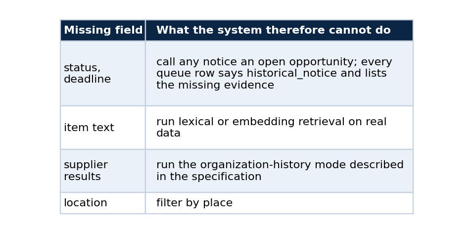
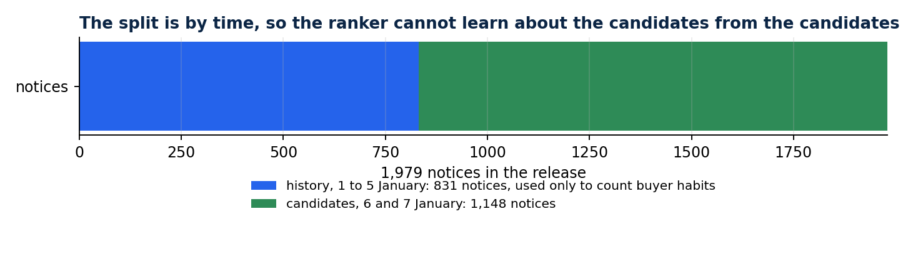
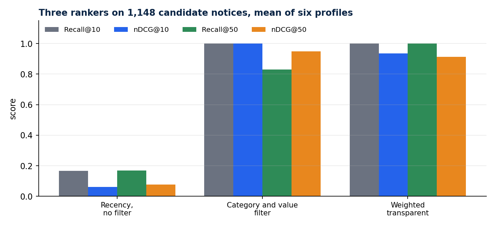
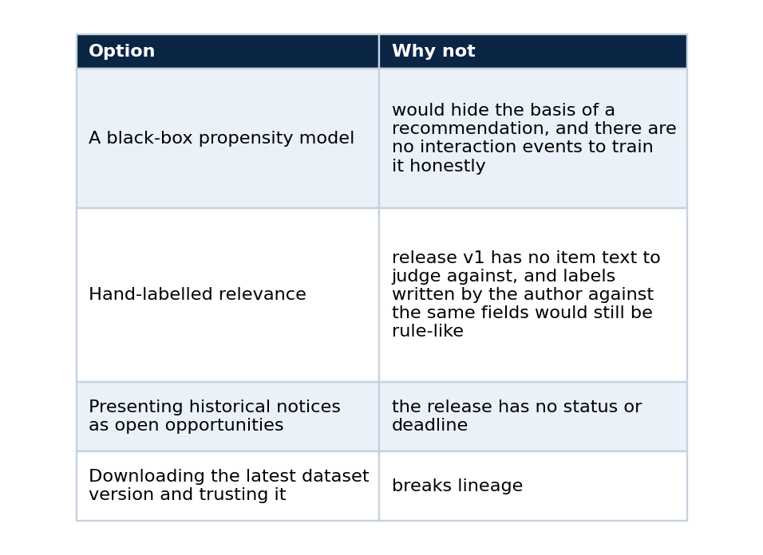

# Ranking procurement notices without pretending to know what suppliers want

### A transparent recommender, a time-split evaluation, and why public procurement history is not user propensity

A procurement opportunity list turns misleading the moment it hides why an item is at the top. I wanted a ranker small enough to read in one sitting, where every result shows how much each feature contributed, what evidence the ranker did not have, and a link to the official record.

Building it taught me more about what a dataset forbids than about ranking. This article walks through the design, the evaluation that cannot cheat, the metrics explained from scratch, and the boundaries I put into the code.

## From fixtures to a pinned public release

The first version ranked synthetic opportunities by term overlap between a declared category list and an item description, then added modality and state matches. It proved the mechanics and nothing more.

Version 0.2.0 reads real records. My companion project publishes a reviewed derivative of the PNCP consultation API on Kaggle as `lucasrangelss/brazil-pncp-procurement-history`, and the recommender pins version 1 by slug, version number and the SHA-256 of the release manifest. It hashes the manifest and every layer before reading a single row, and a different release fails verification until someone updates the pin in a reviewed commit. The Kaggle CLI always fetches the latest version, so the resolver uses `kagglehub`, which takes an explicit version and needs no credential for a public dataset.

Release v1 is narrow on purpose: 1,979 notices published between 2025-01-01 and 2025-01-07, under one modality. Each row has the contracting organization, an estimated value, publication and update times, and a category from a six-value taxonomy. The free-text subject was reduced to that category before release. There is no deadline, status, location, item text or supplier result.

Those absences decide what the system may claim.



## The evaluation that cannot cheat

A declared profile holds one or two categories and a value band. Six synthetic profiles cover health, education, technology, civil works, transport and a mixed case.

The evaluation splits the release by time. The 831 notices published before 2025-01-06 form the history, and the 1,148 published on 2025-01-06 or 2025-01-07 are the candidates. The history is used only to count how often each buyer published in each category. That closes a quiet form of leakage, where a ranker learns about the candidates from the candidates.



*Buyer habits come from the earlier notices only. The later notices are what gets ranked.*

Relevance labels come from a rule: grade 2 when the category matches and the value is inside the band, grade 1 when only the category matches, and grade 0 otherwise. The rule uses fields that every ranker can see, so the metrics measure constraint adherence and cannot measure what a supplier would find useful. The repository states the same limit in every report.

## Three rankers

A recency baseline ignores the profile. A filter baseline keeps notices in the right category and value band and orders them newest first. The weighted ranker keeps every category match and scores each one with three terms: value fit (weight 0.6), prior notices by the same buyer in that category (0.3), and recency (0.1). Value fit is 1 inside the band and loses one unit per order of magnitude outside it. As a sketch:

```python
import math

def value_fit(value: float, low: float, high: float) -> float:
    """1 inside the band; loses one unit per order of magnitude outside it."""
    if low <= value <= high:
        return 1.0
    edge = low if value < low else high
    return max(0.0, 1.0 - abs(math.log10(value / edge)))

score = 0.6 * value_fit(value, low, high) + 0.3 * buyer_recurrence + 0.1 * recency
```

Every output row carries the three terms, so a reviewer can see why a notice sits where it does.

## The metrics, from scratch

Recall@K is the share of the relevant notices that appear in the top K. nDCG@K rewards putting the most relevant notices first, with a discount for each lower position. In a few lines:

```python
import math

def dcg(grades):                       # grades listed in ranked order: 2, 1 or 0
    return sum((2 ** g - 1) / math.log2(i + 2) for i, g in enumerate(grades))

def ndcg_at_k(ranked_grades, all_grades, k):
    ideal = sorted(all_grades, reverse=True)[:k]
    return dcg(ranked_grades[:k]) / dcg(ideal) if dcg(ideal) else 0.0
```

I average these over the six profiles. MRR@10, the average of one over the rank of the first relevant notice, was 0.2431 for the recency baseline and 1.0 for the other two.

## Results




*The filter baseline is perfect at the top because it is the grade-2 rule. It loses recall further down because it discards grade-1 notices.*

The filter baseline scores a perfect nDCG@10 because its filter is the grade-2 rule. It pays at K=50: it discards grade-1 notices, and some profiles have fewer than 50 grade-2 candidates, so recall falls to 0.83. The weighted ranker keeps them. Its buyer-recurrence term sometimes places a notice just outside the value band above one inside it, which the labels count as an error.

That trade-off is the finding, and the labels cannot say whether buyer recurrence helps. Answering it needs interaction events from real users who agreed to share them. The repository defines an event schema and a training entry point for that phase, disabled by default, and it refuses synthetic events whenever a run is configured to claim real propensity.

Two runs at the same commit produced byte-identical evaluation and review-queue files. The dated record, hashes included, sits in `docs/evidence/pncp-release-v1-evaluation-2026-09-25.md`.

## Boundaries built into the code

The profile accepts categories and a value band and nothing that identifies a person. Every organization identifier passes a CNPJ check-digit test before it can enter the candidate set, and any 11-digit value is treated as a possible CPF and dropped. In this release all 1,979 identifiers were valid CNPJ values, so no row was excluded. Each output row states that eligibility was not assessed and that no win probability was estimated. Technical qualification, pricing, delivery capacity and notice requirements stay with the person reading the official notice.

## Alternatives I considered



## What I would do next

A later dataset release with deadlines and item descriptions would let lexical retrieval and open-opportunity constraints run on real data, and the fixture-only parts of the project could retire. I now publish the complete PNCP catalogue, cutoff 2026-07-31, whose notice table carries deadlines, status, location and the notice text, the fields this release lacked. That makes the next evaluation possible, and it is the reason the first one was worth keeping honest.

## Run it

```powershell
python -m pip install -e ".[release]"
python -m pncp_recommender evaluate-release --output artifacts/run-a
python -m pncp_recommender evaluate-release --output artifacts/run-b
```

Compare the files in the two output folders with a hash tool and they should match.

## Code and links

- [pncp-opportunity-recommender](https://github.com/LucasRangelSSouza/pncp-opportunity-recommender): the ranker, ADRs and the evaluation record
- [brazil-public-data-map](https://github.com/LucasRangelSSouza/brazil-public-data-map): the pinned PNCP release
- [Kaggle datasets](https://www.kaggle.com/lucasrangelss/datasets): the public datasets behind these projects, with schemas and SHA-256 manifests
- [GitHub profile](https://github.com/LucasRangelSSouza): all repositories

My portfolio: [https://lucas.rangeltech.net](https://lucas.rangeltech.net)
