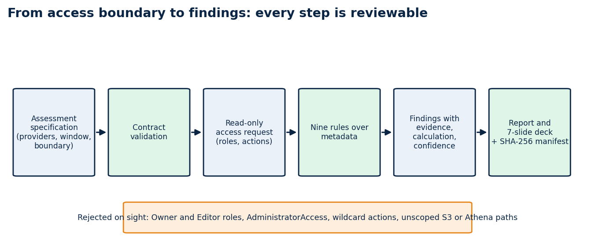
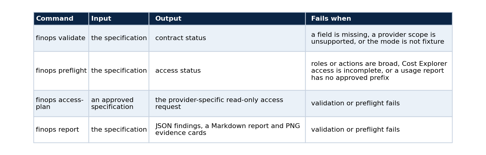
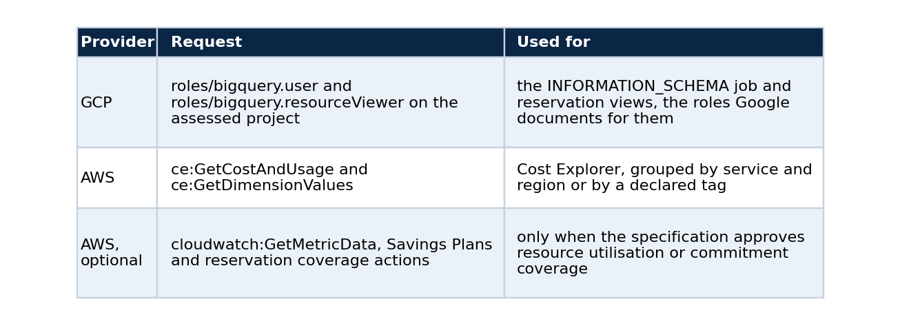
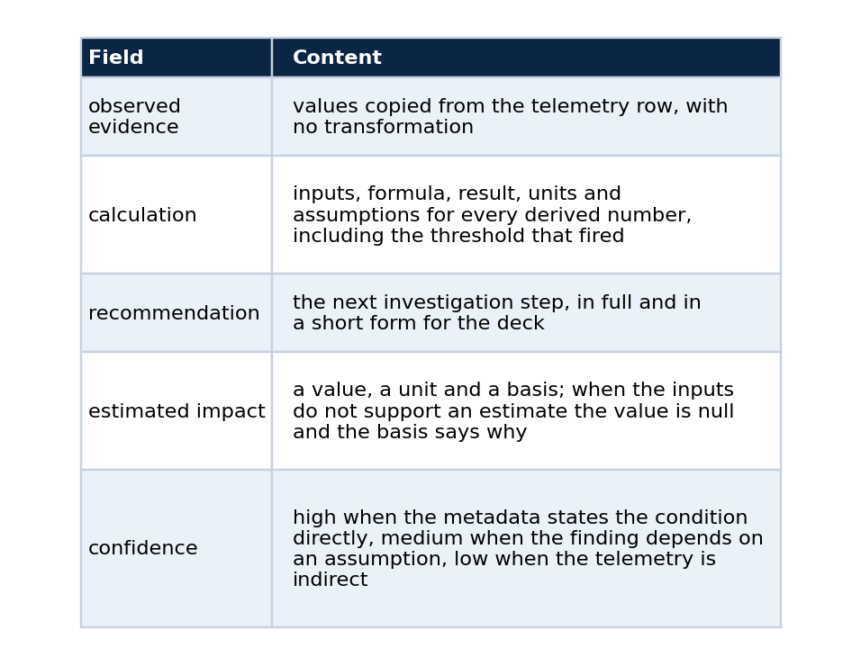
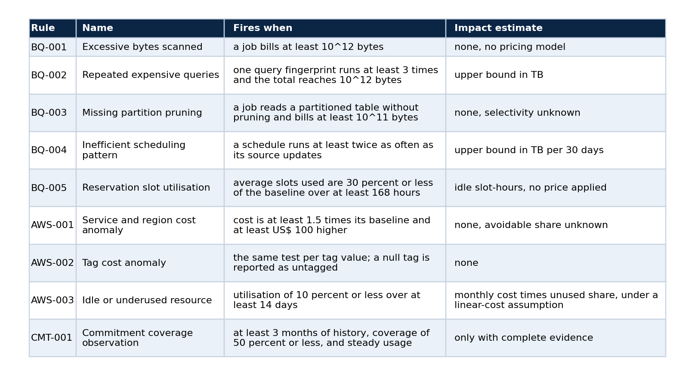
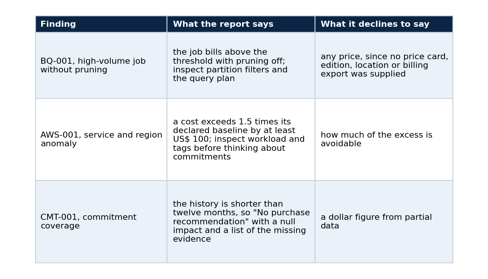

# FinOps starts with what you promise not to look at

### Turning a narrow cloud-metadata boundary into auditable cost findings, a report and a deck, with the contract, the rules, the commands and the limits

Cost work usually opens with a request for broad access. "Give us the billing export, read on the warehouse, maybe the storage buckets too." The request is hard to review, easy to approve without reading, and impossible to demonstrate safely in a public repository.

I wanted to start from a smaller question: which metadata is enough to spot a cost signal without touching business data at all? The answer became a specification, and the specification became a toolkit. This article explains why the specification is the right place to put the trust boundary, how the toolkit turns it into findings, what the findings do and do not claim, and how to reproduce the whole pipeline on a laptop with no cloud account.



*Every step produces something a reviewer can read before the next step runs.*

## The problem with starting from access

A typical engagement begins with credentials. The analyst receives broad read access, explores, and eventually writes a report. Three things go wrong with that order. The reviewer who approved the access did not see what would be read. The report cannot say which data it depended on, because nobody wrote that down. And the work cannot be shown in public, since any realistic demonstration needs a real account.

Reversing the order fixes all three. If the access boundary is the first artefact, a reviewer approves a document and not a session. If every finding names its inputs, the report states what it depended on. And if the whole path runs on synthetic telemetry, anyone can reproduce it.

## The contract is the trust boundary

An assessment specification is a JSON contract that declares the providers, the retention window, the access scope, the evidence each rule needs and the outputs expected. The toolkit has one trust boundary, and it is this file: validation and preflight run before any policy evaluation, so a report cannot come from a specification that asks for broad access.

The public commands map to the stages of the pipeline:



The second command writes the exact GCP and AWS access request, so a reviewer can read the roles, the actions and the prohibited paths before any collector runs. The order matters: access gets reviewed while it is still a document, and the tool refuses to run against anything the document did not describe.

## What the toolkit asks for, and what it rejects

The baseline is read-only metadata.



It rejects, before any report, GCP Owner and Editor roles, AWS AdministratorAccess, wildcard actions, unscoped Athena or S3 actions, and collection of the cost-and-usage report without an approved prefix. Fixture adapters prove that the collection seam calls only job metadata and Cost Explorer metadata, and no test depends on a cloud account.

## The finding model

Every finding keeps its parts separate, and that separation is the main design decision. An illustrative finding has this shape (the values here are made up for the sketch):

```json
{
  "rule": "BQ-003",
  "observed_evidence": {"job": "j-0412", "bytes_billed": 480000000000, "partition_pruned": false},
  "calculation": {"inputs": ["bytes_billed"], "formula": "bytes_billed >= 1e11", "result": true, "units": "bytes",
                  "assumptions": ["the table is partitioned on the filtered column"]},
  "recommendation": "Inspect the query plan and the partition filter.",
  "estimated_impact": {"value": null, "unit": null, "basis": "filter selectivity is unknown"},
  "confidence": "medium"
}
```



No rule converts volume into money without a pricing input. The code can say that a job lacks partition pruning. It cannot say how much a team will save by changing the query, and it does not pretend to.

## Nine rules



All boundaries are inclusive, and thresholds are defaults: a specification can disable a rule or override a threshold, and validation rejects unknown rule identifiers and threshold names, which catches a typo before it silently changes a result. Every rule has positive, negative and boundary tests.

## The rule that refuses to guess

The commitment rule goes furthest. It reports steady on-demand usage with low commitment coverage, and it recommends evaluating a purchase only when three things are present:

1. at least 12 months of history;
2. an approved discount rate between 0 and 1 for that service;
3. a confirmed usage forecast from the workload owner.

Without them, the recommendation starts with "No purchase recommendation", the estimated impact is null, and the calculation lists what is missing. With complete evidence, the estimate is the lowest monthly on-demand cost times the discount rate. I built it so that a short history and a guessed discount cannot turn into a number on a slide.

## Results on the fixture

The telemetry comes from a seeded synthetic multi-cloud generator (seed 20260901). It represents no organisation, billing account, project or production workload. On that fixture the nine rules produce eleven findings: an oversized BigQuery scan, a query pattern repeated without partition pruning, an inefficient schedule, low reservation utilisation, two AWS service and region cost anomalies, a tag-level anomaly, an idle resource, and a commitment-coverage observation.

Three of them show the design at work.



These are signals to investigate, and I use that word with care, because most rules deliberately carry no pricing model, so none of them proves a saving.

## From findings to a deliverable

A versioned specification leads to a reviewed access plan, an explicit evidence model, repeatable findings, a Markdown report, PNG evidence cards and a seven-slide deck built directly with `python-pptx`. There is no external renderer and no dependency beyond the pinned Python packages. A release script rebuilds every artefact from the fixture and checks it against a versioned SHA-256 manifest, so a change to a rule or to a report layout cannot drift away from its recorded evidence unnoticed.

## Why the public path is fixture-first

The repository records the decision in an architecture note. Cloud billing and job telemetry can reveal account structure and workload behaviour, so a public example must run without a cloud account. The default workflow evaluates checked-in synthetic telemetry, live collection stays optional and requires an explicit access plan, and it never runs in public CI. The cost of that choice is stated next to it: fixture signals do not establish savings or live workload behaviour. Bundling a real export would have been more realistic and would have broken the public boundary, and mocking every provider response would have hidden the access-planning problem that the toolkit exists to show.

When a live integration becomes necessary, it inherits these boundaries. It does not have to rediscover them in production, usually the hard way. The live query templates already pass the safety guards in the test suite, although they have not been run against a provider, and some normalised fields (for example whether a job pruned partitions) need a derivation step that a live adapter would have to implement and test first.

## Reproduce it

```powershell
python -m pip install -r requirements-dev.txt
python -m pip install --no-deps -e .
make check
python scripts/reproduce.py
```

`make check` runs formatting, lint, compilation, a secret scan, a documentation link check, 126 unit tests (contract, adapter, workflow, policy, access, safety, presentation and regression) and the four core commands end to end. `scripts/reproduce.py` validates the specification, writes the access request, runs the rules over the fixture, builds the report and the deck, and compares every artefact with the manifest.

## Limits

The collectors use injected fixture clients. They do not authenticate to GCP or AWS, query table content, read a billing export, query the cost-and-usage report or change infrastructure. The access plan documents a request boundary and does not grant permissions. Eleven findings on a fixture say that the rules fire as designed, and they say nothing about how often real estates have such problems. A live assessment needs a separate approved specification, provider credentials outside the repository, and adapter tests for the authorised resources.

## Sources

- BigQuery `INFORMATION_SCHEMA.JOBS` required roles, Google Cloud documentation.
- Cloud Billing access control, Google Cloud documentation.
- AWS Cost Explorer authorization reference, AWS documentation.
- Athena IAM guidance, AWS documentation.

## Code and links

- [cloud-data-finops-sdd-toolkit](https://github.com/LucasRangelSSouza/cloud-data-finops-sdd-toolkit): the specification, the rules, the report and the deck; start with `docs/TECHNICAL_REPORT.md` and `docs/rule-catalog.md`
- [Kaggle datasets](https://www.kaggle.com/lucasrangelss/datasets): the public datasets behind these projects, with schemas and SHA-256 manifests
- [GitHub profile](https://github.com/LucasRangelSSouza): all repositories

My portfolio: [https://lucas.rangeltech.net](https://lucas.rangeltech.net)
