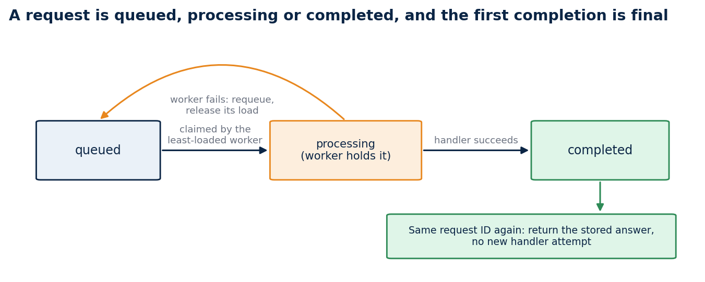
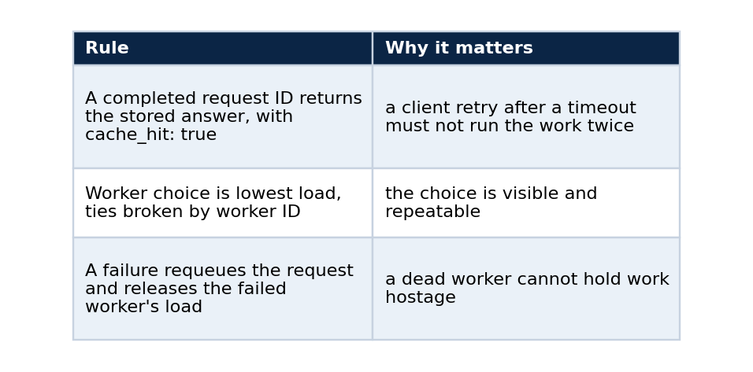
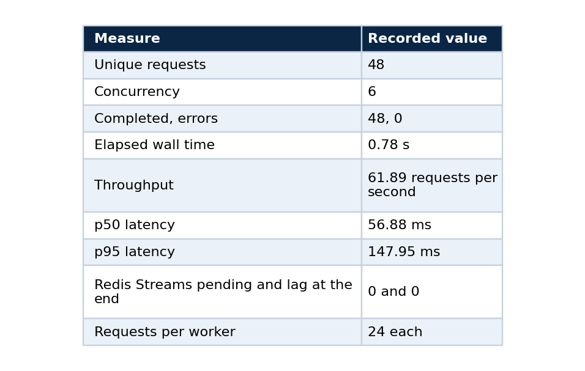

# Idempotency before autoscaling: what an agent runtime needs first

### Redis Streams, killed workers and a three-node kind cluster: the state contract, the evidence for it, the benchmark I refuse to over-read, and the commands to reproduce each claim

Adding replicas does not make an agent runtime safe. A retried client request can land on a different worker. A worker can die after claiming a job. An upstream timeout can make the client submit the same request a second time. Each of these happens on the first busy day, and a scaling rule does nothing about any of them.

The runtime needs a state contract before it needs an autoscaler. That is the whole argument. This article states the contract, shows how a Redis Streams queue enforces it, walks through the three layers of evidence I collected (unit tests, a Compose profile and a Kubernetes cluster), and gives the commands so that you can watch each property hold on your own machine. It also says what the evidence does not show, which includes anything about cloud deployment or capacity.

## Why a load balancer is not enough

A load balancer routes a request to a healthy backend. It does not remember that the request already ran, and it cannot recover work that a backend accepted and then abandoned. The repository records this as its first architecture decision: HTTP acceptance and worker distribution are separate concerns. The gateway persists an idempotent request record and publishes the work to a Redis Stream, workers acknowledge only after the completion is durable, and idle pending entries can be reclaimed.

The alternative I rejected was direct synchronous worker calls. They are simpler, and they cannot demonstrate reclaim of a pending entry, which is the property that matters when a worker dies. I also rejected adding a separate durable database, because it would widen the deployment surface beyond a focused reference.

## The contract

A request is in one of three states: queued, processing or completed. The first completed response becomes the answer to every later submission with the same request ID, even when a second worker handles it.



*A failure sends a request back to the queue and releases the failed worker's load. A completed request is final.*

Three rules follow from the diagram.



The deterministic runtime tests cover each rule: completed-request replay, least-load selection, failure requeue, suppression of concurrent duplicates, a conversation checkpoint, and one Redis Streams worker cycle. The test for the first rule sends a completed request to another worker and checks that the original answer comes back with no new handler attempt. The test for the third recovers a request on a second worker and records two attempts.

## Where Redis fits

Replica-local memory cannot coordinate a Kubernetes deployment, so the queue lives at the deployment boundary. Redis Streams with consumer groups provide it. A consumer group tracks, for every entry, which consumer received it and whether it was acknowledged. An entry that was delivered and never acknowledged stays in the group's pending list, and another consumer can claim it once it has been idle long enough. That is the mechanism a worker crash needs, and it is why the workers acknowledge only after the result is stored.

In-process tests make the transition rules repeatable without any infrastructure. They check the rules. The next two sections check that the rules survive real processes.

## Evidence layer 1: Docker Compose

The Compose profile runs Redis 7, the Python runtime with a React test chat, and, for the recovery exercise, two worker containers.

```powershell
python -m pip install -e .
npm --prefix frontend ci
make check
docker compose up --build --detach
```

Open `http://localhost:8080`, send a message, keep the generated request ID, then send a different message with the same ID. The interface returns the first response and marks it as a replay. The API exposes `POST /api/messages`, `GET /api/requests/{request_id}` and `GET /api/conversations/{conversation_id}` so that you can inspect the state without the interface.

The recovery exercise is the part I find most convincing. I set one worker to use a three-second deterministic processing delay. The gateway accepted a request, and Redis then reported one pending stream entry. I terminated that worker before it could acknowledge the entry. A replacement worker reclaimed the idle entry and completed it, and Redis then reported zero pending entries. Nothing was lost and nothing ran twice. The replacement worker completed it with an attempt count of 1. After I recreated the runtime container, a request with an existing ID reported `state_backend: redis` and returned the same completed result, which shows that the idempotency record lives in Redis and not in a process.

## Evidence layer 2: a three-node kind cluster

On 2026-09-24 the same behaviour ran on a local `kind` cluster with one control plane and two worker nodes.

My first attempt used the default node image, which is Kubernetes 1.37 at the time of writing. Its kubelet rejected my host's cgroup v1 configuration and the tool removed the half-built cluster. The profile now pins `kindest/node:v1.31.4`, whose kubelet starts on this host, and the repository records the failed attempt next to the working one so that nobody has to rediscover it.

```powershell
kind create cluster --name runtime-lab --config k8s/kind-config.yaml --wait 2m
docker build --tag distributed-agent-runtime-lab-runtime:latest .
kind load docker-image distributed-agent-runtime-lab-runtime:latest --name runtime-lab --nodes runtime-lab-worker,runtime-lab-worker2
kubectl --context kind-runtime-lab apply -f k8s/local-kind.yaml
kubectl --context kind-runtime-lab rollout status deployment/agent-workers --timeout=120s
```

Kubernetes scheduled Redis, the gateway and the two worker pods across both worker nodes. Kubeconform had validated the five declared resources with strict schema checking beforehand. Then I posted a message twice with the same request ID:

```powershell
kubectl --context kind-runtime-lab port-forward service/agent-runtime 18080:8080
$body = @{ request_id = "kind-smoke-01"; conversation_id = "kind-conversation-01"; message = "Kubernetes smoke request" } | ConvertTo-Json -Compress
Invoke-RestMethod -Method Post -Uri http://127.0.0.1:18080/api/messages -ContentType application/json -Body $body
Invoke-RestMethod -Method Post -Uri http://127.0.0.1:18080/api/messages -ContentType application/json -Body $body
```

The first request completed once through one worker pod, and the second returned the persisted response with `cache_hit: true`. Then I changed the worker count and deleted a pod:

```powershell
kubectl --context kind-runtime-lab scale deployment/agent-workers --replicas=1
kubectl --context kind-runtime-lab scale deployment/agent-workers --replicas=2
$worker = kubectl --context kind-runtime-lab get pods -l app=agent-worker -o jsonpath='{.items[0].metadata.name}'
kubectl --context kind-runtime-lab delete pod $worker --wait=true
kubectl --context kind-runtime-lab rollout status deployment/agent-workers --timeout=120s
```

Requests submitted after each change completed, and the same conversation held the first three responses. After the pod deletion the deployment restored two ready workers, one on each worker node, and a fresh request completed with `cache_hit: false` and `attempts: 1`. The exercise proves local scheduling, idempotent replay, scale-down and scale-up, and worker replacement. It does not measure recovery time.

## A benchmark, read carefully

One Docker Desktop host ran Redis, one gateway and two workers. It sent 48 unique requests at concurrency six, and a completed result with `cache_hit: false` counted as a success.



```powershell
docker compose up --build --detach
.\scripts\run_compose_benchmark.ps1 -RequestCount 48 -Concurrency 6
docker compose exec -T redis redis-cli XINFO GROUPS runtime-lab:agent-runs
```

The last command is the real check: zero pending entries and zero lag mean every delivered request was acknowledged. The stub model does no real work, so the benchmark measures the request path (HTTP, Redis Streams dispatch, worker completion and gateway polling) and says nothing about capacity. I would object to anyone quoting 61.89 requests per second as if it did.

## What the evidence does not show

Terraform validates GKE and EKS configurations, and none has been planned or applied. Cloud failover, autoscaling under queue pressure, multi-cluster recovery, recovery time, tail latency under saturation and real model latency are all unproven, and the repository says so. Redis persistence and the Compose topology are demonstration constraints and not a universal system of record.

The repository also carries a hardened public-demo Compose profile. Nginx is the only exposed service, a proxy is the only route out, and an education-data RAG service can answer with citations once an operator completes the documented local validation.

## The habit behind it

I write the failure test before the scaling story. Killing a worker mid-request and checking that nothing is lost or repeated is cheap next to the outage it prevents, and it changes what "scale out" can safely mean later. Autoscaling multiplies whatever the runtime already does, so it should multiply a correct behaviour.

## Code and links

- [distributed-agent-runtime-lab](https://github.com/LucasRangelSSouza/distributed-agent-runtime-lab): runtime, Compose and kind profiles, the architecture decision and the dated evidence records; reference version v0.2.2
- [Kaggle datasets](https://www.kaggle.com/lucasrangelss/datasets): the public datasets behind these projects, with schemas and SHA-256 manifests
- [GitHub profile](https://github.com/LucasRangelSSouza): all repositories

My portfolio: [https://lucas.rangeltech.net](https://lucas.rangeltech.net)
