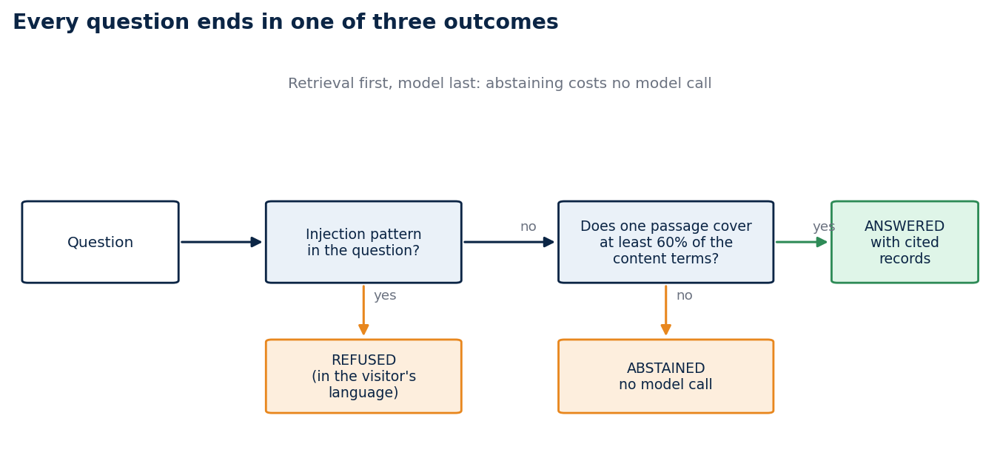
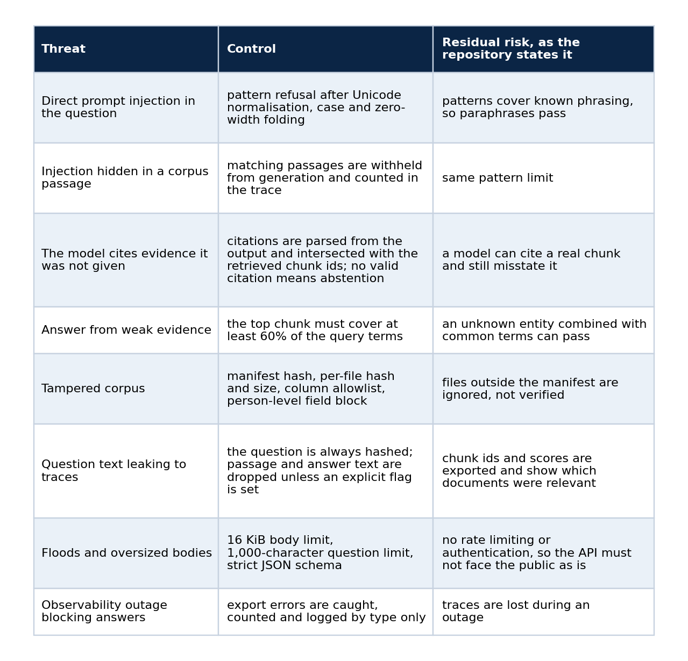
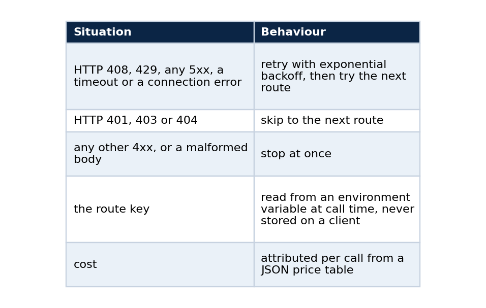

# Observable RAG without unsupported answers

### A response contract with three outcomes, a bug that a failing test caught, a gateway client and a trace exporter that I tested against real services, and how to run all of it

A retrieval system needs a visible response boundary before it needs a cleverer prompt. Mine starts from three outcomes. The system answers when one retrieved passage covers at least 60% of the question's content terms. It abstains when none does. And it refuses any request that contains a tested prompt-injection pattern.

This article explains how those outcomes are enforced, how the model gateway and the trace exporter are kept small and testable, what I found when I ran the exporter against a real Langfuse stack, and how to reproduce every claim. It is the kernel that grew into the live chat described in [the second article of this collection](https://rangeltech.net/medium/02-rag-chat-that-abstains/).



*A question is refused, abstained or answered, and the first two cost no model call.*

## Why evidence comes before fluency

A fluent answer to every request makes an interface look more capable, and it undermines the claim that the answer is grounded. The repository records the opposite choice as its first architecture decision: the reference returns a cited answer only when the evidence is sufficient and abstains otherwise, and its local trace stores minimised metadata and never the raw question or answer. The price is stated next to the decision. The demo is deliberately narrower than a general chatbot, and unsupported-answer behaviour and data minimisation become things a test can check.

## Retrieval is part of the contract

An answered result carries the identifiers and scores of the passages that supplied its evidence. The fixture makes this deterministic, which matters for regression tests: a new ranking function or model adapter should not quietly strip citations from an answer path, and if a change does, a test fails.

The coverage rule is small enough to state in code. This is an illustration of the idea and not the repository's exact function:

```python
def covers_enough(query_terms: set[str], passage_terms: set[str], minimum: float = 0.60) -> bool:
    """Answer only when one passage contains at least 60 percent of the question's content terms."""
    if not query_terms:
        return False
    return len(query_terms & passage_terms) / len(query_terms) >= minimum
```

If no passage passes, the service abstains with `safety_reason: "insufficient_retrieval"`.

## The bug that made abstention real

My first implementation treated a common English word as enough retrieval evidence, so it answered an unrelated weather question. A failing test exposed the flaw.

The corrected tokenizer drops common stopwords before it computes overlap, and the same test now asserts an abstention. The public commit and CI history keep the sequence intact, so anyone can watch the failure first and the fix second. I would trust a repository like that more than one whose history begins with everything already working.

## A threat model that points at tests

The repository's threat model lists each threat, the control, the test that exercises it, and the residual risk that remains. A selection:



The residual-risk column is the part I find most useful. It turns "secure" into a list of things the reader should still worry about.

## Two small clients instead of two SDKs

The reference has to run its quick start, its tests and its CI with no account, no provider key and no network, yet the design names a model gateway (9Router) and an observability layer (Langfuse). The repository resolves this with two small standard-library clients that speak the services' public HTTP contracts.

**The gateway client** speaks the OpenAI-compatible `POST /chat/completions` contract and owns the routing policy:



The optional gateway generator may cite only chunk ids that retrieval returned, and the service abstains when the model output cites none of them.

**The trace exporter** builds a Langfuse-shaped trace (a trace, a retrieval span, a generation nested under the span, and scores) and exports it through the ingestion endpoint with basic-auth keys read at export time. Every exporter receives a trace object and calls the redaction function itself, so no export path can skip redaction. The default mode exports nothing, and a failed export is counted and logged by exception type only, while the answer is still returned.

I chose not to use the official SDKs for a specific reason. They track upstream changes automatically, but they add dependencies, background flush threads and their own retry behaviour, and that would make the redaction and routing rules harder to test in isolation. The cost of my choice is also on record: tests against fake HTTP servers prove the client behaviour that I control, and they do not prove compatibility with a specific release of either service.

## Traces without the text

Each trace records a random trace ID, a SHA-256 digest of the question, the outcome, the safety reason, a retrieval span and a generation observation nested under it. Passage text and answer text stay out of every export unless an operator sets an explicit flag, so a trace can be shared with someone who should not read the questions.

## What happened against a real Langfuse stack

On 2026-09-28 I ran the exporter against a disposable local Langfuse stack (web, worker, PostgreSQL, Redis, ClickHouse and object storage, all passing their health checks) with test-only credentials. The command answered the fixture question and exported its trace:

```powershell
python -m rag_platform answer --question "How does the retrieval service abstain?" --trace-export langfuse
```

An authenticated query to the local Langfuse API returned the trace. The stored trace had `input: null` and `output: null`, with the result state, the citation count, the safety state and the question digest in the metadata, plus two observations and two scores. It contained no question text, no passage text and no answer text.

The run also found a compatibility problem that the fake server could never have shown. The fork I used runs Langfuse v4, my client uses the legacy batch ingestion contract, and in the v4 default mode Langfuse correctly rejected those events. The documented dual-write migration setting on the web and worker services made it accept all five redacted events. That bridge proves the current client works against a running service. It is not a permanent compatibility claim, and the record says the next release should move to a native v4 or OTLP path and repeat the run without the bridge.

For the gateway, I verified only that the component starts: the local 9Router build answered its health endpoint. I did not run a provider-backed generation, so that part of the claim stays at the fake-server level.

## Results on real data

The fixture, with six synthetic documents, gives recall at 3 of 1.0, citation coverage of 1.0 and a correct abstention rate of 1.0. That validates the mechanics and nothing more.

The education corpus adapter, which verifies the release manifest and a column allowlist and rejects person-level fields, ran on the real Kaggle release. On 41 documents built from 40 sampled municipalities it scored:


The gap between recall and citation coverage means that a few answers retrieved the right document while the extractive sentence selection did not carry a citation to it. I have not broken that down further, and the record says so. In the container run, the education profile reported 5,568 documents and answered a population question with a citation that carried the dataset slug, the version and the manifest hash.

## Run it yourself

The only runtime dependency is `pyarrow`.

```bash
python -m venv .venv && . .venv/bin/activate        # Windows: .venv\Scripts\activate
python -m pip install -e .
make check
make reproduce
```

`make reproduce` writes five files. `answer.json` has `"status": "answered"` with one citation. `abstention.json` has `"status": "abstained"` and `"safety_reason": "insufficient_retrieval"`. `traces.jsonl` gets one line per run with the question digest and no question text. The two evaluation files report recall and citation coverage of 1.0 on the fixture, and the education fixture reports an abstention rate of 0.833333 over 7 cases. The test suite has 118 tests.

For the container check:

```bash
docker compose --profile fixture up -d --wait
curl -s http://127.0.0.1:8080/healthz
curl -s -X POST http://127.0.0.1:8080/v1/answer -d '{"question":"How does the retrieval service abstain?"}'
docker compose --profile fixture down
```

The health endpoint answers with the document count, the retrieval mode (`bm25`) and the generator (`extractive`). The service runs as a non-root user with a read-only root filesystem, dropped capabilities and `no-new-privileges`, and it binds only to the loopback address.

## What it shows

This small system does not establish retrieval quality for a production corpus. What it demonstrates is a testable contract: supported answers are cited, unsupported questions abstain, and known hostile phrasing is refused and never becomes an instruction. It also shows the value of running at least one integration against a real service, because the one thing the fake could not tell me was that the service had moved on.

## Code and links

- [ai-platform-rag-observability](https://github.com/LucasRangelSSouza/ai-platform-rag-observability): reference version v0.2.0, with the threat model, the architecture decisions and the evidence records
- [rag-chat](https://github.com/LucasRangelSSouza/rag-chat): the live chat built on the same contract
- [Kaggle datasets](https://www.kaggle.com/lucasrangelss/datasets): the public datasets behind these projects, with schemas and SHA-256 manifests
- [GitHub profile](https://github.com/LucasRangelSSouza): all repositories

My portfolio: [https://rangeltech.net](https://rangeltech.net)
