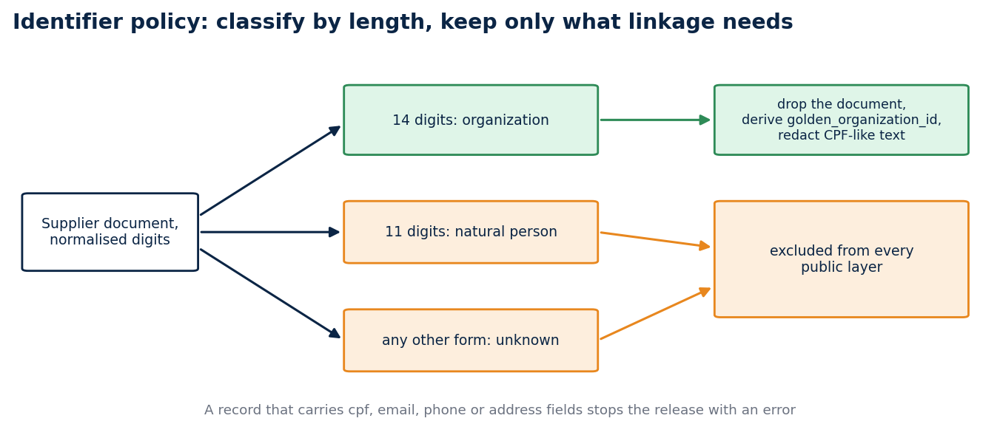

# Testing a privacy policy like software

### A stable organization key, a release gate that raises before it writes, a worked run you can reproduce, and an honest account of what a hashed identifier does not protect

Privacy controls fail when they live only in a document. A policy that nobody executes is a statement of intent, and statements of intent do not stop a bad release candidate at four in the afternoon on a Friday. The rule that helped me most is the one that stops that candidate in the same workflow that catches a malformed date or a missing column.

I applied this to the release path of a public-data project. The exercise forced two decisions worth writing down: how to link organizations without claiming more than the data supports, and how to make the audit impossible to skip. This article shows the policy, the code that implements it, a run on four invented records, the tests, and the limits, which I think are the most important part. Everything here can be reproduced from the repository with the standard library alone.

## The problem

Public procurement data names its suppliers. A supplier is usually a company, and a company identifier (the CNPJ, fourteen digits) is a public registry value. But the same field also holds individual taxpayer numbers (the CPF, eleven digits) when the supplier is a person, and a free-text field can hold an email address or a phone number that someone typed into a note. A release that copies the source verbatim therefore publishes personal data by accident, even when no one decided to publish it.

There are two ways to respond. One is to review each release by hand and hope the reviewer reads every row. The other is to write the rule down in a form a machine can check, run it before anything leaves the machine, and make a failure stop the process. I chose the second, because a reviewer's attention is finite and a test is not.

## The policy, as a contract file

The policy lives in a small YAML file that the code and the documentation both refer to.

```yaml
classification:
  organization:
    input: normalized fourteen-digit supplier document
    action: remove source document and derive golden_organization_id
  natural_person:
    input: normalized eleven-digit supplier document
    action: exclude record from every public layer
  unknown:
    input: any other document form
    action: exclude record from every public layer
prohibited_fields: [cpf, email, phone, address, supplier_document, supplier_name, name]
non_claims:
  - golden_organization_id does not verify identity
  - golden_organization_id does not establish qualification
  - golden_organization_id does not establish ownership
```

The `non_claims` block is unusual, and I like it. It writes down in advance what the key must never be used to claim, so a later contributor who wants to use the key for something else has to argue against a file and not against a memory.



*Classification by length decides what reaches a public layer. Anything else is excluded.*

The governance note in the repository says the same thing in prose: the gate classifies by normalized digit length, removes the source document from organization candidates, and blocks direct CPF, email, phone and address fields. It adds a rule for the future. Any new extractor must run the same policy before it writes fixtures, logs, screenshots or release layers, because a leak through a log file is still a leak.

## A key that links and nothing else

A stable key makes a public dataset easier to join. It also invites claims the data cannot back. The project uses a `golden_organization_id` for one narrow job, linking eligible organization records after the original supplier document has been removed.

The classifier looks only at the number of digits after normalisation:

```python
def classify(document):
    value = digits(document)
    if len(value) == 14:
        return "organization"
    if len(value) == 11:
        return "natural_person"
    return "unknown"
```

I chose length over a checksum on purpose. A checksum validates that a number is well formed, and well formed is a weaker statement than registered. Length is a coarse rule, and a coarse rule has one property I value: a reviewer can predict its output without running it. The cost is that a malformed fourteen-digit string is treated as an organization. The policy accepts that cost because the key promises linkage and not validity.

Only the organization path reaches a public layer. The code derives a SHA-256 key from the normalised document, drops the document and the supplier name, and redacts CPF-like and email-like text in the remaining free-text fields:

```python
sanitized = {key: redact_direct_identifiers(value) for key, value in record.items() if key not in EXCLUDED_FIELDS}
sanitized["identifier_classification"] = classification
sanitized["golden_organization_id"] = hashlib.sha256(f"cnpj:{normalized}".encode()).hexdigest()
```

The `cnpj:` prefix is part of the hashed string, so the same digits hashed for another purpose in another table produce a different value. That keeps keys from different contexts from colliding by accident.

A record that carries a `cpf`, `email`, `phone` or `address` field does not get redacted. It stops the release with an error. The right response to a forbidden field is to fix the extractor and not to clean up after it, because a pipeline that quietly cleans up teaches its authors that the field is fine to emit.

## A worked run on four invented records

The fastest way to understand a policy is to feed it a few records and read what comes out. I wrote four, none of them real. The first has a fourteen-digit supplier document, a supplier name, and a note that contains an email address and a CPF-shaped number. The second has an eleven-digit document. The third has a document that is not numeric. The fourth has no supplier at all.

```python
from brazil_data_map.privacy import apply_identifier_policy

records = [
    {"id": "1", "supplier_document": "12.345.678/0001-95", "supplier_name": "ACME",
     "note": "contact a@b.org or 123.456.789-09"},
    {"id": "2", "supplier_document": "123.456.789-09"},
    {"id": "3", "supplier_document": "abc"},
    {"id": "4", "title": "no supplier"},
]
released, summary = apply_identifier_policy(records)
```

The call returned two released records and a summary. Record 1 came back without the document and without the supplier name. Its note read `contact [REDACTED_EMAIL] or [REDACTED_IDENTIFIER]`. It carried `identifier_classification: organization` and a 64-character `golden_organization_id`. Record 4 came back unchanged with `identifier_classification: not_present`. Records 2 and 3 were gone. The summary said that one natural-person record and one unknown record had been excluded, that one organization was released, and that one record was released without any supplier identifier.

I then fed it a record with an `email` field. It raised `ValueError` with the message `direct identifier field blocks release: email`, and no output was produced. That is the behaviour I wanted to see on a screen before I trusted the policy: three different inputs, three different fates, and a hard stop for the field that should never have been there.

The summary matters as much as the output. It lets a reviewer compare the number of excluded records with what they expect, and a sudden jump in the natural-person count is a signal that the source changed.

## What the key does not protect

This is the part to read twice. A CNPJ is a public identifier, and there are only so many valid ones. A SHA-256 of a public identifier in a known format can be reversed by trying the candidates, since the attacker does not need to invert the hash, only to compute it for every plausible input and compare. So `golden_organization_id` is a linkage convenience inside a reviewed release. It does not anonymise anything.

I would rather say this plainly than let the word "hashed" imply protection. The threat model in the repository takes the same line. It names five risks: natural-person supplier identifiers, free-text leakage, fixture leakage, logs or traces that retain raw fields, and linkage beyond the intended organization-level analysis. It then states that residual risk remains, because a public record can contain context that enables re-identification when it is combined with other sources.

The key also cannot show who owns an organization, whether it qualifies for an opportunity, whether its registration is still valid, or whether two records describe the same business relationship. Those questions need evidence that the release does not carry. The limit matters most in recommendation work. A model may rank a procurement record as relevant to a profile, and that ranking should stay a relevance signal with a link back to the source record. Two records sharing a derived key must never turn it into a supplier endorsement or an eligibility decision.

## An audit that raises before it writes

The gate has two stages. The first, the identifier policy above, transforms the records. The second, the audit, inspects the finished layers and does not trust the first.

The release path classifies supplier documents, removes direct supplier fields, redacts identifier-like text from retained strings, builds the raw, trusted and semantic layers, and then audits every layer for prohibited keys and for CPF-like or email-like values that survived. It records the audit outcome before writing the manifest. If the audit fails, the release function raises before it emits a manifest, so the failure belongs to the engineering workflow and not to a warning that a later reader has to interpret.

Here is the audit in full. It is short enough to read in one sitting.

```python
PROHIBITED_KEYS = {"address", "cpf", "email", "phone", "supplier_document", "supplier_name", "name"}

def audit_release_layers(layers):
    violations = []
    record_counts = {}
    for layer, records in layers.items():
        record_counts[layer] = len(records)
        for index, record in enumerate(records):
            for key, value in record.items():
                if key.casefold() in PROHIBITED_KEYS:
                    violations.append(f"{layer}[{index}].{key}")
                if isinstance(value, str) and (CPF_PATTERN.search(value) or EMAIL_PATTERN.search(value)):
                    violations.append(f"{layer}[{index}].{key}: direct identifier-like value")
    if violations:
        raise ValueError(f"privacy audit failed: {', '.join(violations)}")
    return {"privacy_gate": "passed", "record_counts": record_counts, "violations": []}
```

Two design choices deserve a comment. The audit reports every violation it finds before it raises, so one run tells the author about all of them and not only the first. And the error message names the layer, the row index and the key, never the offending value, so the log that records the failure does not copy the identifier it caught.

The audit duplicates some of the work of the first stage. That is deliberate. The first stage can have a bug, and a second check that does not share its code can catch what the first one lets through.

## The package gate around it

The audit is one condition among several in the release contract. A release candidate needs a source registry entry with a unique identifier and an HTTPS official URL, a recorded retrieval window, a source-specific terms review, the audit result, and a file manifest. The quality gate adds structural rules: a non-empty `id`, a parseable `updated_at`, unique identifiers within each layer, no trusted layer larger than raw, and equal trusted and semantic counts.

The manifest then records the declared package paths, their SHA-256 hashes, byte counts, source lineage and a `privacy_gate` status. It does not discover every file in the output directory, so a stale file cannot enter a release record by sitting in the right folder. A status other than `passed` prevents manifest validation.

The contract is careful about what a valid manifest proves. It proves that the declared package matched the contract at the time it was built. It does not prove that the source terms permit redistribution, because that conclusion depends on the source version and the intended channel, and the release owner records it outside the code path. I think this separation is right. A program can check a pattern. It cannot read a license.

## The tests

The audit tests are short, and they read like the policy.

```python
def test_audit_returns_counts_for_clean_layers(self):
    layers = {"raw": [{"id": "a", "golden_organization_id": "hash"}],
              "trusted": [{"id": "a", "golden_organization_id": "hash"}],
              "semantic": [{"id": "a", "natural_key": "a", "golden_organization_id": "hash"}]}
    audit = audit_release_layers(layers)
    self.assertEqual(audit["privacy_gate"], "passed")

def test_audit_rejects_identifiers_in_key_or_value(self):
    with self.assertRaisesRegex(ValueError, "privacy audit failed"):
        audit_release_layers({"raw": [{"note": "contact someone@example.org"}]})
    with self.assertRaisesRegex(ValueError, "privacy audit failed"):
        audit_release_layers({"trusted": [{"cpf": "12345678901"}]})
```

Three kinds of failure are covered across the suite. The policy excludes an eleven-digit document from every public layer, because masking would leave a record that the stated analysis does not need. A direct field such as `email` blocks the release. And identifier-like content inside an otherwise allowed text field is redacted before the layers are built, after which the audit rejects any identifier-like content that survives. A safe schema can still carry unsafe text, and that is the case people forget.

One limit of the patterns belongs here. The CPF pattern matches eleven digits with optional separators, so it also matches other eleven-digit numbers. The audit therefore errs toward blocking. I accept false positives in a release gate because a false positive costs a review, and a false negative costs a disclosure.

## Beyond the tables

The discipline reaches past tables. The project keeps synthetic fixtures, validates the walkthrough notebook as JSON, and treats screenshots and logs as release surfaces that need the same minimisation rule. A future operational pipeline should add trace redaction and checks against its own logging system before it handles live responses.

I think fixtures are the underrated surface. Test data copied from a real record is the most common way a real identifier ends up in a public repository, and it is invisible to a gate that only looks at release layers. Synthetic fixtures remove the temptation.

## Run it

```bash
git clone https://github.com/LucasRangelSSouza/brazil-public-data-map
cd brazil-public-data-map
python -m unittest discover -s tests
```

The suite has 74 tests and runs in about two seconds. It includes the audit, the layer builders, the manifest checks and the portability tests. To see the policy act on data, paste the four-record snippet from the worked run into a Python session started in the repository root.

## What the tests do not prove

They cannot show that a dataset is harmless. They show that a documented set of forbidden fields and patterns has a repeatable failure mode. A policy that runs before the data moves gives a reviewer something concrete to inspect, and that is a smaller claim than a privacy certificate.

This is a data-minimisation pattern. A future release still needs a source-specific terms review, a schema review, and a human decision about whether organization-level linkage is still necessary for the stated analysis. If the answer to that last question is no, the safest key is no key.

## A note on scope

Different data calls for different choices. The bounded releases described here minimise supplier identifiers. For the full PNCP catalogue I publish the public procurement record verbatim, because that is public-record data and the analysis depends on it. Each release states its own choice in its manifest and audit file, so a reader never has to guess which rule applied.

## Code and links

- [brazil-public-data-map](https://github.com/LucasRangelSSouza/brazil-public-data-map): `brazil_data_map/privacy.py`, the identifier contract, the audit and its tests
- [pncp-opportunity-recommender](https://github.com/LucasRangelSSouza/pncp-opportunity-recommender): a consumer of the key that refuses to treat it as an eligibility signal
- [Kaggle datasets](https://www.kaggle.com/lucasrangelss/datasets): the public datasets behind these projects, with schemas and SHA-256 manifests
- [GitHub profile](https://github.com/LucasRangelSSouza): all repositories

My portfolio: [https://lucas.rangeltech.net](https://lucas.rangeltech.net)
