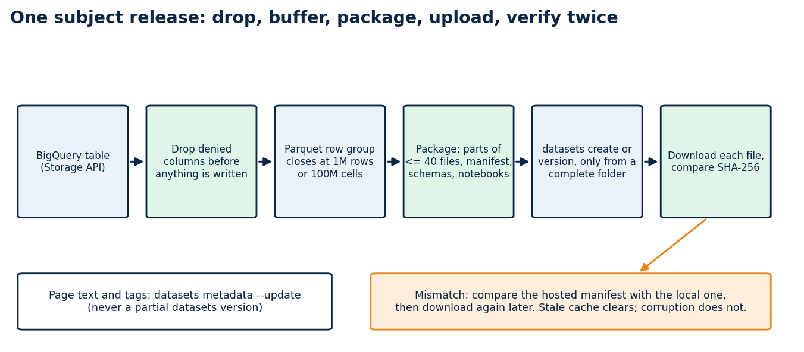
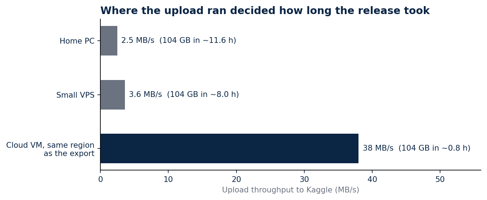

# Four billion rows on Kaggle, and the checks that caught what I got wrong

### Reorganising eleven Brazilian public-data sources into 31 datasets: Parquet row groups, upload speed, a command that deletes files, and columns that should never have shipped

My first Kaggle releases were small and tidy. Two datasets, a few thousand rows each, every file verified by hash after a clean download. Then I tried to publish everything: the school census, procurement, education spending, assessment results, municipal indicators. Eleven sources in all.

The catalogue now has 31 datasets, 428 tables and 3,991,508,838 rows, about 104 GB of Parquet. This article is about the parts of the job that did not go to plan, because each one left a rule behind in the code.

## The shape I settled on

Each source gets two kinds of dataset. `<subject>-raw-trusted` holds the raw and cleaned layers together, with the notebooks that produced them. `<subject>-analytics` holds the tables built for questions, such as one row per municipality and year. A reader who only wants answers downloads the small one; a reader who wants to audit the transformation downloads both.

Kaggle limits how many files sit at the top of a dataset, and nested folders make loading code ugly. So files stay flat, carry a layer prefix (`raw__`, `trusted__`, `semantic__`), and a subject splits into numbered parts when it passes 40 Parquet files. The census became three parts, SIOPE four, SAEB four.

Every dataset ships a `release_manifest.json` with the SHA-256 of each file, a `schemas.json`, an audit file, a data dictionary and a README with the snapshot date. Those files are what let a stranger check my work without trusting me.

## Row groups froze two machines

A Parquet file is split into row groups, and the footer holds metadata for every one of them. My first exporter wrote one row group per page it received from the BigQuery Storage API. On wide tables a page is small, so a single file ended up with tens of thousands of row groups and a footer large enough that writing and reading it stalled. Two virtual machines stopped responding before I understood why.

The fix is a buffer. The writer now accumulates pages and closes a row group at one million rows or one hundred million cells, whichever comes first. The cell rule exists for wide tables, where a million rows with hundreds of columns is already a large group. The stalls stopped.

## Upload speed decided where the job ran

Export was never the slow step. Upload was, and I measured it from three places before choosing: 2.5 MB/s from my home PC, 3.6 MB/s from a small VPS and 38 MB/s from a cloud VM.

At 3.6 MB/s, 104 GB takes about eight hours with nothing going wrong. At 38 MB/s it takes under an hour. Temporary VMs ran the export and the upload together, each with an automatic shutdown written into its startup script, so a forgotten machine could not keep billing.

One machine I should not have used at all. Early on I ran export jobs on a shared server that also ran a scheduler other people depended on, and it froze three times. Exports now run only on machines created for them.

## The command that deletes files

`kaggle datasets version` uploads a new version of a dataset. What the name does not tell you is that the new version contains exactly the files in the folder you point it at. A folder with one corrected file produces a dataset with one file.

I learned this when a version pushed from an incomplete folder left `ibge-analytics` with no tables. I restored it by exporting the subject again. Page text, tags and file descriptions now go through `kaggle datasets metadata --update`, which touches metadata only, and `datasets version` runs only from a complete release folder.

## The check that failed when nothing was wrong

Verification downloads each file back and compares its hash with the manifest. Right after a new version, Kaggle can keep serving the previous file for a while, so the check reported a mismatch on `censo-escolar-raw-trusted-part-3` twice when the upload was fine.

I did not relax the check. I added a second one: compare the hosted manifest with the local one, then download again later. A real corruption fails both. A stale cache fails only the first and clears on retry.

## Columns that should never have shipped

After the catalogue was public I scanned samples of every table for strings that looked like storage paths, internal URLs or local file paths. Ten datasets had them, in nine columns that recorded where a PDF had been stored or downloaded from during the build. None of it was personal data, and all of it was information about my build environment that had no reason to be in a public release.

The exporter now drops those columns by name before it writes anything, and I exported and published the ten datasets again. Two limits apply. The scan read samples, not every row, so a full scan of the republished files comes next. And Kaggle keeps earlier versions of a dataset, so the fix covers the current version, not the history.

The lesson is about where the check sits. A privacy gate that runs after publication finds problems; one that runs inside the exporter prevents them. Mine now does both.

## What a reader gets

Every dataset has a public quickstart notebook that reads its manifest, verifies a few files against their hashes and loads the smallest table. A data map lists all 428 tables and 33,891 columns with their source, lineage and join keys, and the RAG chat and dashboards on my site read the same tables, so the demos and the downloads agree.

## Limits

Each manifest identifies a snapshot. The government portals keep changing after it, and some download servers did not answer my scripts at all, so a few source notebooks show the code without its output. A verified hash proves a file arrived intact. It says nothing about whether the source data was right.

## Code and links

- [brazil-public-data-map](https://github.com/LucasRangelSSouza/brazil-public-data-map): source registry, release tooling, data dictionaries and the data map
- [Kaggle datasets](https://www.kaggle.com/lucasrangelss/datasets): the 31 datasets with manifests and quickstart notebooks
- [Data map](https://rangeltech.net/datamap/): every table and column, searchable
- [GitHub profile](https://github.com/LucasRangelSSouza): all repositories

My portfolio: [https://rangeltech.net](https://rangeltech.net)
