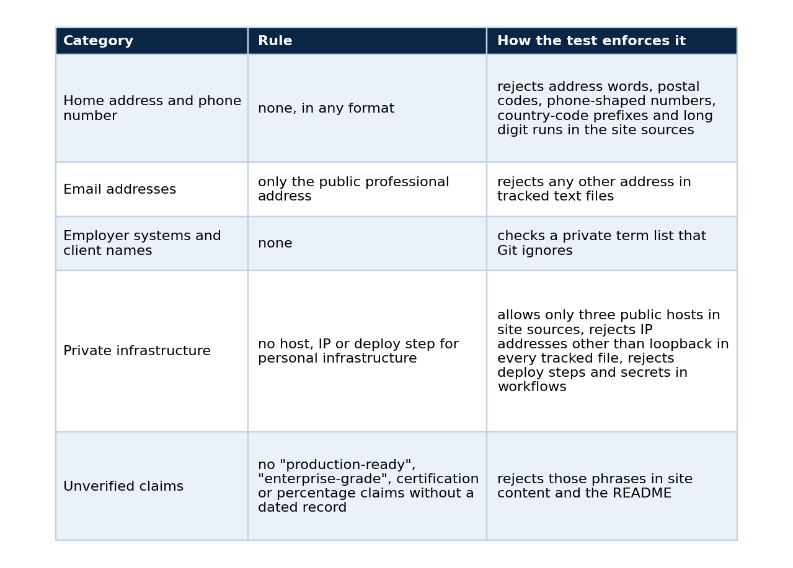
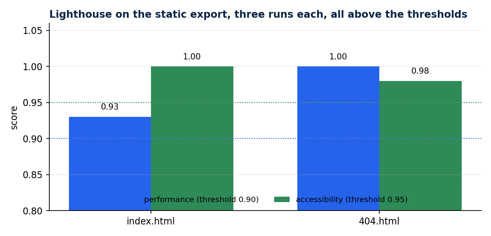

# A portfolio where every claim has an evidence state

### Three labels, a denied-content test that runs in CI, a static export that is checked like software, and why I stopped writing "production-ready"

Most engineering portfolios list technologies. Mine lists what I can prove, and marks how strongly.

A technology list is cheap to write and impossible to check. "Kubernetes, Spark, LLMs" tells a stranger what words appear in my career and nothing about what I did with them. When I rebuilt my portfolio I gave myself one rule: no project appears without saying what kind of evidence backs it. That rule turned out to shape the code as much as the copy. This article shows the labels, the tests that enforce them, the rest of the verification pipeline, one bug that the pipeline caught before a visitor could, and how to set up the same arrangement for your own site.

## The problem with portfolio claims

A portfolio is read by people who cannot ask follow-up questions. A recruiter has ninety seconds and an engineer has a healthy suspicion. Both meet phrases such as "production-ready", "scalable" and "enterprise-grade", and both have learned to discount them, because the phrases cost nothing to write and nobody is accountable for them.

There is a second problem that is less discussed. A portfolio built from real work risks publishing things it should not: an employer's internal system name, a client, a home address, a personal server. The same sloppiness that produces vague claims produces these leaks, because in both cases nobody wrote down a rule and nothing checks the output.

I decided to treat both problems as one engineering task. State what each claim rests on, state what may never appear, and let a test fail the build when either rule is broken.

## Three states

Each project card carries one of three labels.

*Implemented* means the code and documentation are public. On its own it proves no runtime behaviour, and the site says so.

*Locally validated* means a dated local command, test or evidence record proves the behaviour the card states.

*Published dataset* means the Kaggle slug and version are recorded in the repository.

The labels are ordered by what a reader can check. "Implemented" asks the reader to trust the code. "Locally validated" gives them a command and a date. "Published dataset" gives them a file with a hash. I chose three because every project I had fell into one of them, and I could not defend a fourth label such as "production" with a record.

A card also has room for an evidence sentence and a limits sentence. In the data model it looks like this:

```typescript
export type EvidenceState = "Implemented" | "Locally validated" | "Published dataset";

export type Project = {
  title: string;
  summary: string;
  slug: string;
  state: EvidenceState;
  evidence?: string;   // what was run, with its date
  limits?: string;     // what the evidence does not show
  links?: { label: string; href: string }[];
};
```

The state is a union type, not free text. A card cannot invent a fourth label without a type error, and the build fails at the typecheck step before any test runs.

The distributed-runtime card, for example, states a local benchmark with its date, request count, concurrency, throughput and p95, and states that worker recovery was proven on a local kind cluster. It does not say anything about cloud. The model-serving card says the checkpoint comes from a third party and that refusal behaviour was measured only narrowly, because the schema has a field for exactly that sentence. A field that exists gets filled. A sentence that lives only in my intentions does not.

## Rules a test enforces

I wrote the rules as a document and then as a test. `docs/denied-content.md` lists what may never appear on the site or in the repository, and `tests/content.test.mjs` enforces the list on every `npm test`, which CI runs on each push and pull request. The document and the test cover the same categories, so a reader of the public repository can see what is promised and check that it is enforced.



Here is the unverified-claims test, which is short enough to read in full:

```javascript
test("denied: unverified claims", () => {
  assertNoMatch(publicProse, /production[- ]ready|enterprise[- ]grade|battle[- ]tested|world[- ]class/i, "unverified claim");
  assertNoMatch(publicProse, /\bcertified\b|\bcertification\b/i, "certification claim");
  assertNoMatch(publicProse, /\bcloud validated\b/i, "cloud-validation claim without a dated record");
  assertNoMatch(contentText, /\d+(\.\d+)?\s?%/, "percentage claim");
});
```

The percentage rule is strict on purpose. A number on the site needs a record behind it, and a bare percentage rarely has one, so the cards use counts, dates and named measurements instead. "Forty-eight requests at concurrency six" can be checked against a benchmark file. A rounded percentage cannot be checked against anything.

I like the private-list design for what it says about the problem. A denylist that names its entries publishes them, so the public half describes the categories and the private half holds the strings. The private half is a file called `.denied-terms.local` that `.gitignore` excludes. When it exists, the test fails if any listed term appears in the repository. In CI it does not exist, so the private check reports that it skipped, and the test output says so instead of pretending to pass. A check that is silent about being skipped is worse than no check, because it manufactures confidence.

## The rest of the pipeline

`npm run check` is one command that chains the verification, and a few more commands cover what a unit test cannot see:

```powershell
npm ci
npm run check       # content tests, typecheck, static export build, exported-markup tests, internal link check
npm run test:links:external
npm run test:e2e    # Playwright: interaction, accessibility (axe), responsive
npm run lighthouse
```

The site is a static export, so the tests run against the exact files that get served. The three exported-markup tests read the built HTML and assert that every essential section is present, that the hero, the contact channels and the project evidence are in the markup, and that blocks hidden until hydration are forced visible when JavaScript is off. A visitor with scripts disabled, or a crawler that does not run them, therefore still sees the content. The link checker verifies every internal link, and the external check confirmed that all nine non-LinkedIn links (six GitHub repositories, the GitHub profile and two Kaggle datasets) returned 200. LinkedIn is excluded because it blocks automated requests. A manual request with a browser user agent got a redirect to the same address.

On 2026-09-25 the Playwright suite passed 21 of 21 tests: section navigation, contact channels, every project card linking to its public repository, a keyboard-only flow with a visible focus ring, reduced-motion behaviour, the no-JavaScript fallback, and the responsive layouts at three widths. The axe accessibility run found zero serious or critical violations at 390, 768 and 1440 pixels.



*Three runs each against the static export. The thresholds are performance 0.90 and accessibility 0.95, and all six runs passed.*

The recorded scores were 0.93 performance and 1.00 accessibility for the index page, and 1.00 and 0.98 for the 404 page. I keep the thresholds in `lighthouserc.json`, so a regression fails the build and nobody has to remember to look.

## The bug the container found

A Docker run of the container confirmed that `GET /` returns 200, an unknown path returns the exported 404 page, and the security headers (`X-Frame-Options: DENY` and a Content-Security-Policy) are present. A real Chromium load against the running container then found zero console errors and the expected title and hero heading.

That last check earned its place. My first Content-Security-Policy used `script-src 'self'` with no allowance for inline scripts, and Next.js inlines the data it needs to hydrate the page. The browser blocked those scripts, and the unit tests could not see it, because they read markup and do not run a browser against the headers. The fix was to adjust the policy, and the record keeps the original defect next to the correction. The lesson is small and general: a security header and the framework behind it are one system, and only a real browser load exercises both.

```powershell
docker build -t lucas-rangel-portfolio:0.1.0 .
docker run -d -p 127.0.0.1:8090:8080 lucas-rangel-portfolio:0.1.0
curl -s -o /dev/null -w "%{http_code}\n" http://127.0.0.1:8090/              # 200
curl -s -o /dev/null -w "%{http_code}\n" http://127.0.0.1:8090/nonexistent   # 404
curl -sI http://127.0.0.1:8090/ | grep -i -E "x-frame-options|content-security-policy"
```

## Dashboards and demos follow the same rule

The demos on the site link to live services, but the addresses are not in the source. They arrive as build-time environment variables injected by the private deployment, and the content test would reject a literal host. If a variable is empty, the card says the service is not connected and does not fake a link. The embedded dashboards use a frame component with three states (loading, unavailable after a timeout, ready) for the same reason.

The pattern here is that the interface describes its own state truthfully. A broken demo link that looks fine is worse than an honest "not connected", because the visitor learns something about the author from the difference.

## Why bother

A portfolio makes claims to strangers who cannot ask follow-up questions. I would rather give them a small set of claims that survive checking than a large set that does not. Every card links to a repository where the evidence lives, and every article states its limits.

The habit carried into everything else I publish. My RAG chat abstains when its corpus cannot support an answer, my drift gate blocks a batch instead of scoring it, and my model-serving write-up lists what I did not measure. The portfolio just applies the same discipline to me.

There is a practical benefit as well. Because the rules are tests, adding a project is cheap: I fill the fields, run the check, and either it passes or it tells me which sentence overreached. The checklist stops being a chore I remember and becomes a gate I cannot skip.

## Set it up for yours

1. Define your evidence states and write the rule for each in one sentence.
2. Put the state in the data model as a union type, not in free text, so a card cannot omit it.
3. Write the denied-content list as a document, then as a test, and run the test in CI.
4. Keep the sensitive strings in a private file that the repository ignores, and make the test say when it skipped that file.
5. Test the built output, not only the source, and load it in a real browser once.
6. Add an accessibility and a performance threshold so a regression fails the build.
7. Record each verification run with its date, so a claim on the site can point to a file.

## What it is not

Evidence labels do not make a project good, and passing a content test does not make copy honest. A determined author can write a misleading sentence that contains none of the forbidden phrases. The tests lower the cost of being wrong in public, which is the most I can ask of a checklist.

## Code and links

- [lucas-rangel-portfolio](https://github.com/LucasRangelSSouza/lucas-rangel-portfolio): the site, `docs/denied-content.md` and the tests
- [rag-chat](https://github.com/LucasRangelSSouza/rag-chat): the live chat that the demos link to
- [qwen-abliterated-api](https://github.com/LucasRangelSSouza/qwen-abliterated-api): an example of a card with an evidence sentence and a limits sentence
- [Kaggle datasets](https://www.kaggle.com/lucasrangelss/datasets): the public datasets behind these projects, with schemas and SHA-256 manifests
- [GitHub profile](https://github.com/LucasRangelSSouza): all repositories

My portfolio: [https://rangeltech.net](https://rangeltech.net)
