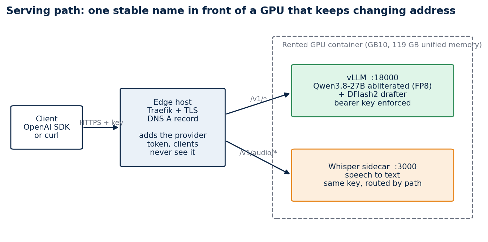
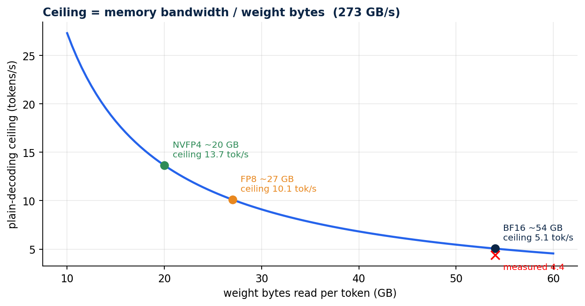
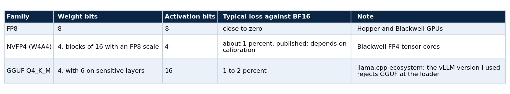
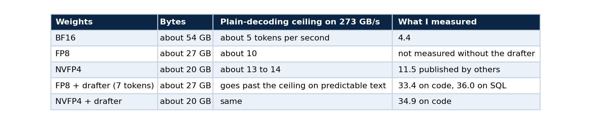
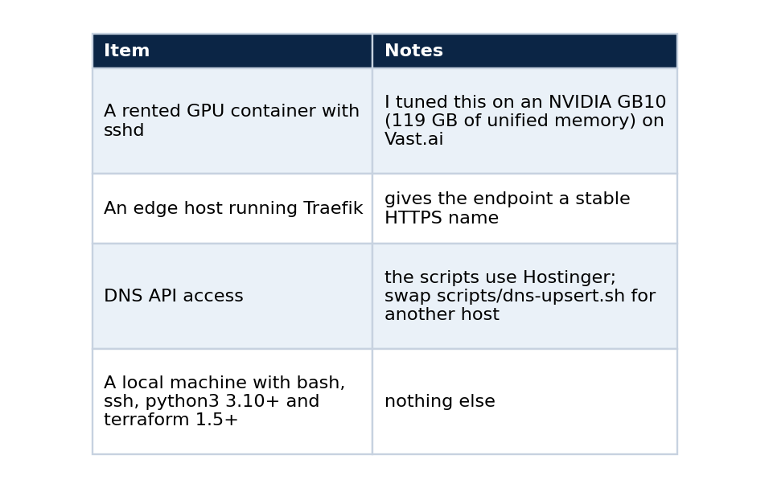
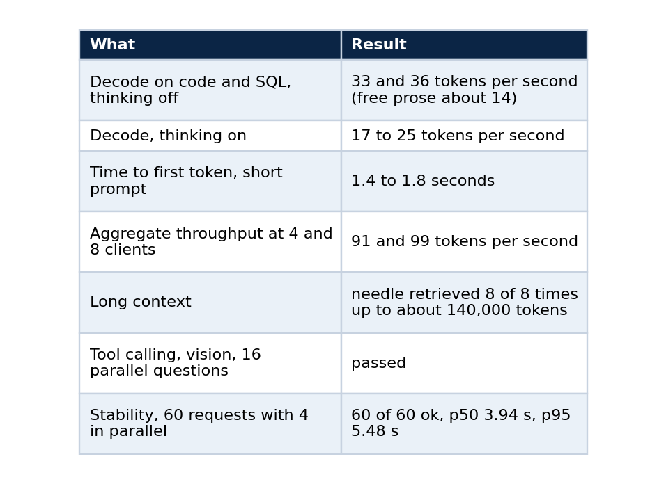
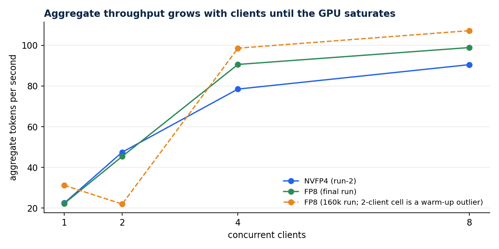
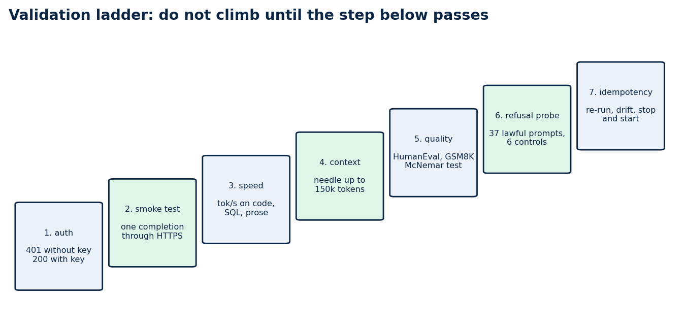

# Serve a 27B open model on a rented GPU: a reproducible, OpenAI-compatible endpoint

### Part 1 of 5. The arithmetic that predicts your speed, the exact steps to bring the endpoint up, and the checks that tell you it is right

You can rent a very good GPU for less than fifty cents an hour, load a 27-billion-parameter model onto it, and get an answer at 4.4 tokens per second. It is the number most people meet first, and most of them conclude that the machine is misconfigured.

It is not. This series shows how I took the same machine from 4.4 to 33.4 tokens per second on code (7.6 times) with the same weights, put a stable HTTPS name in front of it, and proved with tests that the whole setup can be rebuilt on a different GPU by changing one address. This first part covers the physics, the choices that follow from it, and the steps to bring the endpoint up and validate it. The later parts cover serving an abliterated checkpoint, benchmarking honestly, probing refusal behaviour, and running the deployment from CI and CD.

Everything is in a public repository, [qwen-abliterated-api](https://github.com/LucasRangelSSouza/qwen-abliterated-api), and every number below comes from a file in its `reports/` folder.

## What you will have at the end

An endpoint that speaks the OpenAI chat API (chat, thinking mode, tool calling, images, and speech-to-text and embeddings through sidecars), sits behind a name you own, and enforces a bearer key. You will also have a validation ladder that tells you when something drifts.



*The serving path. A DNS record cannot carry a port, and GPU providers map container ports to random high numbers that change when an instance is recreated. A small edge host with a stable address routes the name to whatever address the GPU has today.*

## Concepts you need first

**Prefill and decode.** A language model answers in two phases. Prefill reads the whole prompt in parallel and is limited by compute. Decode then produces one token at a time, and each token needs every weight of the model to be read from memory once. Time to first token is mostly prefill. Tokens per second is decode.

**Decode is bandwidth-bound.** If the weights are 54 GB and the GPU reads 273 GB per second, one token cannot take less than 54 divided by 273 seconds, which gives a ceiling of about 5 tokens per second. Arithmetic throughput hardly enters into it. A GPU with more compute and the same bandwidth would not be faster.



*The ceiling is bandwidth divided by weight bytes. BF16 weights sit at the left of the curve near 5 tokens per second, and I measured 4.4.*

Two levers follow from that single formula. You can read fewer bytes per token with quantisation, or you can get more than one token out of each read with speculative decoding.

**Quantisation stores weights in fewer bits.** "4-bit" is not one thing, and the formats are not interchangeable across runtimes.



**Speculative decoding.** A small drafter model proposes several tokens, and the large model checks all of them in one pass over its weights, keeping the accepted prefix. One read of the weights can then confirm more than one token. The gain depends on how often the drafter is right, which depends on how predictable the text is. Code and SQL accept long runs. Free prose accepts few tokens.

**The KV cache** holds the attention keys and values of every token already processed. It has its own number format, separate from the weights, and part 3 shows why that choice matters.

## The plan, from the arithmetic




*Each step changes one thing. The NVFP4 plain-decoding bar is a figure published by others and is labelled as such.*

If you use a different GPU, do the division yourself. Find the memory bandwidth in the vendor's specification, divide by the weight size in gigabytes, and use the result as your sanity check. A measurement far below it points at configuration. A measurement far above it means something else is wrong with the test.

## What you need



One provider detail saves an hour. Register your deploy public key on the provider account, and not only on the instance. Vast rewrites `authorized_keys` from the account keys, so a key added only to the instance disappears on the next restart. Also note that the provider lists several mapped ports for a container, and only the one mapped to container port 22 is SSH. Mine was visible only from inside the container's environment, as `VAST_TCP_PORT_22`.

## Step 1: clone and check the repository

```bash
git clone https://github.com/LucasRangelSSouza/qwen-abliterated-api
cd qwen-abliterated-api
bash -n scripts/*.sh && echo "shell syntax ok"
python3 -m py_compile tests/*.py && echo "python ok"
terraform -chdir=infra/terraform-vast init -backend=false
terraform -chdir=infra/terraform-vast validate
```

You should see both `ok` lines and `Success! The configuration is valid.` Nothing has touched a server yet, so this is the cheapest place to find a problem.

## Step 2: describe your machines

```bash
cd infra/terraform-vast
cp terraform.tfvars.example terraform.tfvars      # git-ignored
```

Edit the file. It holds the GPU container's address and its three mapped ports (22 for SSH, 8000 for the API, 3000 for the sidecars), your keys, the edge host, and the public name.

Terraform here is used with no provider. Each stage is a `terraform_data` resource that runs a script and re-runs only when its inputs change. That keeps the tool honest about what it does: it orders idempotent scripts and remembers their inputs.

## Step 3: bring it up

```bash
terraform apply
```

The apply does four things in order: configure vLLM on the GPU container, publish the route on the edge host, upsert the DNS record, and run an acceptance test. The first run downloads about 56 GB (the BF16 checkpoint at 52 GB and the 3.6 GB drafter, plus 1.6 GB for Whisper), which took about ten minutes for me. vLLM then quantises the weights to FP8 as it loads them. Later runs move no bytes. A full restart takes about seven minutes, because 52 GB are read from disk and quantised again.

The vLLM command that the script writes is short enough to read in full:

```text
vllm serve <weights> --served-model-name qwen-abliterated --host 127.0.0.1 --port 18000 \
  --gpu-memory-utilization 0.60 --max-model-len 160000 --max-num-seqs 4 --kv-cache-dtype auto \
  --quantization fp8 --trust-remote-code --enable-auto-tool-choice --tool-call-parser qwen3_xml \
  --reasoning-parser qwen3 --speculative-config '{"method":"dflash","model":"<drafter>","num_speculative_tokens":7}'
```

Three choices in that line deserve a sentence each. `--kv-cache-dtype auto` keeps the KV cache in bf16, and part 3 shows what happens when you do not. `--gpu-memory-utilization 0.60` leaves room for the sidecars and for other work on the GPU, although it reserves memory and not bandwidth. And `--speculative-config` is where the speed comes from: the drafter proposes seven tokens per step.

Check that the setup is stable:

```bash
terraform plan -detailed-exitcode
```

An exit code of 0 means nothing is left to change, which is the first proof of idempotency (part 5 goes deeper).

## Step 4: how the request reaches the model

Understanding the path makes the failures easier to read.

```text
client --HTTPS--> Traefik (edge host, Let's Encrypt) --HTTP--> provider's mapped port --> Caddy (token) --> vLLM (--api-key)
```

There are two token layers and one key that clients hold. The provider's own Caddy edge requires an instance token that changes whenever the instance is recreated. Instead of giving that token to clients, Traefik injects it as a cookie, which Caddy accepts next to bearer and query tokens, and this leaves the `Authorization: Bearer` header free for vLLM's own `--api-key`. Clients only ever hold the stable key. Token streaming stays smooth because the route sets `responseForwarding.flushInterval` to 1 ms.

When the provider hands back a different address, `scripts/publish-endpoint.sh` rewrites exactly three managed blocks in the Traefik file (router, middleware and service, with two more when the speech route is on), and `scripts/dns-upsert.sh` makes sure the record exists. Both are idempotent and tested for it.

## Step 5: validate from the outside

Validation runs through the public name, because that is the path your users take.

```bash
export BASE_URL=https://qwen.example.com/v1 API_KEY=<your key>

curl -s -o /dev/null -w "%{http_code}\n" "$BASE_URL/models"                                        # 401
curl -s -o /dev/null -w "%{http_code}\n" -H "Authorization: Bearer $API_KEY" "$BASE_URL/models"    # 200
scripts/smoke-test.sh "${BASE_URL%/v1}" "$API_KEY"
```

Expect 401, then 200, then a completion from the smoke test. If you skip the 401 check you can end up with an open endpoint that looks healthy.

Then call it the way your applications will:

```python
from openai import OpenAI

client = OpenAI(base_url="https://qwen.example.com/v1", api_key="<your key>")
reply = client.chat.completions.create(
    model="qwen-abliterated", temperature=0, max_tokens=512,
    messages=[{"role": "user", "content": "Write a Python retry decorator with exponential backoff."}],
    extra_body={"chat_template_kwargs": {"enable_thinking": False}},
)
print(reply.choices[0].message.content)
```

Thinking mode is on by default. Setting `enable_thinking` to `false` makes short answers about twice as fast, and when it is on the reasoning comes back separately in `message.reasoning`.

## What good looks like

These are the numbers I measured through the public HTTPS endpoint with the default profile, and they are the reference for your own run. A different GPU will give different values.





*One stream is fast and several together are faster in total. The dashed FP8 line has a flagged warm-up outlier at 2 clients.*

Prose is slow, about 14 tokens per second, for a reason you can predict. The drafter accepts long runs on predictable text such as code and SQL, and few tokens on free prose, so the same server feels quick or ordinary depending on the task.

## Optional sidecars on the same GPU

The chat model reads images but not audio. A second vLLM process serves `openai/whisper-large-v3-turbo` behind the same name for speech-to-text, and a third serves an embedding model (Qwen3-Embedding-4B) at `/v1/embeddings`. They start after the main model is healthy, because two vLLM processes that profile GPU memory at the same moment miscount each other, and the edge routes them by path. All three share the GPU's memory bandwidth, so a heavy embedding job slows the chat model. I measured that effect in the series on the public-data stack.

## The validation ladder

The rest of the series follows a fixed order, and you should not climb a rung until the one below passes.



*Seven checks, in order. Part 1 covers the first two, and the rest of the series covers the others.*

The order matters for a practical reason. A fast endpoint that leaks is worse than a slow one that does not, and a benchmark run on a server that silently corrupts long prompts produces numbers you will trust and should not.

## Cost, and when to turn it off

A rented GPU costs the same per hour whether it is busy or idle. At US$ 0.449 per hour with four parallel requests, 364 benchmark tasks cost about US$ 0.12 on FP8. The same tasks through Claude Code at API-equivalent pricing cost US$ 2.90, which is US$ 0.34 against US$ 7.97 per 1,000 tasks.


*Renting wins above about 4 percent utilisation of one instance and loses below it. The Sonnet 5 figure is API-equivalent cost reported by Claude Code.*

Stop the instance when nobody is using it. A stopped instance costs about US$ 0.007 per hour for the disk, and the endpoint returns by itself about eight minutes after a start, with the weights intact.

```bash
scripts/vast-power.sh stop      # needs VAST_API_KEY and VAST_INSTANCE_ID
scripts/vast-power.sh start
```

Never destroy the instance to turn it off. Destroying deletes the weights, and the next start downloads 56 GB again. Remember that a stopped instance still bills its disk, so check what is running before you leave.

## Checks that save time later

- After a restart, confirm that the new process is the one answering: read its PID or a log line that names the quantisation flag. `supervisorctl stop vllm` does not release the port, because the API server and engine children keep it, so the old process can keep answering and make a failed restart look like a success.
- When you kill by pattern, bracket the first letter (`pkill -f "[v]llm serve"`), or the pattern matches the shell that runs it.
- Do not start a long benchmark with `nohup ... &` from an agent session. Background jobs started that way can die with the turn.

## Limits

These figures come from one GPU model, one vLLM version and single runs per cell, so differences of a few tokens per second sit inside run-to-run noise. The cost comparison assumes a busy GPU. A dense 27B model at FP8 is not a frontier model for long agentic work, and I make no claim that it is.

## Next in the series

Part 2 explains what an abliterated checkpoint is, where mine comes from, and what changes and what does not when you serve one. Part 3 shows how to benchmark a model you host without fooling yourself.

## Code and links

- [qwen-abliterated-api](https://github.com/LucasRangelSSouza/qwen-abliterated-api): the whole system, including `docs/SELF_HOSTING.md` with these steps and their checks
- [rag-chat](https://github.com/LucasRangelSSouza/rag-chat): the public chat that uses this endpoint for wording
- [Kaggle datasets](https://www.kaggle.com/lucasrangelss/datasets): the public datasets behind these projects, with schemas and SHA-256 manifests
- [GitHub profile](https://github.com/LucasRangelSSouza): all repositories

My portfolio: [https://rangeltech.net](https://rangeltech.net)
