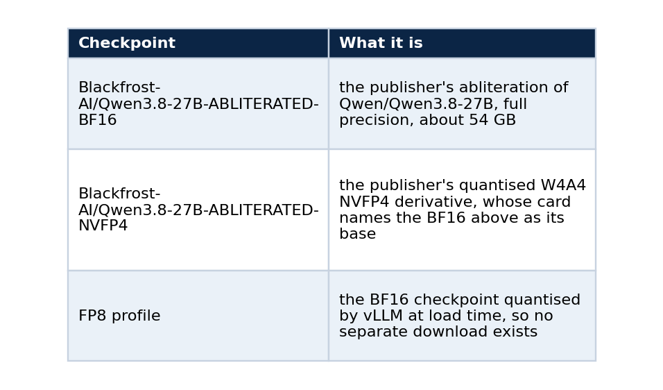
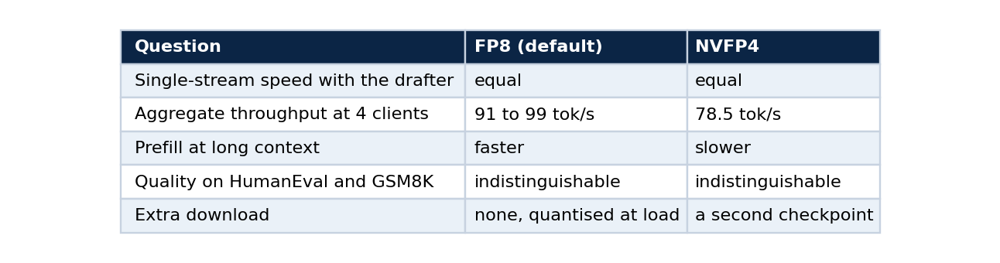

# Serving an abliterated model: what changes, what does not, and how to choose a checkpoint

### Part 2 of 5. The mechanism behind abliteration, FP8 against NVFP4 on the same weights, how to verify a third-party checkpoint, and a checklist before you open the endpoint

An "abliterated" language model has had its tendency to refuse edited out of its weights. People look for these checkpoints for different reasons, and running one is a good way to learn what serving an open model involves, because it forces questions you can otherwise skip. Where did these weights come from? What else changed? How would I know?

This part covers the mechanism, the operational differences (there are fewer than you might expect), the FP8 against NVFP4 decision that I measured on one abliterated lineage, a way to verify a checkpoint you did not train, and a checklist to run before you give the endpoint a public name. It builds on part 1, which brought the endpoint up.

One statement first, because it shapes everything after it. The checkpoint I serve is published by a third party, `Blackfrost-AI/Qwen3.8-27B-ABLITERATED-BF16`. I did not perform the abliteration and I do not claim it as mine. My work is the serving, the measurement and the operations around it.

## What abliteration does

Research on refusal found that, in many chat models, refusing a request is mediated by a single direction in the model's internal activations. Arditi and colleagues showed in 2024 that erasing that direction from the residual stream stops the model from refusing harmful instructions, and that adding it makes the model refuse harmless ones.

Abliteration turns that finding into a permanent edit in four moves.

1. Run the model on a set of prompts it refuses and a set it answers, and record its internal activations at a chosen layer.
2. Take the difference between the two averages. That vector is the estimate of the refusal direction.
3. Project that direction out of the weight matrices that write into the residual stream, so they can no longer produce it.
4. Save the result as an ordinary checkpoint.

No training loop runs and no gradient is computed. The result has the same architecture, the same tensor shapes and the same file format as the original, and that is why serving one is uneventful.

## What changes when you serve it

Very little. vLLM loads the checkpoint the way it loads any Qwen model of that size, and the same drafter, the same quantisation options and the same API apply. Three differences are worth knowing.

The first is the origin of the weights. With an official checkpoint the publisher is a company with a reputation. With an abliterated one the publisher is often an individual or a small group, and the model card is the only documentation. You are trusting a repository on a hub, so you should verify it (the next section shows how).

The second is speculative decoding. A drafter trained on the base model still works because abliteration is a small edit, but you should confirm that in your own logs and not assume it. vLLM prints the acceptance length, and mine stayed high enough to give 33 to 36 tokens per second on code.

```bash
# on the GPU container, after some traffic
supervisorctl tail -20000 vllm | grep "SpecDecoding metrics" | tail -3      # read the mean acceptance length
```

The third is exposure. A model that refuses less is a different thing to put on the internet. My endpoint enforces a bearer key at two layers, and the provider's own token never leaves the edge host. Anyone publishing a similar service should decide the acceptable-use policy first, before opening it to other people.

## Where the checkpoints come from

The lineage matters because it decides what a benchmark comparison actually compares.



I started with a different abliterated checkpoint, `OBLITERATUS/Qwen3.8-27B-OBLITERATED`, and moved to the Blackfrost pair. All the measurements in this series use the Blackfrost lineage, in two numeric precisions of the same weights. The FP8 against NVFP4 results below therefore compare precisions, and they do not compare two independent abliterations.

## How to verify a checkpoint you did not train

Do this before you download 50 GB. The hub exposes the parent model and the exact revision, and you can read both in a few lines.

```python
from huggingface_hub import HfApi

api = HfApi()
for repo in ("Blackfrost-AI/Qwen3.8-27B-ABLITERATED-BF16", "Blackfrost-AI/Qwen3.8-27B-ABLITERATED-NVFP4"):
    info = api.model_info(repo)
    print(repo)
    print("  base model :", info.card_data.base_model if info.card_data else None)
    print("  revision   :", info.sha)
    print("  license    :", info.card_data.license if info.card_data else None)
    print("  files      :", len(info.siblings))
```

Three things to read in that output. The base model should name the official parent. The revision is the commit you tested, and you should pin it in your deploy script, because a hub repository can change under the same name. And the licence is the publisher's terms stacked on the base model's terms, so both apply.

Then read the model card for what it claims and what it leaves out. Mine states that the model is not a coding fine-tune and reports its own coding-retention evaluation as in progress, which is why my repository runs its own executable checks (part 3).

## Choosing the precision

The profile is one environment variable:

```bash
PROFILE=fp8      # default: BF16 checkpoint, quantised at load
PROFILE=nvfp4    # the publisher's pre-quantised NVFP4 checkpoint
```

I measured both through the public endpoint. Bandwidth arithmetic says NVFP4 should be faster because it reads fewer bytes, and that is true for plain decoding. With speculative decoding on, the result changed.


*Decode speed by workload, thinking on and off. On single streams the two precisions are within noise.*


Aggregate throughput separated them more:


FP8 also prefills faster on long prompts.


*Time to first token against prompt length. FP8 stays ahead of NVFP4 as the context grows.*

These cells are single runs, and the FP8 four-client figure moved about 8 percent between two runs (98.6 and 90.6), so I call the throughput gap suggestive. I have no verified mechanism for it. My hypothesis, which I did not test, is that the drafter moves the workload from bandwidth toward compute, so the weight bytes matter less. On quality the two precisions are statistically indistinguishable, and part 3 shows the test.

That gives a decision I can defend, summarised in one table.



FP8 is the default for those reasons, and NVFP4 stays one variable away.

## A checklist before you open the endpoint

Run these before you give a third-party model a public URL.

1. Read the model card fully and note what it claims and what it does not.
2. Confirm the base model in the repository metadata matches what the card says.
3. Prefer publishers whose derivative checkpoints name their parent, so the lineage is checkable.
4. Pin the revision you tested.
5. Read the licence, since the publisher's terms and the base model's terms both apply.
6. Benchmark it yourself on your own tasks, with a grader you audited (part 3).
7. Probe its refusal behaviour with a fixed prompt set and record the result (part 4), and do not trust the card.
8. Put it behind authentication and decide who may use it.

## What I do not claim

I do not claim to have abliterated or retrained this model. I do not claim the publisher's method is the one in the paper, because I have not verified how they applied it. I do not compare it with any model beyond the measurements in part 3 and the probe in part 4.

## Next in the series

Part 3 shows how to benchmark a model you host: speed, context, quality and significance, and the fp8 KV cache failure that no short benchmark caught.

## Reference

Arditi, A., Obeso, O., Syed, A., et al. (2024). *Refusal in Language Models Is Mediated by a Single Direction.* NeurIPS 2024. doi:10.52202/079017-4322

## Code and links

- [qwen-abliterated-api](https://github.com/LucasRangelSSouza/qwen-abliterated-api): serving scripts, `PROFILE` switch, raw reports
- [Refusal probe results](https://github.com/LucasRangelSSouza/qwen-abliterated-api/blob/main/docs/REFUSAL.md)
- [Kaggle datasets](https://www.kaggle.com/lucasrangelss/datasets): the public datasets behind these projects, with schemas and SHA-256 manifests
- [GitHub profile](https://github.com/LucasRangelSSouza): all repositories

My portfolio: [https://lucas.rangeltech.net](https://lucas.rangeltech.net)
