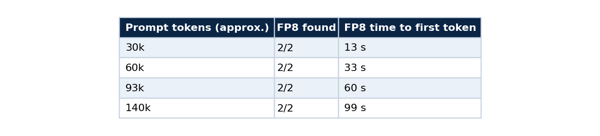
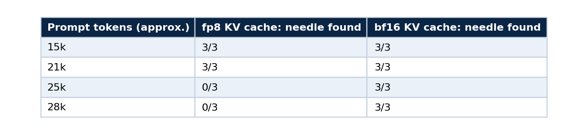
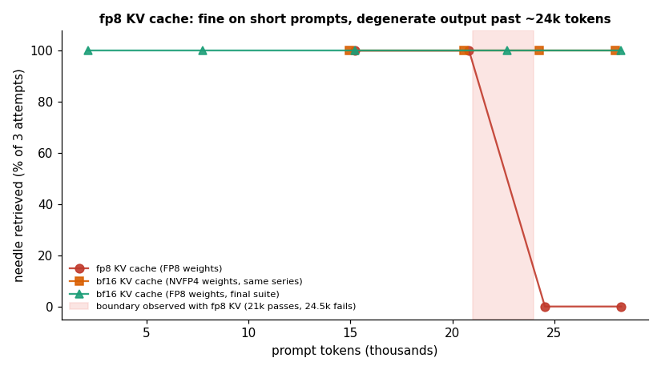
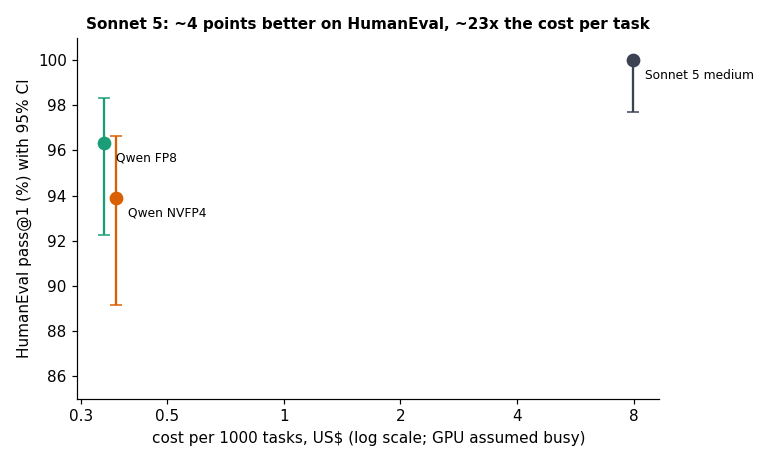
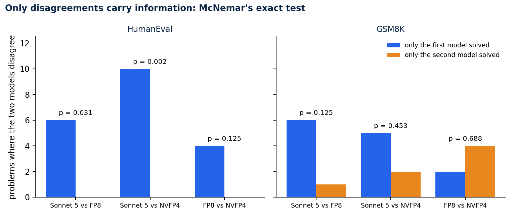
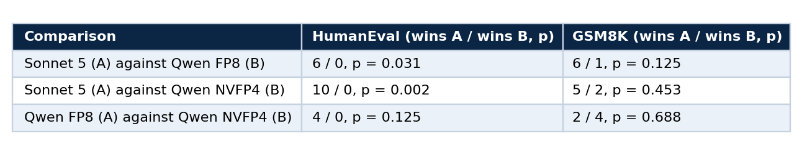
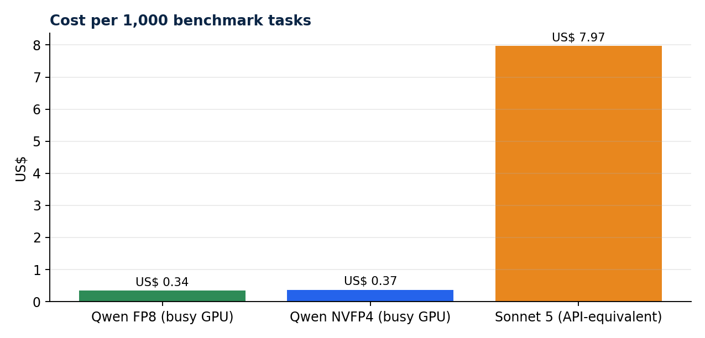

# Benchmark a model you host without fooling yourself

### Part 3 of 5. Speed, context length, quality and significance, with the tests that caught a silent KV-cache failure and a grader that was wrong

A benchmark is a measuring instrument, and instruments are wrong more often than models are. The most useful habit I took from this project is simple: audit the instrument before you trust any reading from it.

This part is a tutorial for measuring a model you host. It covers speed, long context, quality against a stronger model, and the statistics that stop you from reading noise as a result. It uses the scripts in [qwen-abliterated-api](https://github.com/LucasRangelSSouza/qwen-abliterated-api), and every table below comes from a JSON file in `reports/`. Part 1 brought up the endpoint and part 2 explained the checkpoint.

## The plan

Measure four things, in this order, and stop if one fails.

1. Speed: decode tokens per second, time to first token and aggregate throughput.
2. Context: whether the model still works at the prompt lengths you intend to serve.
3. Quality: task accuracy against a reference, with a grader you have audited.
4. Significance: whether any difference you see is larger than the noise.

All the scripts read the same two variables and use only the Python standard library.

```bash
export BASE_URL=https://qwen.example.com/v1 API_KEY=<your key>
```

## 1. Speed

```bash
python3 tests/suite.py --out reports/runs/mine.json      # about 25 minutes, needs no server access
```

The suite sends a fixed set of workloads through the public endpoint, so it measures what users get and includes the network path. It reports decode speed for code, SQL and prose with thinking on and off, time to first token, throughput at 1, 2, 4 and 8 clients, a 60-request stability run, prefix-cache behaviour, tool calling, vision and 16 parallel questions.


*Decode speed depends on the workload. Speculative decoding accepts long runs of predictable text, so code and SQL run at 33 to 36 tokens per second and free prose at about 14.*

Time to first token is mostly prefill and grows with the prompt. A repeated prefix is served from the prefix cache: an 11,476-token prompt went from 6.9 seconds to 3.6 seconds on the second call.

Three rules keep speed numbers honest. Report the workload with every number, since a single "tokens per second" hides a 2.5 times spread between code and prose. Treat single runs as approximate, because differences of a few tokens per second were within run-to-run noise here. And read the odd cell before you plot it: a warm-up outlier turned one of my two-client cells into a nonsense figure, which I flagged in the chart and did not use in a claim.


*Throughput scales with clients until the GPU saturates around four to eight. The dashed line carries the flagged outlier.*

## 2. Context length

Speed at short prompts says nothing about long ones. The needle test hides a fact at the middle of a long filler document and asks the model to retrieve it. This is the whole idea in a few lines.

```python
needle = f"CODIGO-SECRETO-{40000 + size % 997 + seed}"
haystack = filler(size, seed)
mid = len(haystack) // 2
prompt = (haystack[:mid] + f"\n\nA senha do cofre e {needle}.\n\n" + haystack[mid:]
          + "\n\nQual e a senha do cofre? Responda so com a senha.")
ok = needle in ask(prompt, max_tokens=40)
```

Run it at the sizes you intend to serve, with several seeds, and read the failures.

```bash
python3 tests/longctx.py        # 16k to 150k tokens, several seeds per size
```

With the bf16 KV cache the needle was found in every attempt up to about 140,000 tokens. Prefill is the price of length.



### The failure no short benchmark could see

To fit longer contexts I tried an fp8 KV cache next to FP8 weights. Every short prompt worked. Past about 24,500 prompt tokens every attempt failed, and the failed answers were not wrong answers to the question. They began with strings like `duct Register Register R`, which means the output was corrupt.





*Needle retrieval against prompt length. The fp8 KV cache failed in 6 of 12 attempts, all at 24,500 tokens or more.*

The two choices are independent. Weight quantisation was fine and KV-cache quantisation broke, for this model and this vLLM version, and I make no claim about fp8 KV caches in general. The memory saving had also never been needed, because the bf16 cache still holds about 400,000 tokens. The lesson is procedural: run a long-context test at the lengths you plan to serve on the first day, before the demo works. A system that passes every short prompt can be silently corrupt at the lengths your users will send.

## 3. Quality, against a reference

```bash
python3 tests/quality.py fp8            # HumanEval (164) and GSM8K (first 200), about 17 minutes
python3 tests/quality_claude.py         # the same prompts and grader through Claude Code as a yardstick
```

HumanEval is graded by executing the returned code locally with timeouts. GSM8K is exact match on the final number. Qwen ran with thinking off, and the reference was Sonnet 5 at medium effort through Claude Code with tools disabled, so it is a plain single-shot completion. The yardstick call is one line:

```bash
echo "$PROMPT" | claude -p --model claude-sonnet-5 --effort medium --tools "" \
    --no-session-persistence --disable-slash-commands --setting-sources "" --output-format json
```

The empty `--setting-sources` matters for cost. My first attempt loaded about 43,000 tokens of context per call, and not loading project settings and memory brought it to about 3,700.


The intervals are Wilson intervals, which behave well near 0 and 100 percent, where the textbook formula does not.

```python
from math import sqrt

def wilson(k: int, n: int, z: float = 1.96) -> tuple[float, float]:
    p = k / n
    d = 1 + z * z / n
    centre = (p + z * z / (2 * n)) / d
    half = z * sqrt(p * (1 - p) / n + z * z / (4 * n * n)) / d
    return 100 * (centre - half), 100 * (centre + half)

print(wilson(158, 164))     # (92.2, 98.3)
```



*HumanEval pass@1 with 95 percent intervals against cost per 1,000 tasks on a log scale, with the GPU assumed busy.*

### Audit the grader first

Before I trusted any of those percentages I audited the grader. It had two real bugs: helper functions defined in the prompt were not prepended to the code that ran, which caused four `NameError`s, and a 1,024-token limit cut six GSM8K answers before their final line. It also had a design flaw, because the thinking test tied the parser contract to answer accuracy. I fixed all three and validated each fix in both directions, meaning a correct solution passes and a wrong one fails.

Then I re-ran. Totals moved by only minus 1 (HumanEval) and plus 3 (GSM8K), where the bug counts had suggested plus 4 and plus 6. New failures appeared where old ones disappeared. At temperature 0 the outputs are not bit-identical between runs, because batching and speculative decoding are not deterministic, and the run-to-run variation is a few problems out of 164. Reading a two-point difference off raw totals would have been reading noise.

The first-grader results stay in the repository under a name that says they come from the buggy version. A wrong result you keep and label is more useful than one you delete.

## 4. Significance

Every model saw the same 164 problems, so the right test is paired. McNemar's exact test looks only at the problems where the two models disagreed and asks whether the split is more lopsided than a coin flip would give. It fits in a few lines:

```python
from math import comb

def mcnemar_exact(only_a: int, only_b: int) -> float:
    """Two-sided exact p-value from the counts of problems only A solved and only B solved."""
    n = only_a + only_b
    if n == 0:
        return 1.0
    tail = sum(comb(n, k) for k in range(0, min(only_a, only_b) + 1)) / 2 ** n
    return min(1.0, 2 * tail)

print(mcnemar_exact(6, 0))    # 0.03125  Sonnet 5 against FP8 on HumanEval
print(mcnemar_exact(10, 0))   # 0.00195  Sonnet 5 against NVFP4 on HumanEval
```



*Bars show the problems where exactly one of the two models succeeded. Where one side wins all of them, the p-value is small.*



Read it carefully. On HumanEval Sonnet 5 is better than both Qwen precisions with p below 0.05. On GSM8K no gap is significant. The two Qwen precisions do not differ significantly on either benchmark, so choosing between them is a question of speed and simplicity and not of quality. It also explains why 164 problems can give p = 0.002 for a 6-point gap and p = 0.125 for a 2.4-point one: only the disagreements carry information.

## 5. Cost per task

Cost equals run seconds times the hourly price, and the Claude figure is the API-equivalent cost that Claude Code reports.



*364 tasks cost about US$ 0.12 on a busy rented GPU against US$ 2.90 at API-equivalent pricing. The GPU wins above roughly 4 percent utilisation of one instance.*

## Limits of this comparison

The systems differ in access path, settings and date. Sonnet 5 ran through Claude Code, and its cost is API-equivalent, which differs from a subscription's marginal cost. Problem counts of 164 and 200 leave wide intervals. The benchmark says nothing about tool use, long-form writing or refusals, and part 4 covers refusals separately. And it is a plain completion on two tasks, so it is not a general ranking.

## Reproduce

```bash
python3 tests/run_all.py --tag mytag           # suite, audio pipeline, idempotency, reports
python3 tests/make_results.py > docs/RESULTS.md
```

Every number in this article traces to a JSON file under `reports/`, and `docs/RESULTS.md` is generated from them.

## Next in the series

Part 4 probes refusal behaviour with a fixed set of lawful prompts, and shows how to do it without writing anything dangerous.

## Code and links

- [qwen-abliterated-api](https://github.com/LucasRangelSSouza/qwen-abliterated-api): `tests/`, `reports/` and `docs/RESULTS.md`
- [Kaggle datasets](https://www.kaggle.com/lucasrangelss/datasets): the public datasets behind these projects, with schemas and SHA-256 manifests
- [GitHub profile](https://github.com/LucasRangelSSouza): all repositories

My portfolio: [https://lucas.rangeltech.net](https://lucas.rangeltech.net)
