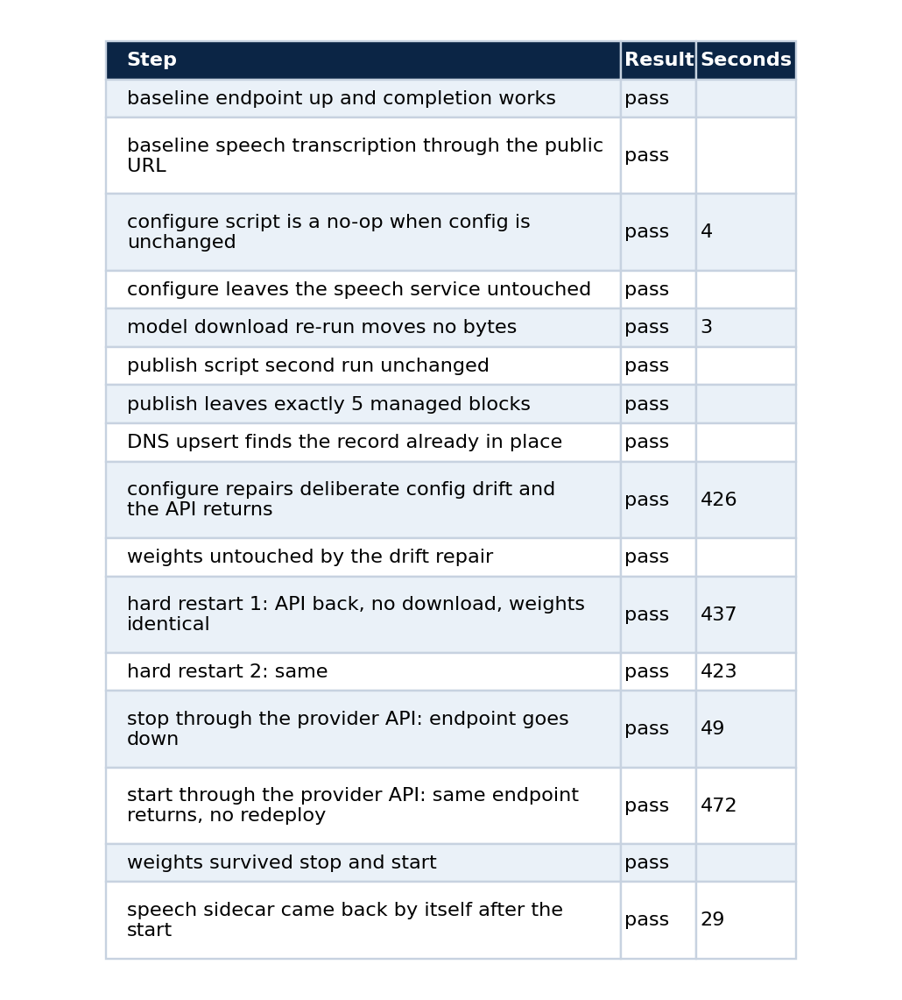
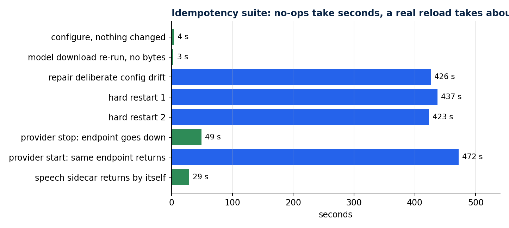
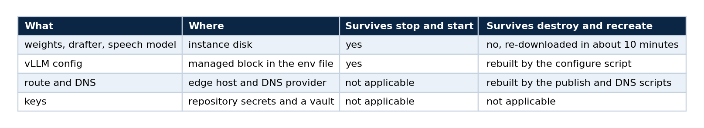
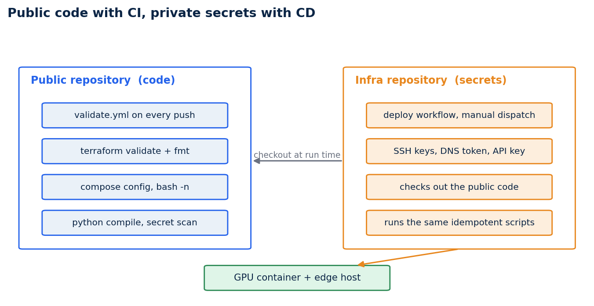

# Make a GPU deployment survive a power cycle: idempotent scripts, Terraform with no provider, and a CI/CD split

### Part 5 of 5. How to rebuild the same endpoint on a different machine by changing one address, how to prove it with tests, and how to keep the secrets out of a public repository

A rented GPU is temporary by design. The provider can stop it, hand back a different address, or give you a different physical card. If the only way to rebuild your endpoint is to remember what you typed last time, you do not have a deployment. You have a pet.

This last part shows how I made the endpoint rebuildable: scripts that compare desired state with current state and change nothing when they match, a Terraform module that orders them, a test suite that proves the property, and a CI and CD arrangement that puts the code in a public repository and the secrets in another one. Parts 1 to 4 covered bringing the endpoint up, the checkpoint, benchmarks and the refusal probe.

## What idempotent means here

Running the deployment a second time must change nothing. Running it after someone edited the config by hand must repair the drift. Running it on a new machine must rebuild everything from the repository plus one new address. Each of those is a testable statement, and that is the point.

Four rules produced it.

1. **Write the desired state as text, compare it with what exists, and act only if they differ.** The vLLM config is a block delimited by markers. The script builds the wanted block, reads the current one, and rewrites it only on a difference.
2. **Make downloads no-ops.** `hf download` moves bytes only when files are missing, so a restart never fetches 56 GB again.
3. **Never restart a server that is still loading.** A vLLM server that is loading weights looks unhealthy for minutes.
4. **Manage the edge configuration in delimited blocks.** The publish script owns five marked blocks in the edge host's Traefik file, makes a backup, and rewrites those blocks and nothing else, so running it twice cannot duplicate them.

The first rule, as code, is a compare step before any action:

```bash
CURRENT=$(sed -n '/^# BEGIN qwen-abliterated-api/,/^# END qwen-abliterated-api/p' "$ENV_FILE")
if [ "$CURRENT" = "$DESIRED" ] && supervisorctl status vllm | grep -q RUNNING; then
  # Right config and the process is up: it may simply still be loading weights (minutes).
  for _ in $(seq 1 ${HEALTH_WAIT_S:-900}); do
    if healthy; then echo "nothing to do"; exit 0; fi
    sleep 1
  done
fi
```

The third rule came from a bug that the idempotency test found. My first version treated "not healthy yet" as "broken" and restarted a server that was still loading its weights. The fix is the loop above: when the configuration already matches, wait for the health check, and restart only a server that never becomes healthy.

## Terraform with no provider

The Terraform module downloads no provider. Each stage is a `terraform_data` resource that runs a script through `local-exec`, and each carries a `triggers_replace` made of the hash of its script and its real inputs. A stage re-runs only when one of those changes.

```bash
cd infra/terraform-vast
terraform init -backend=false
terraform apply                       # configure, route, DNS, acceptance test
terraform plan -detailed-exitcode     # exit 0 means nothing is left to change
```

Changing the machine means changing five values in `terraform.tfvars` (the address, the three mapped ports and the instance id) and applying again. Only the stages that depend on them re-run: the configure step, the route and the DNS record.

Why not a provider? A provider would model the GPU instance as a resource, but the instance belongs to a marketplace that gives you a running container, not an API object you create. What needs managing is the configuration inside it and the route in front of it, and ordered idempotent scripts do that with nothing to install.

## Prove it with a test suite

`tests/idempotency.py` turns the four properties into steps. On my final run all 16 passed:





*The no-op steps take seconds. A real reload takes about seven minutes, and the tests record it.*

The slow rows are worth reading. A drift repair or a hard restart takes about seven minutes because 52 GB have to be read from disk and quantised, and no amount of scripting shortens that. Writing the duration into the test result means nobody mistakes seven minutes for a hang. The provider's stop and start returned the same address with the weights intact, and the speech sidecar came back on its own 29 seconds after the API.

The persistence contract behind those results fits in one table.



## Where CI runs and where CD runs

A deployment workflow needs an SSH key, a DNS token and the API key. Those belong in a repository whose visibility you control. The code being deployed needs none of them, so it can be public: readers can audit it, forks are possible, and CI on a public repository is free.



*The public repository holds the code and its CI. The infra repository holds the secrets and the deploy workflows, and checks the public code out at run time.*

### CI in the code repository

`validate.yml` runs on every push and pull request. It validates and format-checks the Terraform, parses the Compose file, syntax-checks every shell script, compiles the Python tests, parses the prompt file of the refusal probe, and fails if a secret-shaped file or string is tracked.

```yaml
      - run: terraform -chdir=infra/terraform-vast fmt -check
      - run: terraform -chdir=infra/terraform-vast validate
      - run: bash -n scripts/*.sh
      - run: python -m py_compile tests/*.py
      - name: No secrets, keys or private addresses tracked
        run: |
          if git ls-files | grep -E '\.(tfstate|tfvars|pem|key)$|(^|/)\.env$'; then exit 1; fi
          if git grep -nIE 'BEGIN (RSA|OPENSSH|PRIVATE)|ghp_[A-Za-z0-9]{20,}|hf_[A-Za-z0-9]{20,}' \
               -- . ':!.github/workflows/validate.yml'; then exit 1; fi
```

The exclusion on the last line matters. The scan's own pattern contains the text it searches for, so without it the workflow flags itself.

### CD in the infra repository

The deploy workflow is a manual dispatch. It checks the public repository out into a `qwen/` folder and runs the same scripts from there.

```yaml
name: Deploy Qwen API to Vast instance
on:
  workflow_dispatch:
    inputs:
      ssh_host:    { description: GPU container public IP, required: true }
      ssh_port:    { description: Mapped SSH port, required: true }
      api_port:    { description: Mapped API port, required: true }
      instance_id: { description: Provider instance id, required: true }
      public_host: { description: FQDN served by the edge, required: true }
      edge_ip:     { description: Edge host IPv4, required: true }
jobs:
  deploy:
    runs-on: ubuntu-latest
    defaults: { run: { working-directory: qwen } }
    steps:
      - uses: actions/checkout@v4
        with: { repository: LucasRangelSSouza/qwen-abliterated-api, path: qwen }
      # steps: write SSH keys from secrets, configure the GPU container,
      # publish the route, upsert DNS, wait for /v1/models, smoke-test a completion
```

Four secrets are needed: the SSH key for the GPU container, the client bearer key, the DNS token and the SSH key for the edge host. Never put them in the public code repository. Prefer a scoped deploy user on the edge host over root.

Dispatch it from your terminal and follow the run:

```bash
gh workflow run deploy-qwen-vast.yml --repo <owner>/<infra-repo> \
  -f ssh_host=<ip> -f ssh_port=<port> -f api_port=<port> -f whisper_port=<port> \
  -f instance_id=<id> -f public_host=qwen.example.com -f edge_ip=<edge-ip> -f profile=fp8
gh run watch
```

## Test the pipeline itself

A pipeline you have not run is a hypothesis. After moving the deploy workflows I dispatched one against the instance that was already running. It is safe to do because the scripts are idempotent. The configure step became a no-op and the route and DNS record were already in place. The final steps waited for the API and smoke-tested a completion.

Two things came out of running it that reading the workflow would not have shown.

The first run failed at the publish step with `Permission denied`. Git had stored the scripts as mode 100644, so they were not executable on the runner. The fix has two parts: make the files executable in the index (`git update-index --chmod=+x scripts/*.sh`), and call them through `bash` in the workflow so the pipeline no longer depends on file modes.

The second is about visibility. The default workflow token of one repository cannot check out a private repository that belongs to a different owner. Keeping the code public is what makes the checkout work, which is another reason for the split.

After both fixes the run passed end to end.

## The habit

Write the property you want as a test, and run the pipeline before you trust it. Idempotency, restart safety and the CI and CD split are all easy to describe and easy to get slightly wrong. The tests are what turn a description into evidence.

## Limits

The 16 steps ran on one provider and one GPU model. A provider's stop and start is not guaranteed to return the same physical GPU, and the scripts are written so that a new instance can be rebuilt from the repository. The CD workflow depends on secrets that live in the infra repository and on an edge host that already runs Traefik.

## The series

1. [Serve a 27B open model on a rented GPU](https://rangeltech.net/medium/11-serve-a-27b-model-on-a-rented-gpu/)
2. [Serving an abliterated model](https://rangeltech.net/medium/12-serving-an-abliterated-model/)
3. [Benchmark a model you host without fooling yourself](https://rangeltech.net/medium/13-benchmark-a-model-you-host/)
4. [Test a model's refusal behaviour without writing anything dangerous](https://rangeltech.net/medium/14-test-refusal-behaviour-safely/)
5. This article

## Code and links

- [qwen-abliterated-api](https://github.com/LucasRangelSSouza/qwen-abliterated-api): scripts, Terraform, CI, `docs/SELF_HOSTING.md` and `docs/CICD.md`
- [vps_rt_infra](https://github.com/RangelTech/vps_rt_infra): the infra repository with the deploy workflows
- [Kaggle datasets](https://www.kaggle.com/lucasrangelss/datasets): the public datasets behind these projects, with schemas and SHA-256 manifests
- [GitHub profile](https://github.com/LucasRangelSSouza): all repositories

My portfolio: [https://rangeltech.net](https://rangeltech.net)
