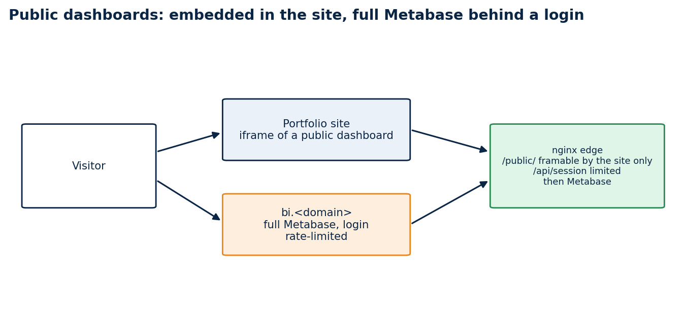
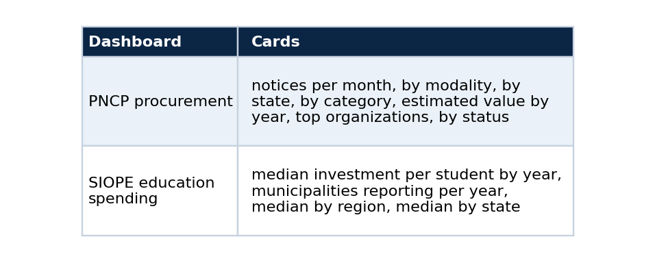

# Put real dashboards in a portfolio: Metabase public links, an nginx edge and a seed script

### A tutorial: stand up Metabase over a read-only Postgres, build dashboards from code, embed them safely in your site, and check that they actually draw

A portfolio screenshot shows that you once made a dashboard. A live dashboard lets a visitor look at the data, and it proves the pipeline behind it still runs. The catch is that a BI tool wants a login, an iframe wants permission, and a public database wants limits.

This tutorial sets that up with Metabase, an nginx edge and one seed script, so the dashboards are rebuilt from code and not from clicks. It assumes the Postgres from the companion article, with a small `bi` schema of materialized views.



*Visitors see a public dashboard inside the site. The full Metabase sits on its own name, behind a login.*

## What you will have

Two public dashboards (PNCP procurement and SIOPE education spending) shown inside the portfolio, and the full Metabase interface on a separate name for people with an account, with login attempts rate-limited.

## Step 1: give Metabase a read-only role

Metabase should connect with a role that can only read, and only the views you intend to chart. I used a role called `bi_reader` with a 60-second statement timeout, and granted it the `bi` schema.

```sql
GRANT USAGE ON SCHEMA bi TO bi_reader;
GRANT SELECT ON ALL TABLES IN SCHEMA bi TO bi_reader;
```

If Metabase runs in another Docker network, connect it to the database network:

```bash
docker network connect pncpdb public-demo-metabase-1
```

## Step 2: chart views, not tables

Every card reads a few rows from a materialized view. A question such as "notices per month" reads 55 rows, so a public page cannot be slowed down by a visitor reloading it.



Put the statement of scope in the dashboard itself, as a text card at the top. Mine says what the data covers and that counts describe released records only. The PNCP card also warns that estimated values are shown as published and include implausible entries that dominate the yearly sums. The education card says that values are nominal, that each municipality counts once per year using the latest period it filed, and that 2025 is a partial year. A chart without that sentence invites a reading the data cannot support.

## Step 3: build the dashboards from code

Clicking in a UI makes a dashboard you cannot reproduce. The Metabase API lets a script register the database, create each card as a native SQL question, place the cards on a dashboard, switch on the public link, and print the address. The script is idempotent: it reuses cards and dashboards by name.

```python
def ensure_database(mb):
    for db in mb.call("GET", "/api/database")["data"]:
        if db["name"] == DB_NAME:
            return db["id"]
    return mb.call("POST", "/api/database", {
        "engine": "postgres", "name": DB_NAME,
        "details": {"host": PG_HOST, "port": 5432, "dbname": PG_DB, "user": PG_USER, "password": PG_PASSWORD}})["id"]

def ensure_card(mb, db_id, name, display, sql):
    body = {"name": name, "display": display,
            "dataset_query": {"type": "native", "database": db_id, "native": {"query": sql}},
            "visualization_settings": {}}
    ...  # PUT when a card with that name exists, POST otherwise
```

Run it from a throwaway container on the same network, with credentials from the environment:

```bash
docker run --rm --network public-demo_app \
  -e MB_URL=http://metabase:3000 -e METABASE_ADMIN_EMAIL -e METABASE_ADMIN_PASSWORD \
  -e PG_HOST=pncp-db-db-1 -e PG_DB=pncp -e PG_USER=bi_reader -e PG_PASSWORD \
  -v ./seed:/seed:ro python:3.12-slim python /seed/seed_dashboards.py
# pncp_dashboard_uuid=...
# siope_dashboard_uuid=...
```

Because the script is idempotent, the same command updates a card's SQL or a banner and keeps the public address stable. I used that when I added a warning to the PNCP banner.

## Step 4: an edge that allows embedding and limits logins

Metabase refuses to be framed by default. The edge, a small nginx, changes that for public dashboards only, and limits the login route.

```nginx
limit_req_zone $binary_remote_addr zone=bi_login:10m rate=6r/m;

location = /api/session {
    limit_req zone=bi_login burst=5 nodelay;
    proxy_pass $metabase;
}

location ^~ /public/ {
    proxy_hide_header X-Frame-Options;
    proxy_hide_header Content-Security-Policy;
    add_header Content-Security-Policy "frame-ancestors 'self' https://your-site.example" always;
    proxy_pass $metabase;
}
```

The `frame-ancestors` header is the important line. It lets your site frame the public dashboards and no one else. The login route allows six attempts a minute per address, with a short burst.

## Step 5: embed with honest states

On the site, the dashboard sits in an iframe. A dashboard can fail to load or load slowly, and the page should say so instead of showing a blank rectangle, so the frame component has three states: loading, unavailable after a timeout, and ready.

```tsx
<iframe title="PNCP procurement dashboard"
        src={`${publicUrl}#bordered=false&titled=false`}
        onLoad={() => setState("ready")} />
```

If the address is not configured, the component says the dashboard is not connected yet. It never fakes one.

## Check that it really draws

This is the step I would not skip. My first automated check passed because it looked for the card titles, and the titles are in the page before any chart has data. A screenshot of the same page showed grey placeholders where the charts should be.

So I measured. The page requested all seven card queries at about 15 seconds after it started loading, the server answered each with HTTP 202 (Metabase streams the result while the query runs), and all the charts were drawn by about 45 seconds on a server that was also running exports. One card answered in 2.7 seconds when called directly through the API, so the delay is in how Metabase handles a cold public page on a loaded machine, not in the SQL.

Two practical conclusions. First, an automated check should wait for something that only exists once data has drawn, such as an axis label, not for the title. Second, a first view that takes this long is a poor demo, so I treat it as a known limit and would turn on Metabase's query caching once the server has spare capacity.

```bash
curl -s -o /dev/null -w "%{http_code}\n" https://bi.example/public/dashboard/<uuid>          # 200
curl -s https://bi.example/api/public/dashboard/<uuid> | python -c "import sys,json;d=json.load(sys.stdin);print(d['name'],len(d['dashcards']))"
curl -sI https://bi.example/public/dashboard/<uuid> | grep -i content-security-policy          # frame-ancestors
```

Mine returned 200 for both dashboards, 8 cards on the PNCP one (seven charts and the scope text) and 5 on the SIOPE one (four charts and the scope text), and the expected `frame-ancestors` header.

## Limits

A public dashboard shows whatever its cards query, so keep the `bi` schema to aggregates you are happy to publish. The views need a refresh when the source changes, and they do not refresh on their own. The education figures are nominal amounts and I have not audited them against another source. The first load of a public page is slow on my server.

## Code and links

- [vps_rt_infra](https://github.com/RangelTech/vps_rt_infra): `pncp-dashboard` with the seed script, the nginx template and the views
- [lucas-rangel-portfolio](https://github.com/LucasRangelSSouza/lucas-rangel-portfolio): the pages and the frame component
- [Kaggle datasets](https://www.kaggle.com/lucasrangelss/datasets): the public datasets behind these projects, with schemas and SHA-256 manifests
- [GitHub profile](https://github.com/LucasRangelSSouza): all repositories

My portfolio: [https://rangeltech.net](https://rangeltech.net)
