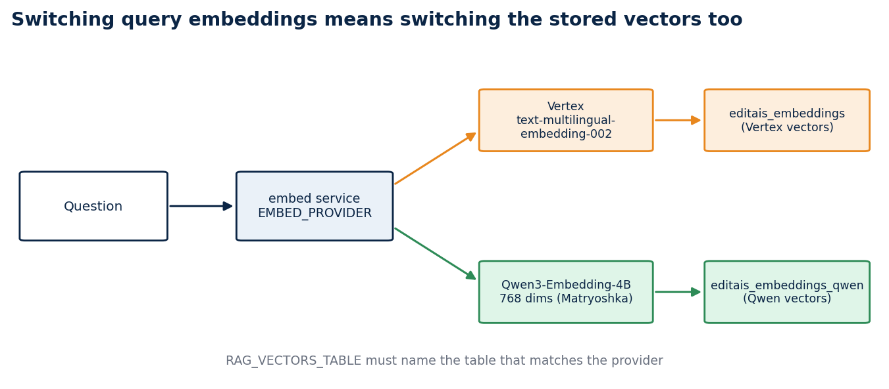
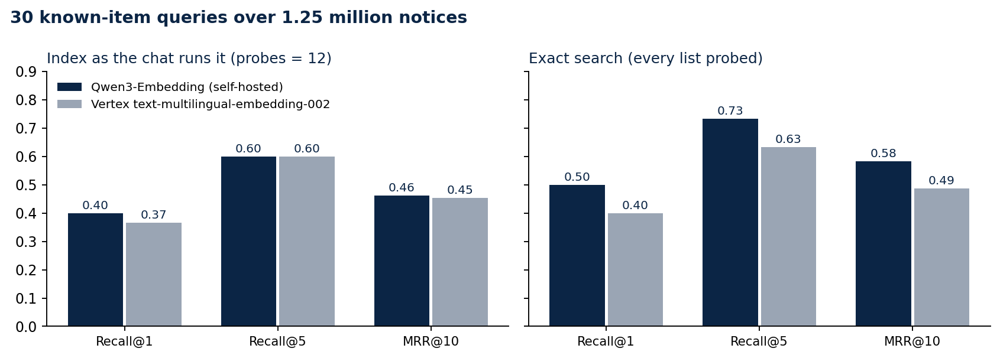

# I swapped a managed embedding API for my own model. The index cost more recall than the model did.

### Re-embedding 1.25 million procurement notices with Qwen3-Embedding, then measuring it against Vertex on the same 30 questions

My RAG chat searches Brazilian procurement notices by meaning. For its first weeks the vectors came from Vertex AI's `text-multilingual-embedding-002`. I already ran a Qwen model on a rented GPU for the chat's answers, so I moved the embeddings there too: one fewer cloud account, no per-call bill, and an endpoint I control.

The move only made sense if search did not get worse. This article covers the swap, what broke during it, and a small benchmark that compares the two models and, as it turned out, the vector index behind them.

## What had to change

A query vector and the stored vectors must come from the same model. Switching the query side alone gives nonsense neighbours, so the swap meant embedding all 1,250,335 notices again into a second table, `pncp.editais_embeddings_qwen`, while the chat kept serving from the Vertex table.

Both tables store `halfvec(768)`. Qwen3-Embedding produces longer vectors, but it is trained so that the first dimensions carry most of the meaning, and truncating to 768 kept the schema, the index settings and the storage identical to the Vertex table. The model also expects an instruction on the query side only, so the embedder sends `Instruct: ... Query: <text>` for questions and the plain text for notices. Getting that asymmetry wrong is easy to miss, because every search still returns results.

## The re-embedding stalled twice

The re-embedding job streamed notice text from BigQuery and wrote vectors to Postgres at roughly 22 to 28 texts per second. It stopped twice for reasons that had nothing to do with embeddings.

The first time, the BigQuery Storage read session expired after a few hours. The producer thread died, the Python process stayed alive, and the counter froze at 871,776 for more than six hours. My watchdog only checked whether the process existed, so it saw nothing wrong. A watchdog for a job like this has to compare the row count between checks and treat a flat count as a failure.

The second time, the rented GPU went into a provider queue and the embedding endpoint returned errors until it came back. Nothing on my side could fix that. What made both stalls cheap was that the job resumes: it skips every notice id already in the table, so a restart costs minutes instead of a day.

Once the table was full I built an IVFFlat index with 1,100 lists, the same as the Vertex table, and pointed the chat at it.

## How I measured

I wanted a test I could run in an hour and repeat later, without a team of annotators. I used known-item search. I drew notices at random from the published table with a fixed seed, kept ones whose text was specific enough to identify, and wrote one query per notice the way a person would type it, in different words from the notice. "Escavadeira anfíbia para desassorear lagoa e rio" targets a notice that asks for an amphibious excavator to clear a lagoon and a river. The target is the notice the query was written from.

Thirty queries ran through each model's own embedder and each model's own table, using the chat's search query. I report Recall@1, Recall@5 and MRR over the top 10, and a McNemar test on the top-1 hits, because the two models answer the same 30 questions and the comparison is paired.

## Results

I ran everything twice: once with the index as the chat uses it (`ivfflat.probes = 12`), and once probing all 1,100 lists, which makes the search exact.

With the chat's settings the two models are level. Qwen found the target first 12 times out of 30 and Vertex 11 times; both had it in the top five 18 times.

With exact search, Qwen pulls ahead: Recall@1 0.50 against 0.40, Recall@5 0.73 against 0.63, MRR 0.58 against 0.49. On the top-1 hits, Qwen was right where Vertex was wrong in 6 queries and Vertex was right where Qwen was wrong in 3. With so few discordant pairs the McNemar p-value is 0.51, so this sample cannot tell the models apart. I read it as "Qwen is at least as good here", not as "Qwen is better".

The larger effect is the index. Going from 12 probes to exact search raised Recall@5 by 0.13 for Qwen and by 0.03 for Vertex, which means the approximate index was hiding correct answers that the Qwen vectors had placed well. The price is time: a search took a median of about 0.8 seconds with 12 probes and 3 to 4 seconds exact, on a busy shared server.

Embedding a query took a median of 346 ms on the self-hosted model and 840 ms on Vertex, measured from the same server.

## What the misses say

Seven queries failed on both models even with exact search: plastic water pipes, large waste bins, staff T-shirts, surgical suture thread, educational toys, a fire-safety project for a school, and bench tools. Each describes something that thousands of municipalities buy every year. The model finds notices about suture thread without trouble; it cannot know which of them I had in mind. Known-item search punishes generic questions, and a relevance-judged benchmark would score those results as correct.

## What I changed

The chat stays on Qwen. I left the index settings alone for now, because more probes cost seconds on this server. The measurement shows where the recall goes; the next step is a larger probe count tested under real load, or HNSW on a machine with enough memory to build it.

## Limits

Thirty queries is a small sample, written by one person who knew the targets. Known-item search measures whether one specific notice comes back, which understates quality for generic questions. The latencies come from one loaded server and include network time to the GPU and to Google's endpoint. The Vertex vectors were built earlier from the same notice text; I did not re-embed them for this test.

## Code and links

- [rag-chat](https://github.com/LucasRangelSSouza/rag-chat): the chat, the embedder and `scripts/eval_embeddings.py` with the queries and both result files in `docs/evidence/embeddings-eval`
- [Kaggle: pncp-analytics](https://www.kaggle.com/datasets/lucasrangelss/pncp-analytics): the notice table the vectors were built from
- [RAG Chat](https://rag.rangeltech.net): the live chat

My portfolio: [https://rangeltech.net](https://rangeltech.net)
