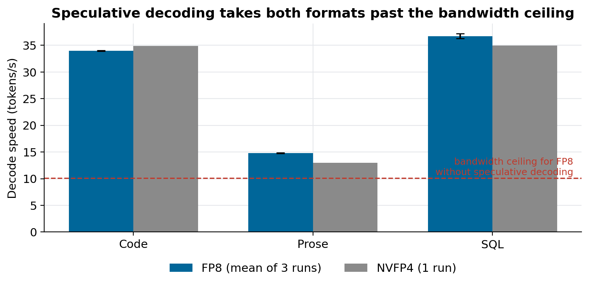
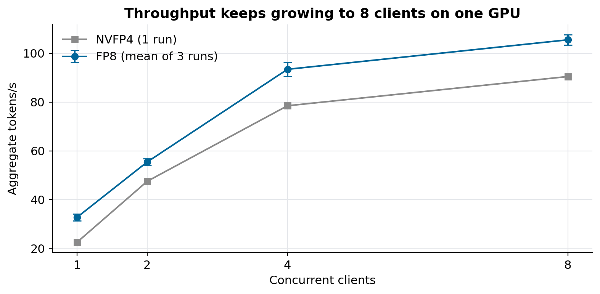
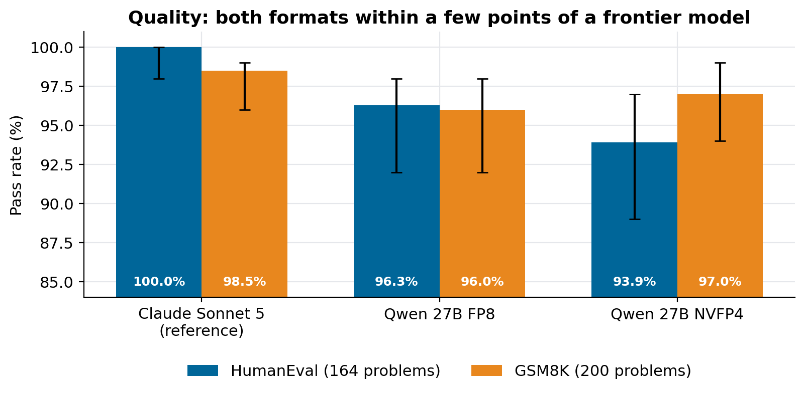
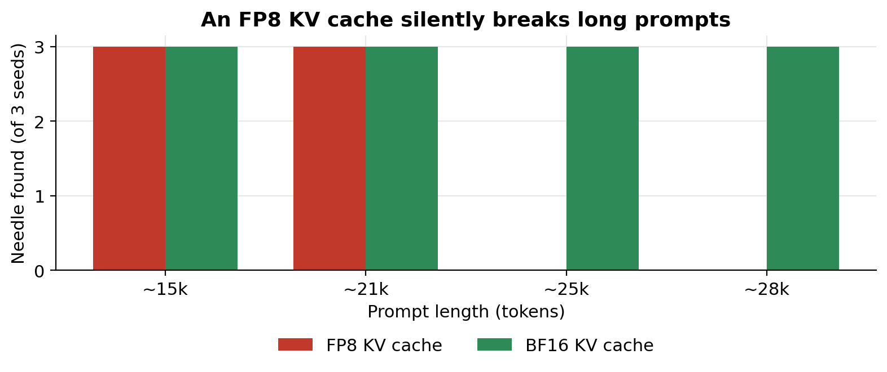
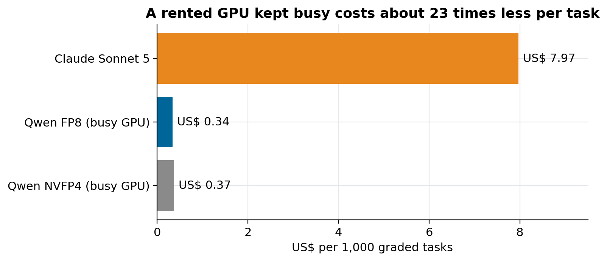

# Qwen 27B in FP8 vs NVFP4: is the smaller format worth it?

### Same weights, two precisions, 364 graded tasks: quality was statistically the same, FP8 was at least as fast, and a busy rented GPU cost US$ 0.34 per thousand tasks against US$ 7.97 for a frontier API.

I serve a 27-billion-parameter open model, an abliterated Qwen3.8-27B, on one rented NVIDIA GB10. The obvious way to make it faster is to shrink the weights: NVFP4 stores each weight in about half a byte, FP8 in one. Half the bytes should mean twice the speed. It didn't, and the reason is the most useful thing I learned running this endpoint.

Everything below comes from [qwen-abliterated-api](https://github.com/LucasRangelSSouza/qwen-abliterated-api): the scripts that produced each number, the raw JSON in `reports/`, and the summary in `docs/RESULTS.md`. You can rerun all of it against your own OpenAI-compatible endpoint.

> **In short**
> - Quality: FP8 and NVFP4 are within each other's error bars on HumanEval and GSM8K (paired McNemar p = 0.125 and 0.688). Both sit a few points below Claude Sonnet 5.
> - Speed: with speculative decoding on, FP8 decodes code at 34 tokens/s and is as fast as NVFP4 or faster on every workload I measured.
> - Long context: the KV cache precision mattered more than the weight precision. An FP8 KV cache lost the answer in every prompt above ~25k tokens.
> - Cost: kept busy, the rented GPU costs about 23 times less per task than the API. It wins above roughly 4% utilisation.

## Why halving the bytes should double the speed

Generating one token means reading every weight of the model once. On a GPU that reads memory at 273 GB/s, the ceiling is simple division:

| Format | Weights read per token | Ceiling |
|---|---:|---:|
| BF16 | ~54 GB | ~5 tokens/s |
| FP8 | ~27 GB | ~10 tokens/s |
| NVFP4 | ~14 GB | ~20 tokens/s |

My first deployment ran in BF16 and decoded at 4.4 tokens/s, right on its ceiling. The table says NVFP4 should be the clear winner. That holds for plain decoding. It stops holding once you add speculative decoding.

## Speculative decoding changes the arithmetic

A small drafter model (here `z-lab/Qwen3.8-27B-DFlash2`, 3.6 GB) proposes seven tokens per step. The 27B model checks all seven in a single pass over its weights and keeps the prefix it agrees with. One weight read now produces several tokens, so speed is no longer bytes divided by bandwidth. It depends on how often the target accepts the draft, and that depends on how predictable the text is.


*Decode speed with speculative decoding on. FP8 is the mean of three runs on 2 October 2026 (the error bars are one standard deviation, barely visible); NVFP4 is a single earlier run. The dashed line is what FP8 could do without the drafter.*

Code and SQL are predictable: the target accepts most of the draft and both formats land near 35 tokens/s, more than three times the FP8 ceiling. Prose is less predictable, acceptance drops, and speed falls to about 15 tokens/s for both. Once most of the cost is verifying drafts, the half-byte saving of NVFP4 buys almost nothing.

The same pattern holds when several clients share the GPU. Aggregate throughput keeps growing up to eight concurrent requests:


*Throughput with 1 to 8 concurrent clients. FP8 reached 32.7, 55.4, 93.5 and 105.6 tokens/s (mean of three runs).*

One caution about these two charts. The NVFP4 line is a single run, so a gap of a few tokens per second between the formats is within noise. My first FP8 run showed only 22 tokens/s with two clients; three fresh runs gave 55.4 ± 1.4. It was a warm-up outlier, and I would not have known without repeating the cell.

## Quality: measured against a frontier model

Speed is useless if the answers get worse, so I graded both formats on the same problems as a reference model:

- **HumanEval**, all 164 problems, pass@1, greedy decoding, with the generated code executed locally.
- **GSM8K**, the first 200 test problems, exact match on the final number.
- Qwen ran with thinking off. The reference was Claude Sonnet 5 at medium effort, with no tools.


*Pass rate with 95% Wilson intervals.*

| Comparison | HumanEval (wins A / wins B, p) | GSM8K (wins A / wins B, p) |
|---|---|---|
| Sonnet 5 (A) vs Qwen FP8 (B) | 6 / 0, p = 0.031 | 6 / 1, p = 0.125 |
| Sonnet 5 (A) vs Qwen NVFP4 (B) | 10 / 0, p = 0.002 | 5 / 2, p = 0.453 |
| Qwen FP8 (A) vs Qwen NVFP4 (B) | 4 / 0, p = 0.125 | 2 / 4, p = 0.688 |

Because both formats answer the same problems, the right test is a paired one: exact McNemar on the problems where the two disagree. Sonnet is ahead on code, and that gap is real. Between FP8 and NVFP4 there are four disagreements on HumanEval and six on GSM8K, in opposite directions, and neither is significant. With 164 and 200 problems I can't tell the two formats apart on quality.

Before trusting any of this I audited the grader. It had two real bugs (helper functions missing from the executed code, and an output limit of 1,024 tokens) and one design flaw. After fixing all three, totals moved by only minus 1 and plus 3 problems. Run-to-run variation at temperature 0 was of the same order, because batching and speculative decoding are not deterministic, which is exactly why the table rests on paired tests and not on who scored higher.

## Long context: the KV cache was the real risk

The weights were not where precision hurt. The KV cache was: the memory that holds the attention state of the prompt. vLLM can store it in FP8 to fit more context. I ran a needle-in-a-haystack test (a fact hidden in a long prompt, then a question about it) with three seeds per length:


*With an FP8 KV cache the needle was found up to ~21k tokens and lost in every attempt above ~25k. With BF16 it was found every time.*

The failure was silent. The model didn't refuse or error. It produced fluent garbage that started with repeated fragments. A short benchmark would never have shown it, because short prompts never reach that length. The default profile now keeps the KV cache in BF16 and serves a 160,000-token context. With BF16, both weight formats found the needle at ~30k, ~60k, ~93k and ~140k tokens. FP8 reached the first token faster at every length, 99 s against 121 s at ~140k.

## Cost: it depends on how busy the GPU is

The GPU rents for US$ 0.449 an hour whether it works or not. I ran the 364 graded tasks with four parallel requests and priced each run by its wall-clock time. For Sonnet I used the API-equivalent cost reported by Claude Code.


*US$ per 1,000 graded tasks: Sonnet 5 at 7.97, Qwen FP8 at 0.34, Qwen NVFP4 at 0.37.*

That 23× gap only holds while the GPU is busy. One GPU-hour buys about as much as 56 Sonnet tasks of this size, and a saturated GPU does about 1,308 such tasks an hour. Renting wins above roughly 4% utilisation and loses below it. An idle GPU is the most expensive model you can run.

## What I chose, and when I would choose differently

I serve **FP8 weights with a BF16 KV cache and speculative decoding**. Quality is the same as NVFP4 within what I can measure, speed is the same or better, and FP8 loads from the original BF16 checkpoint at startup, so there is one fewer converted artefact to trust.

I would pick NVFP4 when memory is the constraint: a larger model on the same GPU, or several models side by side. I would also revisit the choice for a workload of long free prose, where speculative decoding helps least and raw bandwidth matters again.

## Limits

- One abliterated lineage on one GPU type. Other checkpoints, or a GPU with more bandwidth, can change the balance.
- NVFP4 speed comes from single runs; only FP8 was repeated.
- HumanEval and GSM8K are narrow. They say nothing about refusal behaviour, which I measure separately.
- The cost comparison uses API-equivalent prices; on a subscription the marginal cost of the reference is different.

## Reproduce it

```bash
git clone https://github.com/LucasRangelSSouza/qwen-abliterated-api
cd qwen-abliterated-api
export BASE_URL=https://your-endpoint/v1 API_KEY=... MODEL=qwen-abliterated
python tests/suite.py --only speed,concurrency --out reports/runs/my-run.json
python tests/quality.py          # HumanEval and GSM8K against your endpoint
python tests/longctx.py          # needle in a haystack by prompt length
python tests/make_results.py     # rebuilds docs/RESULTS.md from reports/
```

The FP8 repeats behind the speed charts are in `reports/runs/repeat-2026-10-02/`. The serving setup that produced them is the subject of the companion article, *How to self-host an uncensored LLM*.
