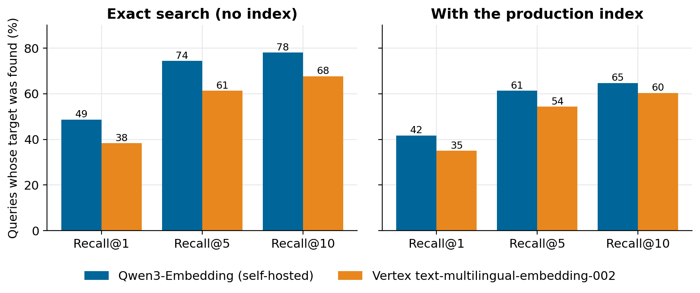
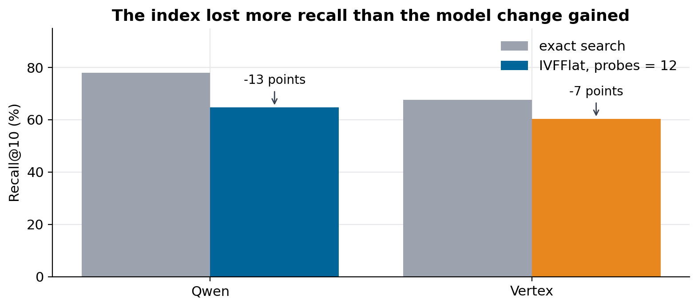

# Vertex AI vs open-source embeddings: which finds more?

### 300 Portuguese queries over 1.25 million procurement notices: a self-hosted Qwen3-Embedding beat Vertex's multilingual model by 10 points of recall@1, and the vector index cost more than either model choice

My public RAG chat searches Brazilian procurement notices by meaning. For its first weeks the vectors came from Google's `text-multilingual-embedding-002` on Vertex AI. I already ran an open Qwen model on a rented GPU for the chat's answers, so I moved the embeddings there too: one fewer cloud account, no per-call bill, and an endpoint I control.

That swap only makes sense if search doesn't get worse. So I measured it, twice. The first benchmark, with 30 queries, said "probably no difference" and couldn't say more. This one has 300, a decision rule written before the run, and a clear answer.

The queries, the script, the raw results and the summary are in [rag-chat](https://github.com/LucasRangelSSouza/rag-chat) (`scripts/eval_embeddings.py`, `docs/evidence/embeddings-eval/v2-300/`). The notices are the public PNCP dataset from [brazil-public-data-map](https://github.com/LucasRangelSSouza/brazil-public-data-map).

> **Result**
> - Exact search: Qwen found the right notice first for 48.7% of queries, Vertex for 38.3%. The 95% interval of the difference is 4.7 to 16.3 points; McNemar p = 0.0006.
> - Through the production index (IVFFlat, 12 probes) both models lost recall, Qwen more: 41.7% against 35.0%, and the gap is no longer clearly significant (p = 0.052).
> - Qwen embedded a query in 321 ms (median) against 446 ms for Vertex, on my GPU and from my server.

## The setup

Both models produce 768-dimensional vectors stored as `halfvec(768)` in Postgres with pgvector, one table each, over the same 1,250,335 notices:

| | Vertex | Qwen |
|---|---|---|
| Model | `text-multilingual-embedding-002` | Qwen3-Embedding-4B |
| Where it runs | Google Cloud, per call | vLLM on my rented GPU, beside the chat model |
| Dimensions | 768 | 768 (truncated; the model is trained so the first dimensions carry most of the meaning) |
| Query side | plain text | `Instruct: ... Query: <text>` |

That last row hides an easy mistake. Qwen3-Embedding expects an instruction on queries and nothing on documents. Leave it off and every search still returns results, just worse ones, so nothing warns you.

Swapping models means re-embedding everything: a query vector and the stored vectors must come from the same model. The job streamed notice text from BigQuery into Postgres at 22 to 28 texts per second and stalled twice. Once the BigQuery read session expired and the producer thread died while the process stayed alive, so a watchdog that only checked for the process saw nothing wrong; it now compares row counts between checks. Once the GPU went into the provider's queue. Both cost minutes instead of a day because the job skips ids already in the table.

## How I measured

**Known-item retrieval.** Each query is a paraphrase of one real notice's object, written the way a person searches: "concessão para construir e explorar restaurantes na orla de Miramar em Cabedelo" for a notice about a beach-front restaurant concession. The target is that notice; success is finding it.

- **300 queries.** The 30 from the first benchmark plus 270 new ones, drawn with a fixed seed (`TABLESAMPLE SYSTEM (0.5) REPEATABLE (77)`) from notices with objects of 80 to 350 characters that exist in both tables.
- **Who wrote them.** A model from neither family under test (Claude, by Anthropic), so neither embedder was scoring text written by its own relatives.
- **Two conditions.** Exact search, which visits every vector, isolates the model. The production setting (IVFFlat with 1,100 lists and 12 probes) is what users get.
- **Metrics.** Recall@1, @5 and @10, MRR@10, a paired McNemar test on top-1 hits, and a 5,000-sample bootstrap for the interval of the recall@1 difference.
- **The rule, fixed in advance.** "Qwen is better" only if the 95% interval of the recall@1 difference in exact search excludes zero.

## Results


*Exact search on the left isolates the model. The production index on the right is what the chat returns.*

| Condition | Model | R@1 | R@5 | R@10 | MRR@10 |
|---|---|---:|---:|---:|---:|
| exact | Qwen | 0.487 | 0.743 | 0.780 | 0.592 |
| exact | Vertex | 0.383 | 0.613 | 0.677 | 0.481 |
| probes 12 | Qwen | 0.417 | 0.613 | 0.647 | 0.504 |
| probes 12 | Vertex | 0.350 | 0.543 | 0.603 | 0.433 |

In exact search, 55 queries were found first only by Qwen and 24 only by Vertex. The recall@1 difference is 10.4 points with an interval of 4.7 to 16.3, so the rule is met: on this data, Qwen retrieves better. The gap held on both query sets, the original 30 and the new 270.

## The index cost more than the model


*Going from exact search to the production index cost Qwen 13 points of recall@10 and Vertex 7. The model choice was worth about 10.*

IVFFlat splits the vectors into 1,100 clusters and, with `probes = 12`, searches only the 12 closest to the query. When the right notice sits in a cluster the query didn't probe, it is never seen, however good the embedding. Qwen lost more here, which suggests its vectors spread the notices across clusters differently from Vertex's, so 12 probes cover less of its neighbourhood.

So the cheapest recall on the table isn't a better model: it is a better index setting. More probes cost latency (exact search took about 1.3 s per query on this server, against 69 ms with 12 probes), and HNSW trades memory for recall. That is the subject of *pgvector at a million rows: IVFFlat or HNSW?*.

## What the misses say

In exact search, 54 queries missed with both models: "polyethylene pipes for household water connections", "large plastic bins for waste management", "surgical suture thread". Each describes something thousands of municipalities buy every year. Both models find notices about suture thread without trouble; they can't know which of them I had in mind. Known-item search punishes generic queries, and a benchmark with human relevance judgements would score many of those results as correct. That makes the absolute numbers here pessimistic. The comparison between models is still fair, because both face the same queries.

## What I changed

The chat stays on Qwen: better retrieval, no per-call bill, and one less cloud credential to manage. The next change is the index, measured against the latency a visitor will accept.

## Limits

- One domain (Brazilian procurement, in Portuguese) and one task (known-item retrieval). A relevance-judged benchmark or another language can rank the models differently.
- Queries written by one model. A different writer, or real user queries, would test a different distribution.
- Vertex's result on the first 30 queries moved by one hit between the two benchmarks, so expect a point of run-to-run noise.
- Latency depends on where each model runs; Vertex calls cross the internet, Qwen calls cross a rented GPU's network.

## Reproduce it

```bash
git clone https://github.com/LucasRangelSSouza/rag-chat && cd rag-chat
# embed the queries with each provider (run where the embedder credentials live)
EMBED_PROVIDER=qwen   python scripts/eval_embeddings.py embed qwen   docs/evidence/embeddings-eval/queries-300.json vectors-qwen.json
EMBED_PROVIDER=vertex python scripts/eval_embeddings.py embed vertex docs/evidence/embeddings-eval/queries-300.json vectors-vertex.json
# search each table, exact (PROBES=1100) and as in production (PROBES=12)
PROBES=1100 python scripts/eval_embeddings.py search pncp.editais_embeddings_qwen vectors-qwen.json res-qwen-p1100.json
python scripts/eval_embeddings.py report res-qwen-p1100.json res-vertex-p1100.json
```
