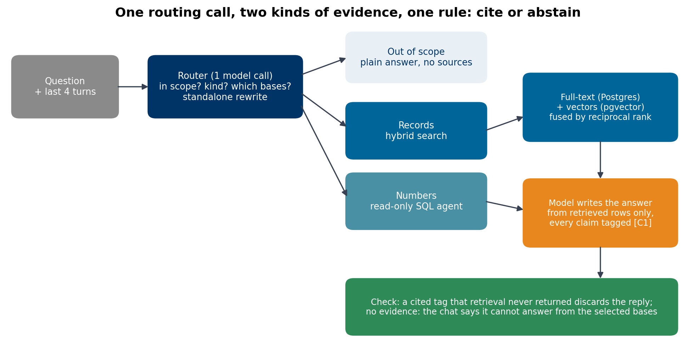

# How to build a RAG agent over your own data

### Hybrid search that fuses Postgres full-text and pgvector, a SQL agent for questions that need numbers, one model call that routes everything, and answers that cite their records or say they can't: 55 of 60 test questions right on public data

A RAG demo answers one friendly question about one PDF. A RAG agent people can use has to cope with what they type: questions about records ("which notices are about school uniforms in Goiás?"), questions about numbers ("how many contracts did Recife sign in 2023?"), follow-ups ("and in 2024?"), and "good morning". Each needs a different path, and every answer has to show where it came from.

This is how my public RAG chat does it, over 1.25 million Brazilian procurement notices plus contracts and education-spending tables, all in one Postgres. It runs at [rag.rangeltech.net](https://rag.rangeltech.net), and the code is [rag-chat](https://github.com/LucasRangelSSouza/rag-chat).

> **What it does, in numbers**
> - One model call routes each question: in or out of scope, records or numbers, which bases, and a standalone rewrite that uses the last four turns.
> - Records come from hybrid search: Postgres full-text and pgvector, fused by reciprocal rank.
> - On a fixed set of 60 questions with answers computed beforehand, 55 were right: 18 of 20 on notices, 37 of 40 on the SQL bases.


*Every path ends in the same rule: an answer cites the rows it used, or the chat says it can't answer from the selected bases.*

## Step 1: route with one model call

The first version used keyword rules to decide what kind of question it was. They broke on the first follow-up. Now one call to the model returns a small JSON object:

```json
{"scope": "in", "kind": "aggregate", "bases": ["pncp-sql"],
 "standalone": "How many contracts did Recife sign in 2024?", "numeric_part": ""}
```

- **scope** separates questions about the data from everything else. Out-of-scope questions, from "good morning" to general knowledge, get a plain conversational answer marked as using no sources, instead of a refusal.
- **kind** is `records` (find specific items), `aggregate` (a count, total or ranking), `mixed` (both) or `summary` (recap the conversation).
- **standalone** rewrites a follow-up into a full question using the last four turns, so "and in 2024?" is searched as the full question it means.
- **bases** picks which of the selected sources the question needs.

If the call fails or returns invalid JSON, a keyword fallback takes over and treats the question as in scope: a wrong refusal costs more than a weaker answer.

## Step 2: hybrid search for records

Neither kind of search is enough alone. Full-text search finds exact terms (a supplier name, a product code) and misses paraphrases. Vector search finds paraphrases and loses exact terms in the noise. The store runs both and fuses the two ranked lists with reciprocal rank fusion, which needs no score calibration between them:

```python
def fuse(rankings, k=60):
    score = {}
    for ranking in rankings:
        for position, key in enumerate(ranking):
            score[key] = score.get(key, 0.0) + 1.0 / (k + position + 1)
    return [key for key, _ in sorted(score.items(), key=lambda item: -item[1])]

def search(self, question, k=5):
    uf, topic = state_filter(question)                 # "em Goiás" becomes WHERE sigla_uf = 'GO' on both searches
    total, text_ids = self._text_ids(topic, 25, uf)    # tsvector + ts_rank_cd, Portuguese configuration
    vector_ids = self._vector_ids(question, 25, uf)    # pgvector cosine distance on halfvec(768)
    return fuse([text_ids, vector_ids])[:k]
```

Two details made a large difference. The **state filter** turns a place in the question into a `WHERE` clause on both searches, so "school transport in Goiás" can't return a notice from Bahia just because it matched better. And the **embedding model** matters less than the index setting: switching from Vertex AI to a self-hosted Qwen embedding raised recall@1 by 10 points in exact search, while the IVFFlat index with 12 probes gave back 13 points of recall@10. Both measurements have their own articles, *Vertex AI vs open-source embeddings* and *pgvector at a million rows*.

## Step 3: SQL for anything that is a number

Retrieval can't count. "How many contracts..." needs a query, so `aggregate` questions go to a SQL agent: the model writes one `SELECT` from table notes and column comments, a validator checks it before the database sees it, a read-only role runs it with a timeout, and the answer shows the query and its rows. A `mixed` question runs both paths. The agent has its own article, *How to build a safe text-to-SQL agent*.

## Step 4: the answer must cite, or not be given

The model writes the answer only from what retrieval or SQL returned, tagging each claim with the record it came from (`[C1]`, `[C2]`). Then the code checks the tags:

- a reply that cites a tag retrieval never returned is discarded, and an extractive answer built from the records replaces it;
- a reply that is only tags, with no sentence, is discarded the same way;
- with no evidence at all, the chat says it can't answer from the selected bases.

The answer follows the question's language (Portuguese or English), keeps record names and identifiers untranslated, and formats money the Brazilian way. Each citation carries the dataset, its pinned version and the record ID, so a reader can walk from a sentence to a row.

## Step 5: make it fast enough to demo

- **Cache the answer** of a question asked without history for six hours. A demo question asked twice returns at once.
- **Warm the database.** After a restart, the first search took 16.8 seconds because nothing was in memory; `pg_prewarm` at startup and a scheduled warm-up every 30 minutes keep the indexes in cache.
- **Run the bases in parallel** when a question selects several.
- **Set timeouts end to end.** The proxy gave up at 25 seconds while the SQL path, which calls the model twice, was still working; every layer now waits longer than the one behind it, and any failure inside ends in an abstention, never a server error.

## How well it works

I wrote 60 questions (20 on notices, 20 on contracts, 20 on education spending), computed every expected answer with my own SQL before running anything, and sent them through the public API one at a time. Notice answers are graded by reading the state and object of every record they cite.

| Base | Correct |
|---|---:|
| Procurement notices (hybrid search) | 18 / 20 |
| Procurement contracts (SQL) | 18 / 20 |
| Education spending (SQL) | 19 / 20 |
| All | 55 / 60 |

The two retrieval misses cited notices in the right state but on a neighbouring topic: teaching material for "school supplies", engineering services that mention schools for "school renovation". That is the typical failure of hybrid search: close in meaning, wrong in scope. The SQL misses are in the text-to-SQL article. The questions, reference queries, answers and grader are in `docs/evidence/qa-60/`, so the test reruns after every change.

## Limits

- 60 questions is a regression test, not a benchmark of retrieval quality; it tells you when a change breaks something.
- The answer model is a 27B open model on a rented GPU, so answers take seconds, and wording varies between runs.
- The data is a released snapshot with a cutoff date, and the chat says so in every answer.

## Run it

```bash
git clone https://github.com/LucasRangelSSouza/rag-chat && cd rag-chat
# see README: a Postgres with the PNCP release, an OpenAI-compatible model endpoint and an embedding endpoint
python -m pytest backend/tests -q
python scripts/qa60.py ask docs/evidence/qa-60/questions.json answers.json   # against your deployment
```

The data comes from the public releases of [brazil-public-data-map](https://github.com/LucasRangelSSouza/brazil-public-data-map), and the model endpoint from *How to self-host an uncensored LLM*.
