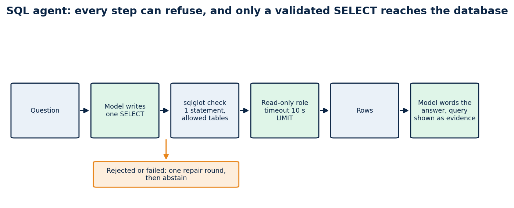

# How to build a safe text-to-SQL agent

### A role that can only read, a validator that runs before the database does, table notes the model reads, one repair attempt, and answers that show their query: 37 of 40 numeric questions right on public data

Retrieval is the wrong tool for numbers. If someone asks for the median education spending per student by region, pasting five similar paragraphs into a prompt can't give the right answer; a query can. So in my public RAG chat, the model writes SQL for the numeric datasets, Postgres runs it, and the answer cites the query.

Letting a language model write SQL against a real database is also how you get a dropped table or a ten-minute query on a shared server. This guide builds the agent with the guardrails in the order they matter, then tests it with 40 questions whose answers I computed first. The code is in [rag-chat](https://github.com/LucasRangelSSouza/rag-chat) (`backend/rag_chat_backend/sql_agent.py`).



*Every step can refuse. Only a validated SELECT reaches the database, and a failure ends in an abstention.*

## What you will build

A function `ask(question)` that returns `{sql, columns, rows, explanation}` or an error, and a chat path that turns rows into a cited answer. It answers education-finance and procurement-count questions, refuses to touch anything outside an allow-list of tables, and cannot write.

## Why text-to-SQL needs more than a prompt

A model that writes SQL can fail in four ways, and each needs its own defence.

| Failure | Defence |
|---|---|
| It writes something harmful (a write, a drop, a second statement) | a read-only database role, and a parser that accepts one SELECT |
| It reads something it should not (system catalogs, other schemas) | an allow-list of tables and a block on catalog names |
| It runs something expensive | a statement timeout and a row cap |
| It writes a valid query that answers the wrong question | descriptions in the schema, notes, a retry, and the query shown to the reader |

The first three are mechanical, so code can guarantee them. The fourth is not, which is why the last defence is transparency.

## Step 1: give it a role that cannot hurt you

Start with the database, not the model. The agent connects as a role that is read-only and has a short timeout.

```sql
CREATE ROLE sql_agent LOGIN PASSWORD :'agent_pw' CONNECTION LIMIT 6;
ALTER ROLE sql_agent SET statement_timeout = '10s';
ALTER ROLE sql_agent SET default_transaction_read_only = on;
GRANT SELECT ON ALL TABLES IN SCHEMA siope, ibge, bi TO sql_agent;
```

If every later check fails, this is the layer that still protects you.

## Step 2: validate what the model writes

A model's output is untrusted input. Parse it with `sqlglot` and accept only one statement that is a SELECT over tables from an allow-list.

```python
def validate_sql(sql: str, allowed: set[str]) -> str:
    """Return a single SELECT statement over allowed tables, or raise UnsafeSql. (abridged)"""
    text = sql.strip().rstrip(";").strip()
    if not text or len(text) > 4000:
        raise UnsafeSql("empty or too long")
    statements = sqlglot.parse(text, read="postgres")          # a parse error is a rejection
    if len(statements) != 1:
        raise UnsafeSql("exactly one statement is allowed")
    tree = statements[0]
    for node in tree.walk():                                     # no INSERT, UPDATE, DELETE, DROP, ALTER, CREATE
        if isinstance(node, (exp.Insert, exp.Update, exp.Delete, exp.Drop, exp.Alter, exp.Create, exp.Command)):
            raise UnsafeSql("only SELECT is allowed")
    cte_names = {cte.alias_or_name.lower() for cte in tree.find_all(exp.CTE)}
    for table in tree.find_all(exp.Table):                       # every table must be on the allow-list
        qualified = f"{table.db.lower()}.{table.name.lower()}" if table.db else table.name.lower()
        if table.name.lower() in cte_names and not table.db:
            continue
        if qualified not in allowed:
            raise UnsafeSql(f"table not allowed: {qualified}")
    if re.search(r"\bpg_\w+|information_schema", text, re.I):   # no system catalogs
        raise UnsafeSql("system catalogs are not allowed")
    return text
```

Then wrap the query so the result is bounded whatever the model wrote: `SELECT * FROM (<validated sql>) AS q LIMIT 50`.

## Step 3: tell the model what the tables mean

The prompt holds the schema, and the schema should carry descriptions. I copy the column and table descriptions from the lake into Postgres `COMMENT`s during the load, and the agent reads them:

```sql
SELECT a.attname, format_type(a.atttypid, a.atttypmod), col_description(a.attrelid, a.attnum)
FROM pg_attribute a WHERE a.attrelid = 'siope.obt_fnde_siope_indicador_municipio_ano'::regclass
  AND a.attnum > 0 AND NOT a.attisdropped ORDER BY a.attnum;
```

The system prompt states the rules in plain words:

```text
You write one PostgreSQL SELECT statement that answers the user's question over the tables described below.
Rules: one statement, SELECT only, use only the listed tables and columns, qualify tables with their schema,
aggregate and ORDER BY when the question asks for a ranking or total, and add LIMIT 50 at most.
Use the statistic the question names: PERCENTILE_CONT(0.5) WITHIN GROUP (ORDER BY col) for a median,
AVG only for an average.
Answer with JSON only: {"sql": "...", "explanation": "one sentence about what the query measures"}.
If the tables cannot answer the question, answer {"sql": null, "explanation": "why"}.
```

Each base can also carry a short note, attached to the prompt, for knowledge the column comments cannot express (which table to prefer, which column is sparse, which year is partial).

## Step 4: ask, run, repair once

```python
for attempt in range(2):
    reply = model.chat_json(SYSTEM, prompt + feedback)
    try:
        columns, rows = self.run(reply["sql"])
        if not rows and not feedback:
            feedback = "\n\nYour previous query returned no rows. Check the filters and ..."
            continue
        return {"sql": reply["sql"], "columns": columns, "rows": rows}
    except UnsafeSql as error:
        feedback = f"\n\nYour previous query was rejected: {error}. Write a corrected single SELECT."
    except Exception as error:
        feedback = f"\n\nYour previous query failed with: {str(error)[:200]}."
return {"error": "the model could not produce a valid query"}
```

One repair round is enough. More rounds mostly burn time and tokens on questions the data cannot answer.

## Step 5: the answer must show its work

The chat turns the rows into cited lines and lets the model word the answer. The interface shows the query and the rows under the answer, in a collapsed section labelled "SQL and result". Someone who doubts a number can open it and read the exact statement.

## Does it work? A fixed test with the answers computed first

I wrote 40 numeric questions about the two SQL bases (20 on education spending, 20 on procurement contracts), computed each expected answer with my own SQL before running anything, and sent the questions one at a time through the public chat. A number counts as correct within 0.5%, and counts must match exactly.

| Base | Correct |
|---|---:|
| Education spending | 19 / 20 |
| Procurement contracts | 18 / 20 |

The three misses are more useful than the score:

- **It answered a question I didn't ask.** Asked how many municipalities spent more than R$ 20,000 per student, it also excluded values above R$ 100,000 as probable typos and answered 1,838 instead of 1,841. It said so in the answer, which is the only reason I caught it.
- **It searched too broadly.** "School uniform contracts" became `LIKE '%uniforme%'`, which counts every uniform contract, not only school ones: 2,448 against 328.
- **It read the question differently, and defensibly.** "School transport contracts in Bahia" added synonyms to the pattern and counted 370 against my 360. My reference SQL is not more right; it is narrower.

Every one of these is visible only because the answer shows the SQL. The questions, the reference queries, the answers and the grader are in `docs/evidence/qa-60/` of the repository, so you can rerun them after any change to the prompt or the notes.

## The ways it got the answer wrong first

**It picked the wrong table.** For the per-student question, the first version chose a wide "general data" table whose expenditure columns are mostly empty from 2023 on, invented a filter on the reporting period, got zero rows and abstained. The data was there, in a different table. The repair was a short note attached to the base, telling the agent which table holds the per-student indicator and that the general table is sparse, plus a ready-made view and comments on it. After that the agent chose the right source.

**It returned nothing and gave up.** An empty result is usually a wrong filter. I added the one retry with an explicit "no rows, check the filters" instruction, and the second attempt can change tables.

**It answered a different question than it was asked.** A query that asked for the state with the highest median used `AVG`, and the answer called it a median. I added a sentence to the system prompt: use `PERCENTILE_CONT(0.5)` for a median and `AVG` only for an average. A validator cannot catch this. Only reading the SQL can, which is another reason to show it.

**The plumbing gave up before the agent did.** The web proxy stopped waiting after 25 seconds while the agent was still working, and the interface showed "service unavailable". I raised the proxy limit to 100 seconds, raised the model timeout to 45 seconds, and made every failure inside the agent end in an abstention instead of a server error.

## How to test your own agent

1. Write ten questions whose answers you can compute by hand, and keep the numbers.
2. Run them through the full path and compare. A query that runs is not a query that is right.
3. Add a question the data cannot answer and check that it abstains.
4. Time each answer, and set your proxy and model timeouts above the slowest.
5. Read the SQL of every answer you plan to quote.

## Limits

The agent is as good as the notes and comments you give it, and it can still choose badly. The allow-list, the read-only role and the timeout bound the damage and do not prove the answer right. The statistics quoted above are nominal BRL, the latest reporting period per municipality and year, and I have not checked them against an independent source. Latency is high for a demo, and two sequential model calls are the reason.
