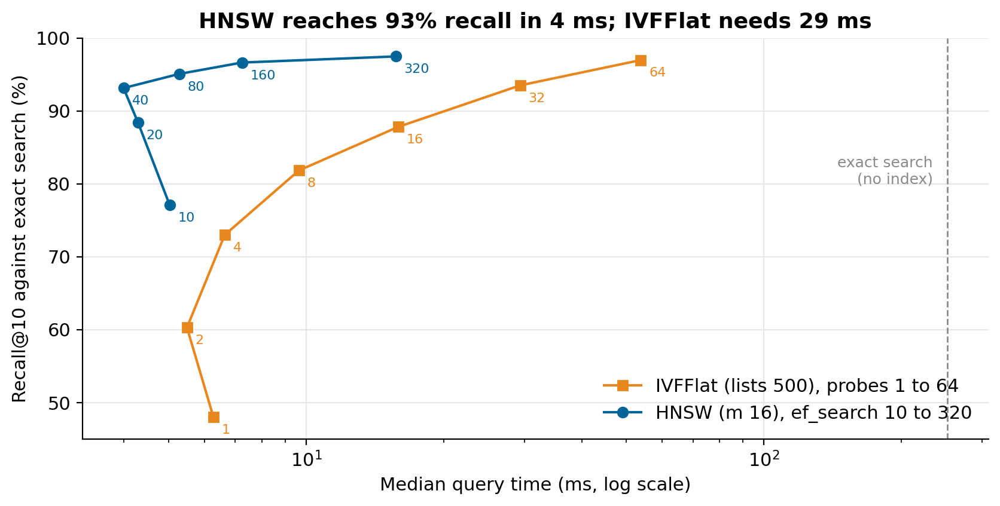
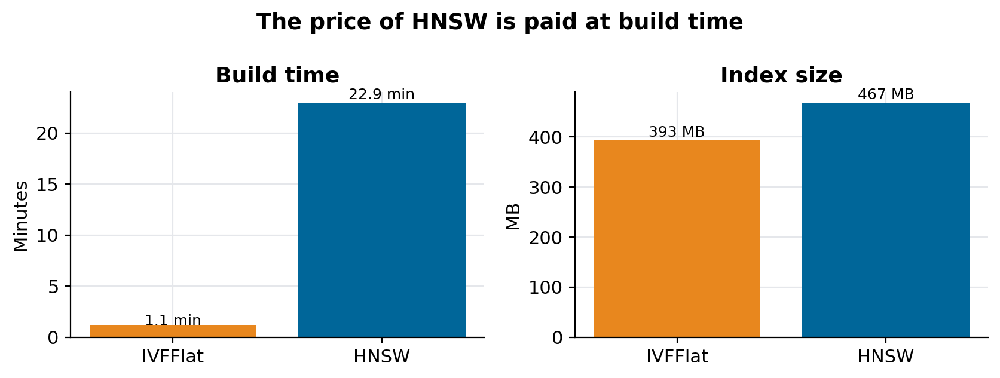

# pgvector at a million rows: IVFFlat or HNSW?

### Same 768-dimensional vectors, same 300 queries, every setting from probes 1 to ef_search 320: HNSW reached 93% recall in 4 ms where IVFFlat needed 29 ms, and paid for it with a 20-fold longer build

pgvector gives Postgres two approximate indexes for vector search, and most guides stop at "HNSW is better, IVFFlat builds faster". That is true, and it doesn't tell you what to set. How much recall does each lose, at what latency, and what does each cost to build on a server that also runs production?

I measured both on the same data my RAG chat searches: Brazilian procurement notices embedded with Qwen3-Embedding into `halfvec(768)`. The benchmark copies 250,000 vectors into a throwaway schema, builds each index in turn, and runs the 300 real query vectors of my embeddings benchmark against every setting, comparing each top 10 with exact search. The script is [`scripts/bench_pgvector.py`](https://github.com/LucasRangelSSouza/rag-chat/blob/main/scripts/bench_pgvector.py) in [rag-chat](https://github.com/LucasRangelSSouza/rag-chat); the results are in `docs/evidence/pgvector-bench/`.

> **Results**
> - HNSW (`m = 16`, `ef_search = 40`): recall@10 of 93.1% at a median of 4.0 ms.
> - IVFFlat (`lists = 500`): 93.5% needs `probes = 32` and 29.4 ms. At `probes = 8`, the speed of HNSW, recall is 81.8%.
> - Exact search with no index: 252 ms median.
> - HNSW took 23 minutes to build against about 1 minute for IVFFlat, and its index was 19% larger.


*Each point is one setting, averaged over 300 queries. Up and to the left is better. HNSW is above IVFFlat at every latency.*

## The two indexes in one paragraph each

**IVFFlat** clusters the vectors into `lists` groups when you build it. A query computes its distance to every cluster centre, then searches only the `probes` closest clusters. If the true neighbour sits in a cluster the query didn't probe, it is never seen. Recall grows with `probes` and so does time, roughly linearly.

**HNSW** builds a layered graph in which every vector links to `m` neighbours. A query enters at the top layer and walks greedily towards closer nodes, keeping a candidate list of size `ef_search`. It visits far fewer vectors than IVFFlat for the same recall, which is why it is faster, but inserting each vector into the graph is expensive, which is why it builds slowly.

## How I measured

```bash
python scripts/bench_pgvector.py setup 250000           # copy 250k vectors into schema bench
python scripts/bench_pgvector.py run vectors-qwen.json out.json
python scripts/bench_pgvector.py drop                    # remove schema bench
```

For each query the script first runs exact search with no index and keeps that top 10 as the reference. Then it builds IVFFlat and runs every query at `probes` 1, 2, 4, 8, 16, 32 and 64; drops it, builds HNSW and runs `ef_search` 10, 20, 40, 80, 160 and 320. Recall@10 is the share of the exact top 10 that each setting returns. Everything ran on my production server at night, Postgres 16 with pgvector 0.8.6 in a container limited to 3.4 GiB, in a separate schema that was dropped at the end.

Two settings in the setup matter for anyone repeating it. I tested on 250,000 vectors instead of the full 1.25 million because an HNSW build over everything risked the memory of the production database. And the first HNSW build failed with `could not resize shared memory segment ... No space left on device`: a parallel build allocates shared memory in `/dev/shm`, which Docker limits to 64 MB by default. Building with no parallel workers and 256 MB of `maintenance_work_mem` worked. If you build HNSW inside a container, raise `--shm-size` first.

## The results

| Index | Setting | Recall@10 | Median | p95 |
|---|---|---:|---:|---:|
| none | exact search | 100% | 252 ms | 727 ms |
| IVFFlat | probes 8 | 81.8% | 9.6 ms | 44.6 ms |
| IVFFlat | probes 32 | 93.5% | 29.4 ms | 196 ms |
| IVFFlat | probes 64 | 97.0% | 53.9 ms | 188 ms |
| HNSW | ef_search 40 | 93.1% | 4.0 ms | 21.3 ms |
| HNSW | ef_search 160 | 96.6% | 7.2 ms | 30.5 ms |
| HNSW | ef_search 320 | 97.5% | 15.7 ms | 105 ms |

HNSW at `ef_search = 40` matches IVFFlat at `probes = 32` on recall and is seven times faster at the median and nine times faster at p95. To reach 97% recall, HNSW needs about 16 ms and IVFFlat about 54 ms.

One oddity is worth reading correctly: HNSW at `ef_search = 10` was slower than at 20 or 40. It was the first setting to run after the build, with the index not yet in memory. Run a warm-up batch before timing anything.

## The price is the build


*HNSW: 1,373 s and 467 MB. IVFFlat: 68 s and 393 MB. The build settings differed (see above), so read the ratio as an order of magnitude.*

Twenty minutes for 250,000 vectors means hours for the full table on the same server, and the build competes with production queries the whole time. IVFFlat also has a cost HNSW doesn't: its clusters are fixed at build time, so after many inserts the lists drift away from the data and recall degrades until you rebuild. HNSW absorbs inserts into the graph as they arrive.

## Which one to use

- **Read-heavy search on data that changes slowly, and you can afford one long build:** HNSW. My chat is this case.
- **Data reloaded in bulk often, or a server with little memory to spare:** IVFFlat, with `probes` chosen from a curve like the one above instead of a default. `lists` around rows/1000 for up to a million rows and `sqrt(rows)` above is the usual starting point.
- **Either way, measure recall on your own queries.** The default `probes = 1` gave 48% recall here: half the right answers silently missing, with nothing in the logs to say so.

In production my chat still runs IVFFlat over all 1.25 million vectors with 1,100 lists and 12 probes. My embeddings benchmark showed that setting loses 13 points of recall@10 against exact search. These numbers say the next step is HNSW, built at a quiet hour with enough shared memory.

## Limits

- 250,000 of 1.25 million vectors; the curve shifts with table size, though the ordering of the two indexes rarely does.
- One run per setting, on a server with other services running at night.
- The two builds used different memory settings, forced by the container's shared memory.
- Recall here is measured against exact nearest neighbours, not against human relevance: an index can miss the exact neighbour and still return a useful result.
