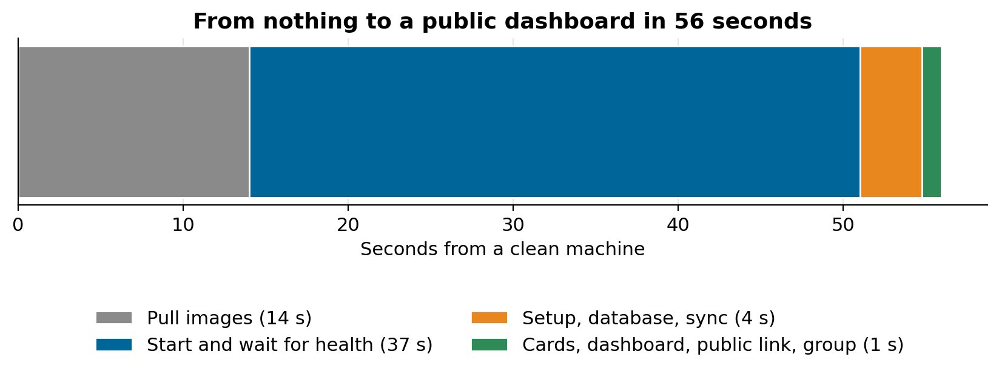
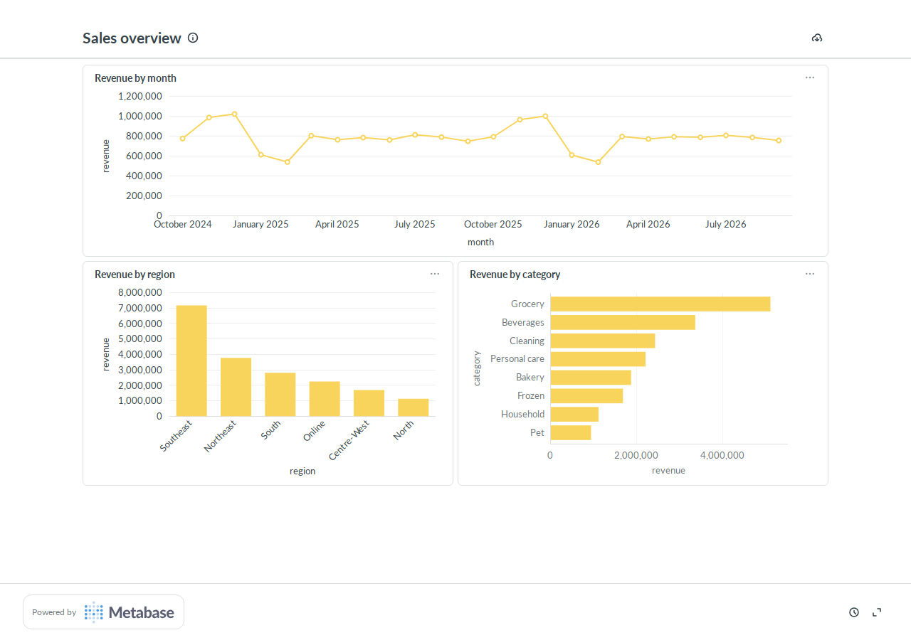

# How to deploy Metabase on Postgres with Docker

### A production-shaped BI stack in one compose file: a read-only role, dashboards built from code, a public link and a viewer group, installed from nothing in 56 seconds and checked in CI

Metabase is the quickest way I know to put real dashboards in front of people who don't write SQL. It is also easy to install badly: the default keeps its own data in an embedded H2 file, connects to your database with whatever user you type in, and leaves every chart as something you clicked together and can't rebuild.

This guide sets it up the way I run it in production for the public dashboards on my portfolio, reduced to one repository you can clone: [metabase-postgres-docker](https://github.com/LucasRangelSSouza/metabase-postgres-docker). Its CI builds the whole stack on a clean GitHub runner on every push, configures Metabase from code, checks the security boundaries and takes a screenshot of the result.

> **What you get**
> - Postgres with your data, plus a separate Postgres for Metabase's own state.
> - A `bi_reader` role that can read a few views and nothing else.
> - Three charts and a dashboard created by a script, a public link, and a "Viewers" group that can explore but can't write SQL.
> - About a minute from a clean machine to a working public dashboard.


*Measured in the repository's CI (run 37079850602 on GitHub Actions, Metabase v0.58.34): 14 s to pull the images, 37 s to start and pass health checks, 5 s for everything Metabase needs.*

## The stack

Three services in one `compose.yml`:

| Service | Image | Why it is there |
|---|---|---|
| `warehouse` | `postgres:16-alpine` | the data you want to chart (here, synthetic sales) |
| `metabase-db` | `postgres:16-alpine` | Metabase's application database: users, questions, dashboards |
| `metabase` | `metabase/metabase:v0.58.34` | the BI tool, bound to `127.0.0.1:3000` |

Two decisions are worth defending.

**Metabase's own state goes in Postgres, not H2.** Out of the box Metabase stores everything in an H2 file inside the container. It works until the day the file corrupts or the container is recreated without the volume, and then every dashboard is gone. Four environment variables move it to a real database:

```yaml
MB_DB_TYPE: postgres
MB_DB_HOST: metabase-db
MB_DB_DBNAME: metabase
MB_DB_USER: metabase
```

**Pin the image version.** Metabase changes its permissions API between releases (the data permissions moved from "native/schemas" to "view-data/create-queries" in recent versions). A setup script that works today breaks on an unpinned `latest`.

## Step 1: a role that can only read views

Metabase should never connect as the owner of your data. The init script creates a role that can read one schema of views, with every write refused at the role level:

```sql
CREATE ROLE bi_reader LOGIN PASSWORD '...' CONNECTION LIMIT 10;
ALTER ROLE bi_reader SET statement_timeout = '60s';
ALTER ROLE bi_reader SET default_transaction_read_only = on;
REVOKE ALL ON SCHEMA public FROM PUBLIC;
GRANT USAGE ON SCHEMA bi TO bi_reader;
GRANT SELECT ON ALL TABLES IN SCHEMA bi TO bi_reader;
```

The timeout stops one heavy chart from holding a connection for minutes. The connection limit stops a busy dashboard from exhausting the database. And because the role can see only the `bi` schema, a viewer exploring tables in Metabase never finds the raw ones.

The CI proves both boundaries on every run, connecting as `bi_reader`: reading a view works, an `INSERT` into the raw table fails, and a `SELECT` on the raw table fails.

## Step 2: chart small views, not big tables

Every chart reads a materialized view with a few dozen rows:

```sql
CREATE MATERIALIZED VIEW bi.revenue_by_month AS
  SELECT date_trunc('month', order_date)::date AS month,
         sum(quantity * unit_price)::numeric(14,2) AS revenue, count(*) AS orders
  FROM sales.orders GROUP BY 1 ORDER BY 1;
```

A public page gets reloaded by strangers. If each load scans the full order table, the dashboard's speed depends on how many people are looking at it. With a view of 24 rows it doesn't. Refresh the views on the schedule your data changes (`REFRESH MATERIALIZED VIEW CONCURRENTLY` once a unique index exists).

## Step 3: configure Metabase from code

Clicking through the UI produces a dashboard nobody can rebuild. Metabase's API can do every step, and [`setup/metabase_setup.py`](https://github.com/LucasRangelSSouza/metabase-postgres-docker/blob/main/setup/metabase_setup.py) does them in order, using only the Python standard library:

1. **First-run setup.** A fresh instance exposes a one-time setup token at `/api/session/properties`; the script creates the admin with it.
2. **Register the warehouse** with the `bi_reader` credentials and a schema filter, so Metabase syncs only `bi`.
3. **Wait for the sync** until the three views and their fields appear.
4. **Create the questions** as native SQL and place them on a dashboard.
5. **Enable the public link.**
6. **Create the viewer group.**

```python
card = {"name": "Revenue by month", "display": "line", "visualization_settings": {},
        "dataset_query": {"type": "native", "database": db_id,
                          "native": {"query": "SELECT month, revenue FROM bi.revenue_by_month ORDER BY month"}}}
mb.call("POST", "/api/card", card)
```

The script is idempotent: it finds cards, dashboards and groups by name and updates them instead of creating duplicates. Running it again after you change a query updates the chart and keeps the public address stable.


*The public dashboard, captured by Playwright at the end of the CI run. The data is synthetic, generated with a fixed seed, regional weights and a year-end peak, so the numbers are illustrative.*

## Step 4: permissions that mean what they say

Two Metabase behaviours surprise people.

**Every user is also in "All Users", and grants add up.** If "All Users" can write SQL against a database, so can everyone, whatever their own group says. The script closes "All Users" down and gives the access to a named group:

```python
mine   = {db: {"view-data": "unrestricted", "create-queries": {"bi": "query-builder"}}}
nobody = {db: {"view-data": "unrestricted", "create-queries": "no"}}
mb.call("PUT", "/api/permissions/graph",
        {"revision": graph["revision"], "groups": {viewers: mine, all_users: nobody}})
```

"Viewers" can open the dashboards and build questions with the visual query builder over the `bi` schema, but can't write SQL, can't edit anything and can't reach the admin settings. Admins bypass group permissions, so nothing changes for them.

**Collections have their own permissions.** Data access says what someone may query; collection access says which saved dashboards they may open. The script grants "Viewers" read on the root collection and removes it from "All Users".

## Step 5: share it publicly, safely

A public link serves a dashboard to anyone without a login, read-only, at `/public/dashboard/<uuid>`. The CI checks that the public endpoint returns the three cards while the authenticated API answers 401 to an anonymous caller.

To embed the dashboard in your own site, put a small reverse proxy in front of Metabase. Two lines matter: allow framing only from your site, and rate-limit the login route. This is the nginx edge I use in production:

```nginx
limit_req_zone $binary_remote_addr zone=bi_login:10m rate=6r/m;

location = /api/session {
    limit_req zone=bi_login burst=5 nodelay;
    proxy_pass http://metabase:3000;
}

location ^~ /public/ {
    proxy_hide_header X-Frame-Options;
    add_header Content-Security-Policy "frame-ancestors 'self' https://your-site.example" always;
    proxy_pass http://metabase:3000;
}
```

## Check that it really draws

An automated check that looks for the dashboard's title passes before any chart has data, because the titles render first. My first production check did exactly that while the page showed grey placeholders. Wait for something that exists only once data has drawn, such as an axis label, or take a screenshot, as the CI here does. On a loaded server, a cold public dashboard took about 45 seconds to draw all its charts; turn on Metabase's query caching if your first view matters.

## Run it yourself

```bash
git clone https://github.com/LucasRangelSSouza/metabase-postgres-docker
cd metabase-postgres-docker
cp .env.example .env          # change every password
docker compose up -d --wait
set -a; . ./.env; set +a
python3 setup/metabase_setup.py
```

Open `http://localhost:3000` and sign in with the admin from `.env`. To point it at your own data, replace `db/01_schema_and_data.sql` with your views and edit the three queries at the top of the setup script.

## Limits

- The timings are from a GitHub-hosted runner with images pulled fresh; a slower machine or network changes the first two bars.
- Synthetic data: the charts show the mechanics, not a business.
- One Metabase version. The permissions API in particular changes between releases, so pin the image and rerun the CI before upgrading.

The same setup, with real public data, runs the procurement and education dashboards linked from my portfolio at [bi.rangeltech.net](https://bi.rangeltech.net).
