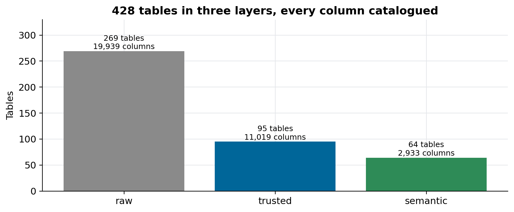
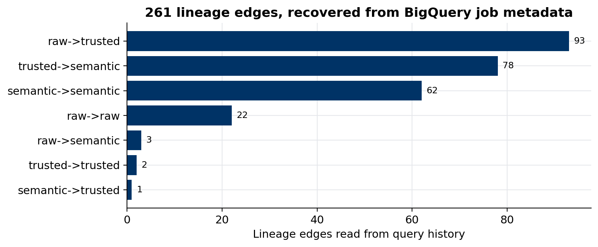
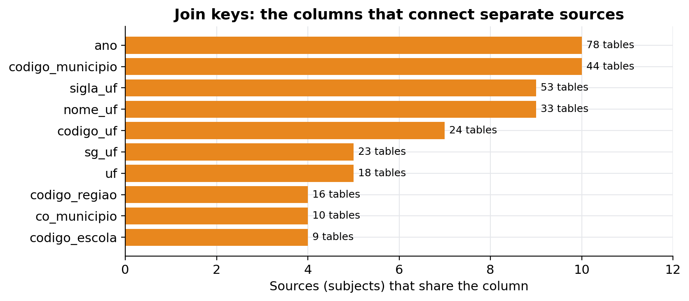

# How to build a free data catalog with lineage

### 428 tables, 33,891 columns and 261 lineage edges from a BigQuery lake, published as a static site and as a data dictionary inside every dataset, with one Python script and no catalog server

Every data team eventually asks the same three questions: what is in this table, where did it come from, and how do I join it to that other one. Commercial catalogs answer them well and cost accordingly; open-source ones such as OpenMetadata or DataHub answer them too, but you have to run and feed a whole platform.

For a public data lake of Brazilian education and procurement data I wanted the answers without a server to maintain. The result is a single script that reads the lake's own metadata, writes a JSON catalog, and renders it as a searchable static site and as a Markdown data dictionary shipped inside each published dataset. It is [brazil-public-data-map](https://github.com/LucasRangelSSouza/brazil-public-data-map) (`scripts/build_datamap.py`), and the map itself is live at [lucas.rangeltech.net/datamap](https://lucas.rangeltech.net/datamap/).

> **What it catalogs**
> - 31 published datasets, 428 tables in three layers (raw, trusted, semantic), about 4 billion rows.
> - 33,891 columns with types; 33,231 of them have a description.
> - 261 lineage edges between tables, recovered from query history.
> - 22 join keys: the columns that connect tables across different sources.


*The raw layer holds the sources as delivered; trusted tables are typed and deduplicated; semantic tables join them for analysis.*

## The three things a catalog must answer

**What is in the table.** Name, layer, row count, size, and every column with its type and description. The descriptions already live in BigQuery's table and column metadata; the catalog should read them, not ask someone to retype them.

**Where it came from.** Which tables feed this one and which tables it feeds. This is lineage, and most teams think they need a tool to capture it at write time. If your transformations run as SQL in BigQuery, the warehouse already recorded it.

**How to join it.** Which columns identify the same thing across sources: a municipality code, a state abbreviation, a year. In a lake built from many public sources this is the question new users ask first and the one documentation answers least.

## Lineage from query history

Every query job in BigQuery records the tables it read (`referenced_tables`) and the table it wrote (`destination_table`). Unnest one against the other and you have the edges of the lineage graph:

```sql
SELECT destination_table.dataset_id AS to_dataset, destination_table.table_id AS to_table,
       rt.dataset_id AS from_dataset, rt.table_id AS from_table, COUNT(*) AS jobs
FROM `region-us`.INFORMATION_SCHEMA.JOBS_BY_PROJECT AS j, UNNEST(j.referenced_tables) AS rt
WHERE creation_time > TIMESTAMP_SUB(CURRENT_TIMESTAMP(), INTERVAL 170 DAY)
  AND job_type = 'QUERY' AND state = 'DONE' AND error_result IS NULL
  AND destination_table.dataset_id IN ('raw_zone', 'trusted_zone', 'semantic_zone')
GROUP BY 1, 2, 3, 4
```

Three filters keep the graph honest. Only successful jobs count, so a failed experiment doesn't invent an edge. Only the lake's three datasets count, so an analyst's scratch table doesn't appear. And table names that look like backups or rebuilds (`_bak`, `_tmp`, `__rebuild`, `_copy`) are dropped.


*The 261 edges by the layers they connect. Most flow raw to trusted to semantic; the semantic-to-semantic edges are analysis tables built on other analysis tables.*

The limit is the window: `INFORMATION_SCHEMA.JOBS` keeps 180 days. A table rebuilt monthly shows up; a table built once a year ago doesn't, and loads written by Python code outside BigQuery never appear at all. The script has a fallback for the most common case, a trusted table with the same name as a raw one, which it treats as its typed copy. In the current build every edge came from query history.

## Join keys from column names

A join key is a column that appears in tables of more than one source. The script counts, for every column name outside the raw layer, how many tables and how many distinct sources use it, and keeps the ones that look like identifiers (`codigo`, `cod_`, `_id`, `cnpj`, `ano`, `uf`, `sigla`):

```python
for t in tables:
    if t["layer"] == "raw":
        continue
    for c in t["columns"]:
        seen[c["name"]]["tables"].append(t["id"])
        seen[c["name"]]["subjects"].add(t["subject"])
keys = [name for name, e in seen.items()
        if len(e["subjects"]) >= 2 and len(e["tables"]) >= 3 and IDENTIFIER.search(name)]
```


*The year and the municipality code join ten sources each.*

The chart also shows the catalog's most useful side effect: the same concept under different names. A state appears as `sigla_uf`, `sg_uf` and `uf`; a municipality as `codigo_municipio` and `co_municipio`. Nobody decided that. Each source arrived with its own convention, and the catalog made the inconsistency visible in one picture. That list is now the backlog for standardising names in the trusted layer.

## Keep internal details out of a public catalog

A catalog generated from a real lake will happily publish things you didn't mean to: storage paths, internal URLs, columns that point at files on a private bucket. The script keeps an explicit list of withheld columns, rewrites storage URIs and internal hostnames in descriptions, and reads organisation-specific terms to scrub from a git-ignored file, so the public code never names them:

```python
WITHHELD_COLUMNS = {"gcs_uri_pdf", "url_download_pdf", "caminho_local", "raw_table", "pdf_path"}
SCRUB = [
    (re.compile(r"gs://[^\s,;)]+", re.I), "<storage URI>"),
    (re.compile(r"\bGCS\b"), "cloud storage"),
]
```

Descriptions keep a marker when a machine wrote them (12,216 of the 33,231), so a reader knows which ones a person checked.

## One build, four outputs

`python scripts/build_datamap.py` reads the release manifest of each published dataset plus the lake's metadata, and writes:

| Output | For whom |
|---|---|
| `datamap/data/catalog.json` | tools: the whole map in one file |
| `datamap/site/` | people: a static site with search, lineage and joins, no backend |
| `docs/datamap/<dataset>.md` | the repository: one data dictionary per dataset |
| `DATA_DICTIONARY.md` inside each Kaggle dataset | whoever downloads the data, offline |

Generated outputs are committed, so readers need no access to the lake, and `--no-lake` rebuilds everything from a committed extract. The site is plain HTML and JavaScript that loads a small index first and one JSON file per dataset on demand, so it opens fast even with 33,891 columns behind it.

## When you need more than this

This approach stops where a catalog becomes a workflow. It has no ownership, no approvals, no column-level lineage, and no lineage from tools that don't write through BigQuery (Spark jobs, Python loaders, dbt models compiled elsewhere). When people need to own and certify tables, or you need lineage across systems, that is when OpenMetadata, DataHub or Dataplex earn their running cost. For a lake whose transformations live in BigQuery and whose readers mostly need to find and join tables, a script and a static site went a long way.

## Reproduce it

```bash
git clone https://github.com/LucasRangelSSouza/brazil-public-data-map && cd brazil-public-data-map
python scripts/build_datamap.py --no-lake      # rebuild the catalog, site and dictionaries from the committed extract
python -m http.server -d datamap/site 8000      # open http://localhost:8000
```

To point it at your own lake, set `GOOGLE_APPLICATION_CREDENTIALS` and `EXPORT_PROJECT`, change the three dataset names in the lineage query, and run it without `--no-lake`.
