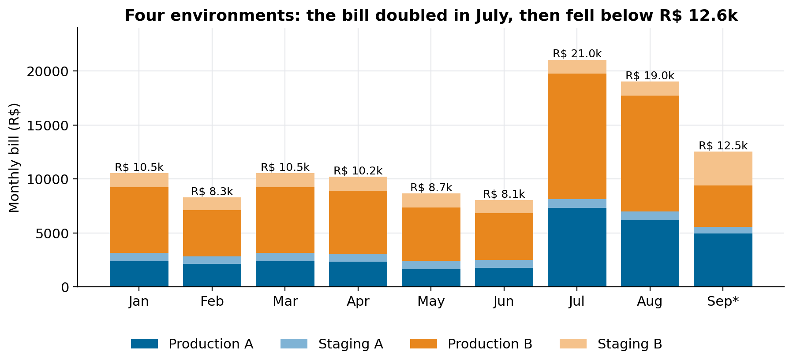
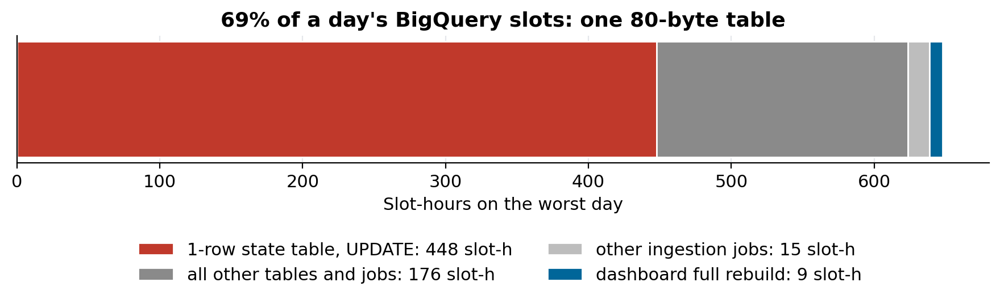
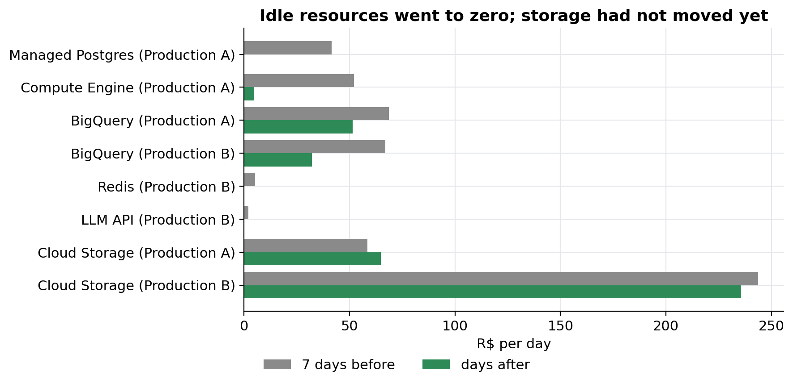

# How to systematically cut your cloud data lake costs

### Partitioning, clustering, how loads are organised, and Cloud Storage that never expires: the method we used to take a four-environment Google Cloud lake from R$ 21,047 to R$ 12,538 a month, and the open-source toolkit that finds the same problems in yours

In July the bill for a client's data lake on Google Cloud nearly doubled. The lake runs in four environments (two production, two staging), each with its own BigQuery, Cloud Storage, orchestration machines and a handful of other services. Nobody had deployed anything unusual. The bill had simply drifted from about R$ 10,000 a month at the start of the year to R$ 21,047.

Two months later it was R$ 12,538, with more data in the lake than in January. This article is the method, in the order I would apply it again, with the BigQuery and Cloud Storage techniques that did most of the work. The client and its projects stay anonymous; the environments are called Production A, Production B and their staging twins, and every number comes from the billing export.

The checks are packaged in an open-source tool, [cloud-data-finops-sdd-toolkit](https://github.com/LucasRangelSSouza/cloud-data-finops-sdd-toolkit): a specification-driven assessment that reads only metadata, runs twelve rules, and writes a report and an executive deck. Its last release added three rules taken from this case.


*Monthly bill, January to September 2026. September is projected from 12 complete days. The staging share grew in September because one staging machine now runs both production workloads to validate a consolidation.*

> **What moved the bill**
> - One 80-byte table took 69% of a day's BigQuery slots: it was being used as a lock-contended state store.
> - A daily export never deleted anything: 441,613 files. Cloud Storage for the lake went from R$ 7,329 in August to about R$ 531 a month.
> - Tables rebuilt in full every run became partitioned incremental loads or views: production BigQuery in one environment fell from R$ 1,644 to R$ 859 a month for the same work.
> - Idle resources (a database nobody connected to in 60 days, a fleet of six stalled VMs, an empty cache) went to zero.

## Step 1: measure before you touch anything

Cost work tempts you to start cutting the biggest line. The biggest line is often legitimate, and the waste hides in a line nobody looks at. Three sources, in this order:

1. **The billing export, by day and by service.** Not the monthly invoice: daily rows show *when* a line changed, which usually points at *what* changed. If you don't have the BigQuery billing export enabled, the console exports the same table as CSV. That is what we used at first.
2. **BigQuery's own job metadata.** `INFORMATION_SCHEMA.JOBS_BY_PROJECT` gives every job's bytes billed, slot time, statement type and destination table. Grouping slot-hours by destination table answers "what is BigQuery doing all day" in one query.
3. **Instance and storage metrics** from Cloud Monitoring and the bucket inventory, for compute and storage lines that BigQuery can't see.

```sql
-- where the slot-hours go, per destination table, last 7 days
SELECT CONCAT(destination_table.dataset_id, '.', destination_table.table_id) AS destination,
       statement_type, COUNT(*) AS jobs, ROUND(SUM(total_slot_ms) / 3.6e6, 1) AS slot_hours
FROM `region-us`.INFORMATION_SCHEMA.JOBS_BY_PROJECT
WHERE creation_time >= TIMESTAMP_SUB(CURRENT_TIMESTAMP(), INTERVAL 7 DAY)
GROUP BY 1, 2 ORDER BY slot_hours DESC LIMIT 20;
```

The access needed is small: `roles/bigquery.user` and `roles/bigquery.resourceViewer` on the project, and read access to one billing dataset. The toolkit's `preflight` command refuses to run if someone grants it Owner or Editor instead, which is a good default for any cost review: if you need to read business data to find waste, the review is designed wrong.

```bash
git clone https://github.com/LucasRangelSSouza/cloud-data-finops-sdd-toolkit && cd cloud-data-finops-sdd-toolkit
pip install -r requirements-dev.txt && pip install --no-deps -e .
python -m cloud_data_finops.cli preflight --spec tests/fixtures/assessment.json --grants tests/fixtures/grants/least-privilege.json
python -m cloud_data_finops.cli report --spec tests/fixtures/assessment.json --output artifacts/demo
```

## Step 2: stop using BigQuery as a database

The worst day in August billed 648 slot-hours. The first guess was the dashboard rebuild, the obvious heavy job. It accounted for about 1%.


*447.66 of 648 slot-hours went to UPDATE statements on one table of one row and 80 bytes: 8,272 of them in a day, averaging 195 slot-seconds each.*

The table was the rate-limit controller of a fleet of workers backfilling a public API: every worker thread wrote its lease to the same row about once a minute. BigQuery queues concurrent DML on the same table, so each UPDATE spent minutes waiting for a lock, and the wait is billed as slot time. The cost grew with the number of workers, not with the work done.

No setting fixes this. The state has to move somewhere built for it. An object in Cloud Storage with a generation precondition is an atomic lease at negligible cost; a small key-value store or a transactional database works too. As a stopgap, one writer per machine per cycle instead of one per thread cuts the statement count by the number of threads.

The toolkit's **BQ-006** rule finds this pattern from metadata alone: a table under 10 MB, more than 1,000 DML statements a day, and more than 10 slot-seconds per statement.

## Step 3: partition, then make the filter mandatory

Partitioning splits a table by a date or integer column so a query that filters on it reads only the matching partitions. It is the single largest lever on BigQuery on-demand cost, because you pay per byte read.

```sql
CREATE TABLE trusted.municipal_reports
PARTITION BY RANGE_BUCKET(fiscal_year, GENERATE_ARRAY(2010, 2040, 1))
CLUSTER BY section, period
OPTIONS (require_partition_filter = TRUE)
AS SELECT * FROM staging.municipal_reports;
```

`require_partition_filter` turns a forgotten `WHERE` into an error instead of a full scan. Before changing a production table, measure what you would save with a dry run, which reports the bytes a query would read and costs nothing:

```bash
bq query --use_legacy_sql=false --dry_run \
  'SELECT section, SUM(value) FROM trusted.municipal_reports WHERE fiscal_year = 2026 GROUP BY 1'
# prints: Query successfully validated. ... this query will process <N> bytes of data.
```

Run the same query with and without the partition filter and compare. The toolkit ships `scripts/pruning_dry_run.py`, which does that comparison on a public BigQuery table so you can see the effect before touching your own. Rule **BQ-003** flags jobs that read a partitioned table without pruning it, from job metadata.

## Step 4: cluster on the columns you filter and group by

Clustering sorts the data inside each partition by up to four columns. BigQuery then skips blocks whose values can't match a filter on those columns. It costs nothing to add and helps queries that filter or aggregate on the clustered columns, in the order they are declared. Choose the column you filter by most first. The win is usually smaller than partitioning and harder to predict, so measure it the same way: dry-run the common queries before and after, on a copy of the table.

## Step 5: organise the loads

How a table is loaded matters more than how it is queried, because loads run every day whether anyone reads the result or not.

- **Rebuild only what changed.** A 55 GB table of municipal reports was recreated in full (`CREATE OR REPLACE TABLE ... AS SELECT`) every day, although only the current year ever changed. Partitioned by year and loaded with `INSERT` into the current partition (or a `MERGE`), it reads a fraction of the bytes. Closed years are never recomputed. Rule **BQ-007** flags any table over 100 GB rebuilt in full at least daily.
- **Use a view when the query is cheap.** Several tables that were materialised in full on every run became views over the source. Nothing is stored twice, and nothing is computed until someone asks.
- **Run at the cadence of the source.** A scheduled query that runs every hour on a source that changes once a day pays 23 times for the same answer. Rule **BQ-004** compares runs per day with source updates per day.
- **Validate before you switch.** Build the incremental version next to the full one, compare row counts and totals per partition for a day or two, then cut over.

The effect in one environment: production BigQuery went from R$ 1,644 to R$ 859 a month (−48%) for the same daily workload.

## Step 6: give every bucket a lifecycle rule

Cloud Storage was the line nobody owned. The lake exported each table to CSV every day for downstream users, and the export kept every previous copy. Nothing ever deleted them: 441,613 files had accumulated across the environments.

```json
{"rule": [
  {"action": {"type": "Delete"}, "condition": {"numNewerVersions": 3}},
  {"action": {"type": "Delete"}, "condition": {"age": 30, "matchesPrefix": ["exports/csv/"]}}
]}
```

```bash
gcloud storage buckets update gs://YOUR_BUCKET --lifecycle-file=lifecycle.json
```

We turned the accumulation off by default, kept history only where someone needed it, added a daily cleanup and deleted the backlog.

One thing will confuse whoever checks the result: **Cloud Storage bills the average bytes held over the month**, not deletions. The invoice for the month of the cleanup still looks high, because it averages the days before it. Daily billing rows show the turn immediately (the line started falling the day after the cleanup and kept falling), and the next month shows it in full: the lake's storage went from R$ 7,329 in August to about R$ 531 a month in September.

Rule **GCS-001** reads a Storage Insights inventory and flags a prefix that gains more than 100 objects a day, deletes almost none, and sits in a bucket with no lifecycle rule.

## Step 7: switch off what nobody uses

The cheapest savings came from things nobody used:


*Daily cost per service, seven days before against the days after the first round. Storage hadn't moved yet for the billing reason above.*

- **A managed Postgres instance** created in June, holding only the default database. Sixty days of logs (137,000 lines) showed zero application connections. R$ 41.39 a day.
- **A fleet of six VMs** running a backfill that had stopped making progress 18 days earlier but kept a watchdog alive. R$ 52.13 a day, down to R$ 4.85.
- **An empty in-memory cache** from an older version of an application, and a data catalogue service that duplicated the one the team already used.
- **An LLM writing column descriptions.** An automatic flow sent every undocumented column of the catalogue to a hosted LLM API. It cost R$ 3,364.81 in 30 days, R$ 2,382.70 of it on the first day, when the whole backlog went at once. The key was revoked and the flow removed.

Across these, the first seven days after the cuts averaged R$ 472.34 a day against R$ 618.47 in the seven days before (−24%), before storage had moved at all.

## Where we decided not to cut

Measurement also says no. The notebook VM in one environment cost about twice the other's and looked like waste. Thirty days of CPU metrics showed one machine averaging 60% and above 90% for 13.6% of the time, and the other with real peaks of 77% during heavy loads. Shrinking either would have slowed the work it exists for. We left both alone.

One line took longer to explain: an erratic data catalogue charge in one environment, between R$ 0 and R$ 18 a day, with no catalogue resource anyone remembered creating. It turned out to be the provider's own catalogue service, redundant with the one the team already ran, and it was switched off with the cache in September.

## Prove it on the bill

Every cut was checked against the billing rows for the service it should affect, and only reported once the line moved. The result for the four environments, from the billing export:

| | Monthly bill |
|---|---:|
| January to March average | R$ 9,796 |
| July (peak) | R$ 21,047 |
| September (projected from 12 complete days) | R$ 12,538 |

September is still above the start of the year, and the difference has two known owners: one lake that didn't exist in January and is now in production (about R$ 3,091 a month of BigQuery that is new work, not waste), and a staging environment temporarily running both production workloads to validate the consolidation of the orchestration machines (about R$ 1,450 a month). That consolidation, once promoted to production, removes one machine and is projected to save another R$ 1,184 a month.

## The toolkit

[cloud-data-finops-sdd-toolkit](https://github.com/LucasRangelSSouza/cloud-data-finops-sdd-toolkit) turns this method into a repeatable assessment. A versioned specification declares the scope; `preflight` checks that the access is read-only and minimal; the adapters read only metadata; twelve rules produce findings that separate the observed evidence, the calculation, the recommendation, the estimated impact and the confidence; and the output is a Markdown report and a PPTX deck. The rules that came from this case:

| Rule | Detects | Built from |
|---|---|---|
| BQ-006 | a small table used as a high-frequency state store | the 80-byte table above |
| BQ-007 | a large table rebuilt in full on every run | the 55 GB daily rebuild |
| GCS-001 | objects that accumulate with no expiry | the 441,613 export files |

The repository runs on synthetic telemetry that reproduces each pattern, with 135 tests and a checksum gate that rebuilds every artifact. It never states a monetary saving it can't support: without a pricing input, the impact is reported in bytes, slot-hours or gigabytes.

## Limits

- One client, one cloud, one quarter. The order of the steps generalises; the shares don't.
- Billing data runs to 13 September 2026; September is a projection from 12 complete days.
- The toolkit's live query templates pass its safety tests but have not been run against a production project from the repository; the case above was measured by hand with the same queries.
