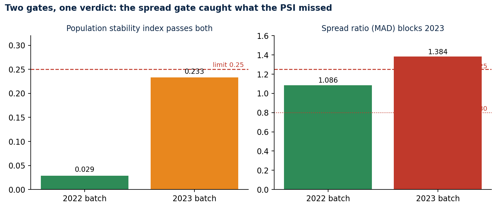
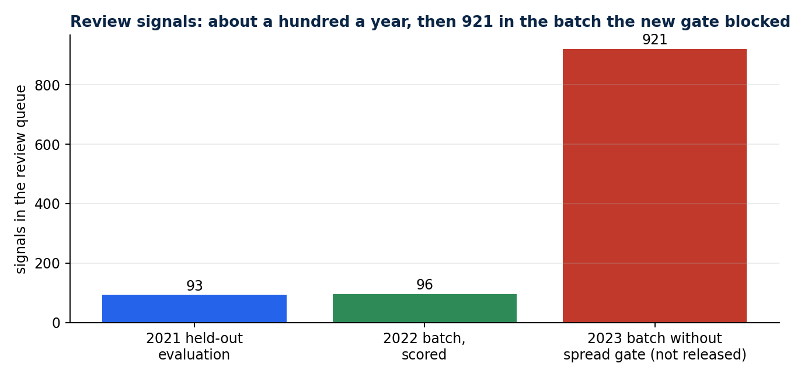

# Why your data drift check missed a bad batch

### Population stability index passes when a distribution widens around a fixed centre. A pipeline over public education-finance data, the batch that slipped through with 921 false alarms, and the spread gate that now stops it

A drift check is supposed to stop a model from scoring data that no longer looks like what it learned from. Mine passed a batch that produced 921 review signals, about ten times the usual rate, and every check I had written said the data was fine.

The cause is common and easy to miss: the population stability index (PSI), the drift metric most teams reach for, barely reacts when a distribution gets wider without moving its centre. This article walks through a real pipeline, shows the feature design that makes drift measurable in the first place, and gives the code for the second gate that catches the case PSI misses. Everything is in [education-finance-mlops](https://github.com/LucasRangelSSouza/education-finance-mlops), over a public dataset from [brazil-public-data-map](https://github.com/LucasRangelSSouza/brazil-public-data-map).

> **In short**
> - Normalise the feature first (here, value divided by the national median of the same year), or every drift check just measures inflation.
> - Use a robust peer model (median and MAD per peer group) so the outliers you want to find don't hide each other.
> - Check spread as well as shape: a MAD ratio outside 0.80 to 1.25 blocked the batch that PSI (0.233, under the 0.25 limit) let through.

## The data

My companion project, brazil-public-data-map, publishes `lucasrangelss/brazil-education-data-lake` on Kaggle. Version 1 holds 27,830 annual municipal declarations to SIOPE, the education budget system run by FNDE, for 2019 through 2023, joined to IBGE municipality codes. The pipeline pins that version by manifest hash and verifies every file before it reads a row.

The model watches one declared value, investment per basic-education student. Nobody audits these declarations and some are implausible, which makes them a fair target for triage and a poor one for anything that pretends to be a verdict. Thirty rows report zero investment per student and are excluded before training. The registry records that count, so the exclusion is visible.

## A feature that cannot be fooled by inflation

The raw value is a bad feature. Nominal investment per student rose about 30% from 2022 to 2023, so any fixed threshold would flag growth and little else. The pipeline divides each value by the national median of the same year and takes the log. Later years never inform earlier decisions, so there is no leakage from the future into the baseline.

## A robust peer model

Each municipality is compared with peers in the same macro-region and population band (under 10 thousand, 10 to 50 thousand, 50 to 200 thousand, and 200 thousand or more). For each peer group the model stores the median and the median absolute deviation (MAD) of the feature from the training years only. A group with fewer than 30 training rows falls back to the national distribution.

A later declaration becomes a review signal when its robust z-score reaches 3.5 in absolute value:

```text
robust z = 0.6745 x (value - group median) / group MAD        signal when |z| >= 3.5
```

Why MAD and not the standard deviation? A few extreme declarations are exactly what the model exists to find, and they would inflate a standard deviation and hide each other. MAD ignores them, so the scale of "normal" is set by the typical municipality.

A single-group global baseline runs beside the peer model and is stored in the registry. Trained on 2019 and 2020 (11,102 rows in 18 peer groups) and describing 2021, the peer model flagged 93 of 5,566 rows (1.67%), 89 above their peers and 4 below, and the global baseline flagged 15 (0.27%). Trained through 2021 and describing 2022, it flagged 89 (1.60%) against 24 for the baseline. No anomaly labels exist for this data, so these are rates and carry no claim of accuracy.

The run also counts signals below the constitutional 25% education-spending minimum. That was 7 of 93 in 2021, against 1,090 such rows in the year. It is co-occurrence only, since the model never sees the threshold.

## Two gates before any scoring

Before it scores a year, the pipeline compares the candidate year with the evaluation year on the relative feature. It checks the schema, the rise in missing values (limit 0.10), the population stability index (limit 0.25), the shift of the median (limit 0.30 in log units), and the spread ratio (limit 1.25 in either direction, so the interval 0.80 to 1.25).

The population stability index compares the shape of two distributions on a common set of bins. This simplified version uses deciles of the reference year:

```python
import numpy as np

def psi(reference: np.ndarray, candidate: np.ndarray, bins: int = 10) -> float:
    edges = np.quantile(reference, np.linspace(0, 1, bins + 1))
    edges[0], edges[-1] = -np.inf, np.inf
    ref = np.histogram(reference, edges)[0] / len(reference)
    cand = np.histogram(candidate, edges)[0] / len(candidate)
    ref, cand = np.clip(ref, 1e-6, None), np.clip(cand, 1e-6, None)
    return float(np.sum((cand - ref) * np.log(cand / ref)))
```

And the spread gate that I added after the failure is a ratio of median absolute deviations:

```python
def mad(x: np.ndarray) -> float:
    return float(np.median(np.abs(x - np.median(x))))

def spread_ratio(reference: np.ndarray, candidate: np.ndarray) -> float:
    return mad(candidate) / mad(reference)

# blocked when spread_ratio is outside [0.80, 1.25]
```

## The batch that should not have passed

The 2022 batch passed with a PSI of 0.029 and a spread ratio of 1.086, and the pipeline scored it: 96 review signals, 92 above peers and 4 below.

The 2023 batch is where it got interesting. My first drift check had schema, missingness, PSI and median shift, and nothing about spread. On nominal values it blocked 2023 at a PSI of 0.615, which was the right verdict for the wrong reason, because nominal values had simply grown. After I switched to the relative feature the PSI fell to 0.233, under the 0.25 limit, and 2023 went through with 921 signals.



*The PSI passes both batches. The spread ratio of 1.384 blocks 2023.*

More than half of those signals, 525 of 921, were Northeast municipalities, and 843 sat above their peers. The median of the relative feature had not moved. Its spread had widened by roughly 38%, and decile PSI barely reacts when a distribution widens symmetrically around a fixed centre.



*About a hundred signals a year, and 921 in the batch that the new gate blocked.*

The repair was the spread gate on MAD, which the model's own outliers cannot trigger. With it, 2023 is blocked at a spread ratio of 1.384 and the run writes a drift report where the queue would have been.

The data does not say why the spread widened. A change in funding rules is one candidate, though the release holds no evidence for it. Someone should find out before refitting on 2023. Refitting silently would teach the baseline that the new dispersion is normal, and every later signal would inherit that lesson.

## Alternatives I rejected, and why

| Option | Why I did not take it |
|---|---|
| Deflate by an inflation index | needs an external series and still misses a funding-rule change |
| Raise the PSI limit until 2023 passes | that is the failure itself, with a bigger number |
| Refit on 2023 right away | absorbs an unexplained change into the baseline |

## Lineage you can diff

Every registry and queue file records the dataset slug and version, the manifest hash, the data build commit, the code commit, the feature schema, the model ID and the intended use. Each command was run twice into separate folders, and every output file was byte-identical across the two runs. That turns "reproducible" from a claim into a `diff`. The files embed the code commit, so a run at another commit produces different bytes, which is the point.

The command line accepts a single intended use, `review_triage`, and refuses allocation, eligibility, sanction, audit-finding and ranking uses by name. Every queue entry carries `human_review_required` and `decision_prohibited`. The boundary lives in the interface and not in a paragraph of documentation that nobody reads at 5 p.m.

## Run it

```powershell
python -m pip install -e ".[release]"
python -m education_finance_mlops run-release --train-through-year 2020 --evaluation-year 2021 --score-year 2022 --output artifacts/a-2022
python -m education_finance_mlops run-release --train-through-year 2021 --evaluation-year 2022 --score-year 2023 --output artifacts/a-2023
```

The second command ends with a drift report and no queue. The release resolver downloads through `kagglehub` and needs no Kaggle credential for a public dataset. Later dataset versions are not picked up silently: the command requires `--dataset-version`, and version 1 stays the default pin until a reviewed change chooses another. A run against version 3 of the dataset still blocked 2023 on the same spread ratio of 1.3843.

## The lesson

Monitoring a model on the metric that is easiest to compute is a comfortable habit, and it fails quietly. The PSI on my first feature was low and the batch was still wrong. Changing the feature, noticing that the check no longer covered the failure, and adding a gate for the specific way the distribution changed: that sequence is the work, and I would rather show the record of it than a dashboard that stayed green.

## Limits

The pipeline does not identify fraud, evaluate schools or explain policy outcomes. It produces a short queue a person can inspect, and it stops when the data stops resembling its training input. Declared values are not audited. The peer definition ignores rural and urban structure, enrollment mix and funding-rule changes. The thresholds (3.5 for the robust z-score, 1.25 for the spread) were set by convention and not tuned on outcomes, and no uncertainty interval is reported.
