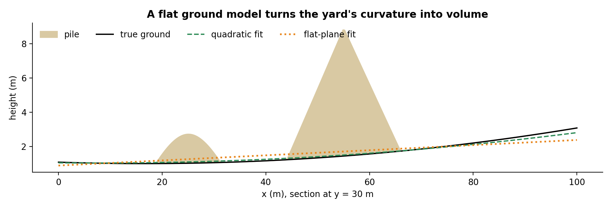
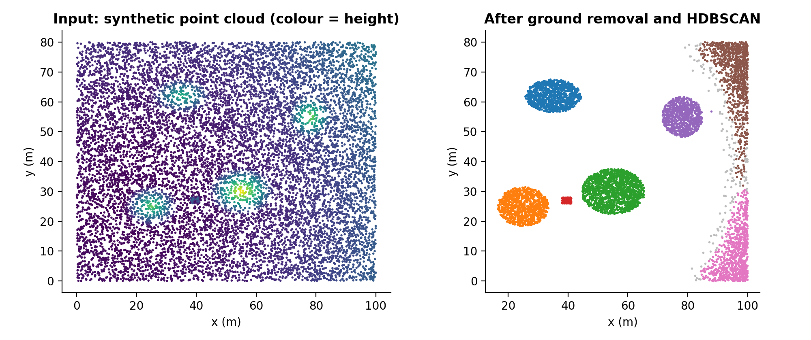
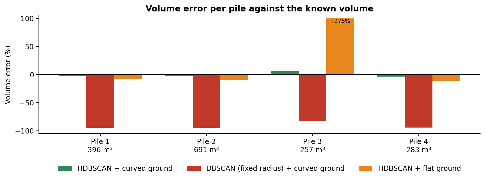

# How to measure stockpile volume with drone photos

### Photogrammetry with OpenDroneMap, RANSAC to find the ground, HDBSCAN to separate the piles, and a volume you can check: the pipeline we built for a bulk materials producer, rebuilt on synthetic data

A bulk materials yard holds its stock in open piles: salt, ore, grain, gravel. Knowing how much is there used to mean a topographer with a total station, once a month. A drone flight takes twenty minutes, and the photos hold everything needed to measure every pile. The hard part is software that turns photos into a number a stock controller trusts.

We built that system for a bulk materials producer. The client and its data stay private, so this article rebuilds the core of the pipeline on a synthetic yard whose true volumes are known, which also makes it easy to show where each step goes wrong. The code and the scene generator are in [stockpile-volume-from-drone-photos](https://github.com/LucasRangelSSouza/stockpile-volume-from-drone-photos). Every number and figure below comes from that synthetic scene.

> **What the synthetic test shows**
> - With a curved ground model and HDBSCAN, the four piles came out between −3.7% and +5.8% of their true volume.
> - A flat ground model turned the yard's own curvature into "stock": one pile read 276% too high.
> - DBSCAN with a fixed radius, tuned for another flight, broke every pile into fragments and lost over 80% of the volume.

## From photos to a point cloud

The first stage is photogrammetry: overlapping, georeferenced photos in, a 3D model out. We used [OpenDroneMap](https://www.opendronemap.org/) through NodeODM, its processing API, which produces an orthomosaic, a point cloud and a textured mesh. It handles JPEG and TIFF well; PNG works but worse, and raw formats such as DNG must be converted first.

Before settling on it we tested the alternatives on real flights, because a reconstruction that fails silently ruins everything downstream. WebODM, COLMAP and PyVista couldn't reconstruct one pile from the angles available in that flight; Blender can, but only as manual sculpting by someone who knows the tool; a generative 3D service produced the most coherent mesh of that pile, which we cross-checked against area and perimeter measured on satellite imagery. The failed reconstructions had something in common: too few angles around the pile. The flight plan is part of the measurement.

## Step 1: find the ground

A pile's volume is the space between its surface and the ground under it, so the ground has to be estimated where it can't be seen. RANSAC does the first pass: pick three random points, fit a plane, count how many points lie within 15 cm of it, repeat a few hundred times, and keep the plane with the most support. On a yard, that plane is the floor.

Real yards are not flat. They slope for drainage and dip where trucks turn. So the second pass refits a quadratic surface on RANSAC's inliers:

```python
design = lambda p: np.column_stack([np.ones(len(p)), p[:, 0], p[:, 1], p[:, 0]**2, p[:, 1]**2, p[:, 0] * p[:, 1]])
coef, *_ = np.linalg.lstsq(design(ground_points), ground_points[:, 2], rcond=None)
surface = lambda p: design(p) @ coef
```


*A section through two piles of the synthetic yard. The plane can't follow the curve, and the gap between them, multiplied by thousands of square metres, becomes phantom volume.*

## Step 2: keep what stands above it, and drop the machines

Everything more than 30 cm above the ground surface is a candidate. That includes things that aren't stock: loaders parked between piles, poles, people. Machines are tall and narrow, so the pipeline drops small patches of points that span more than 1.5 m vertically. In production this stage did more work (noise filtering, and reconstructing pile edges at higher resolution), but the principle is the same: remove what connects two piles before clustering, or they merge.

## Step 3: separate the piles

The remaining points are clustered on their horizontal position. Our first version used DBSCAN with fixed parameters: a 0.9 m radius and 25 neighbours. It worked on the flights it was tuned on. DBSCAN's radius is an absolute distance, though, so when point density changes (a different drone, altitude or overlap) the same radius either merges neighbouring piles or shatters each pile into fragments.

HDBSCAN adapts the density threshold per cluster and only needs a minimum cluster size:

```python
from sklearn.cluster import HDBSCAN
labels = HDBSCAN(min_cluster_size=300, min_samples=25).fit_predict(points[:, :2])
```


*Left: the synthetic yard, coloured by height. Right: the four piles separated, plus three clusters that aren't stock: the loader (red) and two strips along the yard edge, where the ground model drifts.*

Notice the extra clusters. No threshold removes them all on every yard, and that is why the product never decides alone: after processing, the user sees the clusters on the orthomosaic, confirms which ones are piles and picks the material of each. The material sets the density, which turns volume into tonnes.

## Step 4: integrate the height

Volume is the sum of height above the ground over the pile's footprint. Put the points on a grid, average the height in each cell, multiply by the cell area, add up:

```python
def volume(points, height, cell=1.0):
    keys = (points[:, 0] // cell).astype(int) * 10_000 + (points[:, 1] // cell).astype(int)
    _, inverse = np.unique(keys, return_inverse=True)
    mean_height = np.bincount(inverse, weights=height) / np.bincount(inverse)
    return float(mean_height.sum() * cell * cell)
```

The cell size has to match the point density. My first run used 0.5 m cells on a cloud with about six points per square metre, so a fifth of the cells were empty and every pile came out 23% short. A 1 m cell fixed it. Empty cells inside a footprint are missing volume, not zero volume.

## Results on the synthetic yard


*Error against the known volume of each pile. Curved ground with HDBSCAN: −3.1%, −2.1%, +5.8% and −3.7%.*

| Variant | Clusters found | Volume error per pile |
|---|---:|---|
| HDBSCAN, curved ground | 7 (4 piles + 3 not stock) | −3.1%, −2.1%, +5.8%, −3.7% |
| DBSCAN with fixed radius, curved ground | 21 | −94.7%, −94.9%, −83.2%, −94.3% |
| HDBSCAN, flat ground | 6 | −8.7%, −9.4%, +276.1%, −11.1% |

The +276% is the pile in the corner where the yard rises most: with a flat ground model, the slope around it is counted as part of the pile.

On real yards, the check was against professional surveyors. We set the acceptance criterion before testing, a maximum error of 5% on volume, because every step (reconstruction, ground model, grid) adds its own uncertainty. On real mappings measured by both, the automatic volumes, areas and perimeters differed from the surveyors' reports by about 2%. The remaining gap is about what you'd expect from where each side draws the edge of a pile, the resolution of the flight, and the simplifications in any volume model, the surveyor's included.

## The production architecture

Photogrammetry takes hours, so nothing in the request path processes images. An API call only starts a job. The first version ran everything in one container on Fargate, with NodeODM and the volume code together; the second design moves to Step Functions orchestrating AWS Batch, with GPU Spot instances for reconstruction that are created per job and destroyed after. Each client's images and results sit in its own storage prefix, and the web app isolates tenants by an identifier in the login token. A run cost about half a dollar in compute.

## What we would do differently

- Write the flight checklist (overlap, altitude, angles around each pile) before the code. A reconstruction can't recover angles the drone never saw.
- Validate against a known volume from day one. A synthetic yard like the one here, or one pile measured by a topographer, catches grid and ground-model errors that look plausible on real data.
- Treat clustering as a suggestion. Asking the user to confirm the piles was the feature that made the numbers trusted.

## Run it

```bash
git clone https://github.com/LucasRangelSSouza/stockpile-volume-from-drone-photos && cd stockpile-volume-from-drone-photos
pip install -r requirements.txt
python pipeline.py      # true and estimated volume per pile, three variants
python figures.py figures     # the figures in this article
```
