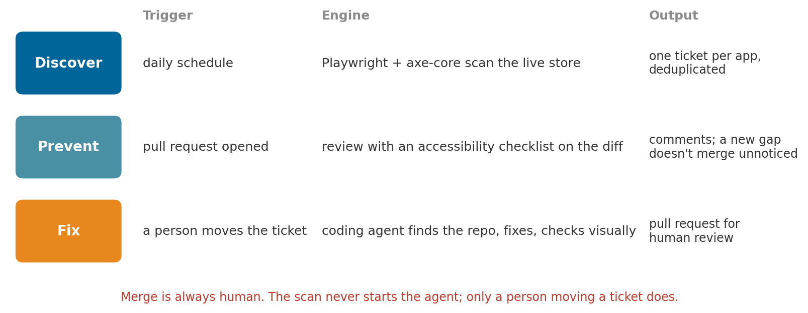
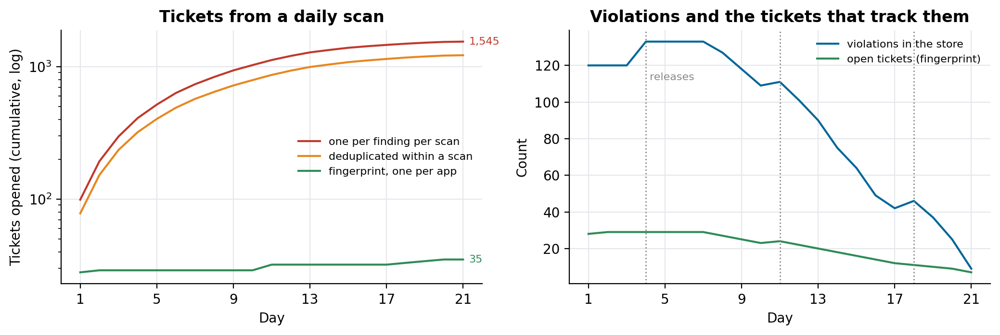

# Fixing accessibility issues with AI agents

### Accessibility problems in an online store are found late, fixed slowly and come back with the next release. A design that splits the work into three moments with their own triggers: a daily scan that opens deduplicated tickets, a review on every pull request, and a coding agent that only starts when a person asks. With the dedupe rebuilt on synthetic scans

Ask how an online store handles accessibility and the answer is usually an audit: someone samples pages, runs a checker, writes a report. Three things go wrong after that. The problems are found late, months after the release that introduced them. They're fixed slowly, because the checker names a CSS class and nobody knows which of dozens of repositories contains that component. And they come back, because nothing stops the next pull request from reintroducing them. On the pages we first measured for one retailer, automated accessibility scores ranged from 60 to 85 out of 100, mobile usually worse than desktop.

We designed and built the proof of concept of an agentic accessibility module for e-commerce stores built on VTEX IO, as the first skill of an existing AI delivery pipeline. This article is the design and the two problems that took most of the thought: deduplicating findings across daily scans, and finding the repository that owns a component. The dedupe and the repository lookup run on synthetic data in [a11y-scan-dedupe](https://github.com/LucasRangelSSouza/a11y-scan-dedupe).

> **What the synthetic three weeks show**
> - A daily scan that opens one ticket per finding opened 1,545 tickets over 21 days for a store that never had more than about 130 violations at once.
> - Deduplicating within each scan still opened 1,219, because every run reopened what the previous run had found.
> - A fingerprint per finding and one open ticket per app opened 35.

## Three moments, three triggers

The first sketch was a single daily loop: scan, open tickets, let an agent fix them. We split it into three moments, each with its own trigger, owner and pace:


*Discovery runs on a schedule, prevention on every pull request, correction only when a person moves a ticket.*

- **Discover.** Every day, Playwright opens the store's key pages and runs axe-core, the open-source accessibility engine, against WCAG 2.2 level AA. Findings become tickets in the team's board. The scan never moves a ticket and never starts an agent.
- **Prevent.** Every pull request in a front-end repository gets an accessibility review on its diff, from a coding assistant given an accessibility checklist. If the diff only touches back-end code, the job passes and skips. The review comments; it doesn't approve.
- **Fix.** When a person moves a ticket to "selected for development", an automation calls a small API that authenticates the request, guards against double triggers and starts a coding agent in a container. The agent finds the repository, fixes the component, runs a visual regression check and opens a pull request linked from the ticket. A person reviews and merges.

The boundaries are what make the system auditable. The board doesn't know about the agent. The scan doesn't start fixes. The agent only starts on a human decision (a ticket moving, never a ticket being created), and merging is always human. When something goes wrong, there's one place to look for each step.

## A daily scan needs a fingerprint

Running discovery every day, instead of as a one-off audit, keeps findings fresh, but it creates a problem: each run finds most of what the previous run found. Scans are also noisy, since a page that loaded slowly or a carousel slide that wasn't visible can hide a finding one day and show it the next.


*Left: cumulative tickets over three weeks of synthetic daily scans (log scale). Right: violations in the store and the open tickets that track them as fixes land.*

The fix was a fingerprint for each finding, `app + axe rule + CSS handle`, and a rule of one open ticket per app:

```python
fingerprint = f"{app}|{rule}|{css_handle}"
if app not in open_tickets:
    open_tickets[app] = {fingerprint}                 # new ticket
elif fingerprint not in open_tickets[app]:
    open_tickets[app].add(fingerprint)                # appended to the open ticket, no new one
```

One ticket per app matches how the work is done: one repository, one pull request, all the findings in that component fixed together.

## Which repository owns this component?

axe-core reports the element, and in a VTEX IO store the element carries a CSS handle in a fixed pattern, `vendor-app-major-x-handle`. That identifies the app (`store-product-card-0-x-title` belongs to the app `product-card` of vendor `store`), but not the repository: the repository name on GitHub can be anything.

So the ticket doesn't try to say where the code lives. It carries the suggested app, the handle, the rule and a hint, and the agent resolves the repository at run time by reading each repository's `manifest.json`, where VTEX IO apps declare their vendor and name. If no repository matches, the agent comments on the ticket with what it tried and stops without a pull request. Official platform apps aren't forked: their fixes go into the store theme as an override.

```python
def parse_handle(css_handle):
    m = re.match(r"^([a-z0-9]+)-(.+)-\d+-x-.+$", css_handle)   # app names can contain hyphens
    return (m.group(1), m.group(2)) if m else (None, None)
```

Leaving the lookup to the agent removed a whole mapping table that someone would have had to maintain.

## Context per project

A coding agent fixing a component in someone else's codebase needs that project's conventions: its design tokens, which components wrap which, what the team considers a breaking change. Each project gets a knowledge base served to the agent through an MCP server (a small server that exposes "list projects" and "query knowledge" tools over a retrieval API), so the agent asks the project's documentation before it edits instead of guessing from the code alone.

## Where it stands

The proof of concept runs end to end locally and in the cloud environment: the scan opens deduplicated tickets in the board, and the coding agent runs inside the existing delivery pipeline. The next milestones are the pull-request review in the front-end repositories and a harder loop with an end-to-end smoke test before the agent's pull request is offered for review.

## What we would do differently

- Write the boundaries first. Our first estimate treated accessibility as a standalone product with a daily loop; framing it as three moments attached to an existing pipeline cut the scope and made each part testable.
- Design the dedupe before turning on the schedule. A daily scan without fingerprints floods the board on day two, and a flooded board gets ignored.
- Store the fingerprints in the ticket, not only in a database. When people edit tickets by hand, the ticket is the source of truth.

## Run it

```bash
git clone https://github.com/LucasRangelSSouza/a11y-scan-dedupe && cd a11y-scan-dedupe
pip install -r requirements.txt
python scan_dedupe.py      # three dedupe strategies over 21 synthetic days, and the repo lookup
python figures.py figures        # the figures
```
