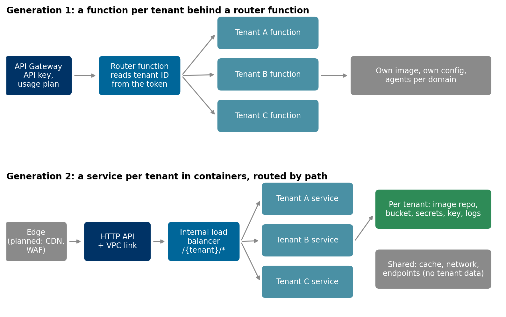
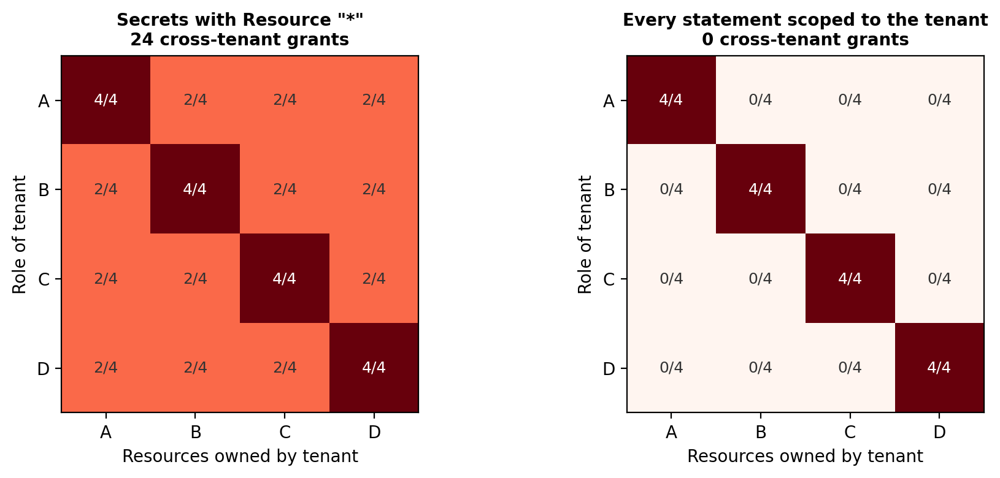

# Multi-tenant AI on AWS: keeping each client isolated

### One conversational AI platform, several client companies, and the rule that none of them can ever see another's data, keys or bill. Two generations of the architecture, the audit that found the gap, and a small check that proves isolation instead of assuming it

A conversational AI product for companies has a property that a single-customer system doesn't: every client's data, model keys, prompts and costs live next to everyone else's. Clients ask about it early, and the honest answer has to be more specific than "we use separate databases".

We built and then rebuilt the AWS platform behind such a product: business users ask questions in natural language and specialised agents answer from that company's own data. This article covers the two generations of the design, what each isolates and what it shares, and the review of our own infrastructure code that found a one-line hole. The isolation check runs on synthetic policies in [multi-tenant-iam-isolation-check](https://github.com/LucasRangelSSouza/multi-tenant-iam-isolation-check).

> **In short**
> - Generation 1 gave each tenant its own serverless function behind a router; generation 2 gives each tenant its own container service, image repository, bucket, secrets and logs, routed by path.
> - An audit of the infrastructure code found one shared role allowed to read secrets with `Resource: "*"`. In a four-tenant model, that single line creates 24 cross-tenant grants.
> - Scoping each statement to the tenant's own ARNs brings that to zero, and a test that evaluates every role against every resource keeps it there.

## Generation 1: a function per tenant


*Top: a router function chooses the tenant's function. Bottom: a load balancer routes `/{tenant}/*` to the tenant's container service.*

The first version was serverless. API Gateway authenticated the call and applied a usage plan per tenant, so one client couldn't exhaust capacity for the others. A router function read the tenant ID from the user's token and invoked that tenant's own function, packaged as its own container image, with the tenant's configuration, agents and data access inside it. API Gateway's timeout was raised to five minutes, because generative answers that run several agents take longer than the default allows.

It was simple to reason about: a tenant is a function. The second generation keeps that one-tenant-one-unit rule but moves the unit to a long-running container service, which fits multi-agent conversations, a shared cache and per-tenant autoscaling better than a function invoked per request.

## Generation 2: a service per tenant

The second generation moved to containers:

- An HTTP API, connected through a VPC link to an internal load balancer, with one routing rule per tenant (`/tenant-a/*` goes to tenant A's target group).
- One ECS Fargate service per tenant, in private subnets, with its own task definition, autoscaling on CPU and memory, and its own log group.
- Per tenant: an image repository (immutable tags, vulnerability scan on push, the last ten images kept), an S3 bucket (encrypted, public access blocked), and its secrets.
- Shared, and holding no tenant data: the network, VPC endpoints so traffic to S3, the image registry, logs and parameters never leaves the VPC, and a serverless cache reachable only from the tasks.

Everything is Terraform, with the values for each environment in YAML files the code reads.

## The audit

Before adding the next layer we reviewed our own infrastructure code against the reference architecture, file by file, and wrote down every gap with its evidence. Most findings were the expected kind for a fast first version: IDs and ARNs written as literals instead of references, each environment a copy of the other instead of shared modules, no CI/CD pipeline yet, and the edge layer (CDN, web application firewall, edge functions) still on paper.

One finding was about isolation. The role that ECS uses to start tasks and inject their secrets, shared by every tenant's service, had this statement:

```json
{"Effect": "Allow", "Action": ["secretsmanager:GetSecretValue"], "Resource": "*"}
```

Buckets and keys were scoped per tenant, so the data looked isolated. The secrets weren't: any task could, in principle, read every tenant's model key and database URL.


*Each cell counts how many of a tenant's four sensitive resources a tenant's role can reach. Left: one wildcard on secrets. Right: every statement scoped to the tenant.*

## Prove isolation with a test

Reviews catch this once. A test catches it on every change. The check in the repository generates the policies for every tenant from one list, the way a Terraform module with `for_each` does, and then asks the only question that matters for every pair of tenants: can this role reach that tenant's resource?

```python
for role in TENANTS:
    for owner in TENANTS:
        reachable = sum(allowed(policies[role], ACTIONS[k], arn) for k, arn in resources(owner).items())
        assert role == owner or reachable == 0, f"{role} reaches {reachable} resources of {owner}"
```

The evaluator is deliberately small (Allow statements and wildcards, no Deny or conditions), enough to catch the common mistake: a wildcard that was convenient on the day it was written. In a real account, IAM Access Analyzer and the policy simulator answer the same question against the live policies, and are worth running in the pipeline too.

The fix is to scope each statement to the tenant's prefix, `secret:platform/{tenant}/*`, and to give each tenant its own roles, so that a mistake in one policy affects one tenant.

## What isolation means in each layer

| Layer | Isolated per tenant | Shared |
|---|---|---|
| Entry | Route, usage plan | API, edge |
| Compute | Service, task definition, scaling, image | Cluster, network |
| Data | Bucket, database credentials | Cache (no tenant data, short TTL) |
| Secrets and keys | Model API key, database URL, encryption key | None |
| Observability | Log group, cost tags | Dashboards |

A table like this turns "is my data isolated?" into a list a client can check.

## What we would do differently

- Write the isolation test before the second tenant. With one tenant, a wildcard can't leak anything, which is exactly why it survives until the second one arrives.
- Use modules from the first environment. With each environment a copy of the other, every fix has to be made twice.
- Tag every resource with the tenant from day one, so cost per client is a query and not a project.

## Run it

```bash
git clone https://github.com/LucasRangelSSouza/multi-tenant-iam-isolation-check && cd multi-tenant-iam-isolation-check
pip install -r requirements.txt
python isolation.py      # cross-tenant grants with and without the wildcard
python figures.py figures      # the figures
```
