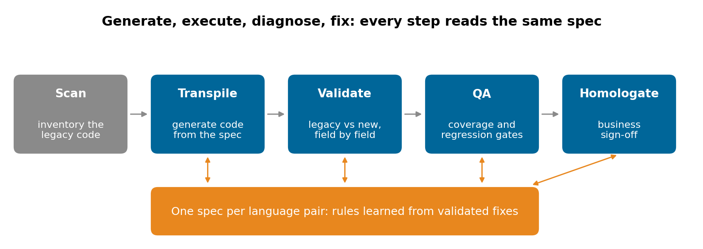
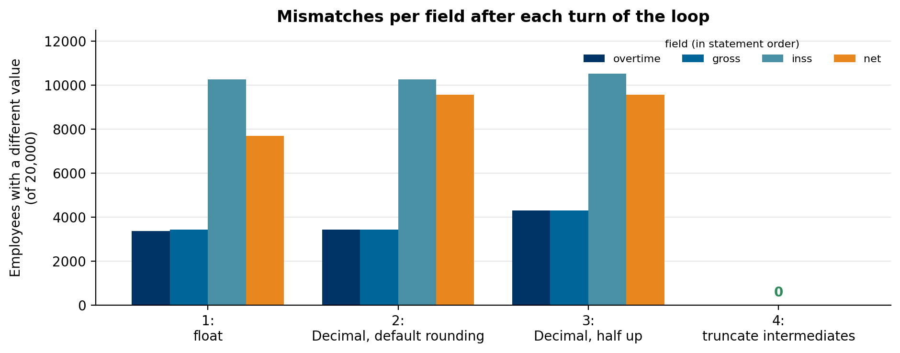

# Migrating legacy code with spec-driven AI

### An AI model can translate COBOL, SAS or Delphi into a modern language in seconds. Proving the translation computes the same thing is the actual project. The design we use: one spec per language pair that generation, validation and sign-off all read, a loop that runs until the outputs match, and a payroll rule that shows why the first plausible fix is usually wrong

Ask a language model to translate a COBOL payroll program to Python and the result will compile, read well and be wrong by a cent for more than a third of the employees. Nobody will notice in a code review. They'll notice in the first payroll.

Legacy migration is mostly a validation problem. We built a reusable core for it: language-agnostic, with a template for each source language (COBOL, SAS, Delphi, legacy PHP and Java) and target platform (Python, Java, .NET, Kotlin, Databricks), that every client project starts from. This article is the design and one small example that shows how the loop behaves. The example runs in [legacy-migration-validation-loop](https://github.com/LucasRangelSSouza/legacy-migration-validation-loop).

> **What the payroll example shows (20,000 synthetic employees)**
> - A float translation of a four-line COBOL rule differed from the legacy result for 7,701 employees, by one cent each time.
> - Two plausible fixes (Decimal arithmetic, then the right rounding mode) didn't converge: 9,570 and 9,559 mismatches.
> - Comparing every intermediate field, not only the final one, pointed to the first statement that differed, and the third lesson (truncate every intermediate result to its field's scale) brought it to zero.

## One spec that everything reads

Most migration efforts have three documents that drift apart: the instructions for whoever translates, the test plan, and the acceptance criteria for the business. We keep one: a spec per language pair, for example COBOL to Python, that the translation step, the validator and the sign-off all read. What "done" means is written once.


*Scan the legacy code, transpile from the spec, validate legacy against new, run quality gates, get business sign-off. Every failure goes back to transpilation, and every validated fix can become a rule in the spec.*

The spec holds what the model can't infer from one program: the source language's arithmetic and data semantics, the target platform's conventions, tolerances (exact to the cent for money, a relative tolerance for some statistics), and the rules learned on earlier programs. Each source language enters through its own template, with its known traps listed first: packed decimals, edited pictures and EBCDIC for COBOL; missing values, numeric precision and `RETAIN`/`BY` processing for SAS; one-based strings, `Currency` and `TDateTime` for Delphi; loose `==` comparisons and falsy values for PHP.

## Generate, execute, diagnose, fix

The core of the method is a loop that doesn't stop at "it compiles": generate the code, run the legacy program and the new one on the same inputs, compare, diagnose the difference, fix, repeat until the outputs match within the spec's tolerance. Validation runs where the client's data already is (Databricks, Fabric, Synapse or BigQuery), so the comparison happens on real volumes instead of a sample copied out.

The payroll example shows how that loop behaves. The legacy rule is four COBOL statements:

```cobol
COMPUTE WS-OVERTIME = WS-HOURLY * WS-OT-HOURS * 1.5.
COMPUTE WS-GROSS    = WS-BASE + WS-OVERTIME.
COMPUTE WS-INSS     = WS-GROSS * WS-INSS-RATE.
COMPUTE WS-NET ROUNDED = WS-GROSS - WS-INSS - WS-UNION-FEE.
```


*Each turn of the loop fixed what looked like the cause. Only comparing every field showed that the first difference was already in the overtime line.*

- **Turn 1, floats.** The obvious translation, with `round(x, 2)` at the end: 7,701 employees off by a cent. Lesson for the spec: money is `Decimal`, never `float`.
- **Turn 2, `Decimal` with the default rounding.** Worse, 9,570 mismatches. Python quantizes half-even by default; COBOL's `ROUNDED` rounds half up. Lesson: say the rounding mode explicitly.
- **Turn 3, half up everywhere.** Still 9,559. Comparing the intermediate fields shows the first difference in `WS-OVERTIME`, the first statement, which has no `ROUNDED` at all. In COBOL, a `COMPUTE` stores its result into a fixed-scale field, `PIC 9(7)V99`, and without `ROUNDED` the extra digits are truncated.
- **Turn 4, truncate every intermediate to its field's scale.** Zero mismatches.

```python
t = lambda x: x.quantize(Decimal("0.01"), rounding=ROUND_DOWN)   # store into PIC 9(7)V99
overtime = t(hourly * ot_hours * Decimal("1.5"))
gross    = t(base + overtime)
inss     = t(gross * rate)
net      = (gross - inss - fee).quantize(Decimal("0.01"), rounding=ROUND_HALF_UP)   # ROUNDED
```

Two things generalise. Validate every intermediate field, not only the output: the final number tells you *that* the code is wrong, the first differing field tells you *where*. And a fix that looks right can make the result worse; only the comparison decides.

## A spec that learns, with a person at the gate

The three lessons above are not about this program. They're about COBOL arithmetic, and the next payroll program will need them too. After each validated fix, an agent proposes the rule for the spec of that language pair, and the rules that survive across projects move to a shared knowledge base, so the next project starts with them.

Two guardrails keep that from going wrong. Only fixes that passed validation can become rules. And every change to a spec passes through a person, because a rule learned from one bad baseline would spread to every later program.

## Validation needs an oracle you trust

The loop is only as good as what it compares against. If the legacy program's outputs aren't available for the same inputs, or were produced by a different version of the code, "validated" means nothing. We wrote this down in the core's own critique as a rule: without a reliable baseline, validation is decorative. The first task in every project is to secure that baseline: the legacy program running on a fixed set of inputs, outputs captured field by field, and the business deciding which tolerance applies to each field.

## What we would do differently

- Start each language template with its arithmetic and data semantics, before any syntax rule. The traps in every template are about numbers and data types far more than syntax.
- Capture intermediate fields from the legacy run from day one. Final outputs alone turn diagnosis into guessing.
- Keep a short, honest critique next to the core: what holds, what's optimistic, what can go wrong. It keeps a project from committing to automatic migration where no oracle exists.

## Run it

```bash
git clone https://github.com/LucasRangelSSouza/legacy-migration-validation-loop && cd legacy-migration-validation-loop
pip install -r requirements.txt
python payroll.py      # mismatches per field for each turn of the loop
python figures.py figures    # the figures
```
