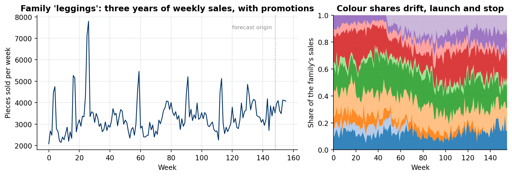
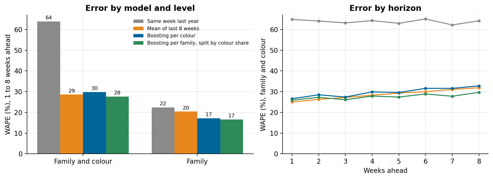

# Weekly demand forecasting for a manufacturer

### Forecasting every product in every colour, every week, sounds like the obvious target. On sales that behave like a textile maker's, the better plan is to forecast the family and split it by colour. A backtest of four methods on synthetic sales, and the data platform underneath

A textile manufacturer plans production weeks ahead: which fabrics to knit, which colours to dye, how many pieces of each. Planning starts from a question that sounds simple: how much of each product, in each colour, will sell in each of the next eight weeks?

We're building the data lake and the weekly demand forecast by product family and colour for a large textile manufacturer. The client's data stays private; this article tests forecasting approaches on three years of synthetic weekly sales with the same shape, using a backtest anyone can rerun from [weekly-demand-forecast](https://github.com/LucasRangelSSouza/weekly-demand-forecast).

> **On the synthetic sales (10 families, 82 family-colour series, 14 forecast origins, 1 to 8 weeks ahead)**
> - Forecasting each family with gradient boosting and splitting it by each colour's recent share had the lowest error at both levels: 28% WAPE by family and colour, 17% by family.
> - A boosting model trained directly on every colour series was worse at colour level (30%) than an 8-week moving average (29%).
> - "Same week last year" was fine for families (22%) and useless for colours (64%), because colours move with fashion and come and go.

## What the sales look like


*Left: one family over three years, with promotion spikes on top of its season. Right: the share of each colour in that family's sales, drifting, launching and stopping.*

Three properties of this kind of data decide the method:

- **Families are stable, colours aren't.** A family follows its season and its trend; the mix of colours inside it shifts with fashion, and colours are launched and discontinued every collection.
- **Colour series are small and noisy.** Splitting a family into eight colours divides the signal by eight and leaves most of the noise.
- **Promotions make spikes** that a model should not learn as a normal week.

The synthetic generator builds all three in: 10 families with winter or summer peaks, a slow trend and promotions; 4 to 10 colours each with drifting shares, some launched midway and some discontinued; and over-dispersed weekly counts.

## Four ways to forecast

1. **Same week last year.** The classic baseline for seasonal products.
2. **Mean of the last 8 weeks.** Simple and hard to beat at short horizons.
3. **Boosting per colour.** One global gradient-boosting model (Poisson loss) for every family-colour series, with the last 8 weeks, their means, the same week last year, the week of the year and the horizon as features. It is a direct model: one row per forecast origin and horizon, so a single model forecasts 1 to 8 weeks ahead.
4. **Boosting per family, split by colour share.** The same model at family level, then each colour gets its share of the family's last 8 weeks.

```python
family_forecast = family_model.predict(features(family_sales, origin, h))
colour_share = colour_sales[origin - 7:origin + 1].sum() / family_sales[origin - 7:origin + 1].sum()
colour_forecast = family_forecast * colour_share
```

## Backtest like you'll use it

The evaluation imitates the weekly planning cycle: from each of 14 forecast origins over the last six months, forecast the next 1 to 8 weeks using only data known at that origin, then compare with what sold. The models are trained once on earlier origins (in production they retrain monthly). The error measure is WAPE, the sum of absolute errors over the sum of actual sales, which weights big series more and doesn't explode on weeks with zero sales; bias shows whether a method systematically over- or under-forecasts.


*Left: WAPE over all origins and horizons, at family-and-colour level and summed to family level. Right: WAPE at family-and-colour level by weeks ahead.*

| Method | WAPE, family and colour | WAPE, family | Bias |
|---|---:|---:|---:|
| Same week last year | 64% | 22% | +4% |
| Mean of last 8 weeks | 29% | 20% | −7% |
| Boosting per colour | 30% | 17% | −5% |
| Boosting per family, split by colour share | 28% | 17% | +3% |

The family model does the part a model is good at (season, trend, promotions in a series with enough volume), and the recent share does the part where history is short and fashion moves faster than a year. A model trained on every colour series spends its capacity on noise; at colour level it doesn't beat a moving average. The moving average, in turn, under-forecasts as a season ramps up (bias −7%), because it always looks at the last eight weeks.

These results are about this synthetic data, not a universal ranking. The point is the method: test the hierarchy you plan with, at the level people plan at, against simple baselines, before choosing.

## The platform underneath

The forecast is the last step of the first phase. Most of the work is the data under it:

- **A data lake on AWS** in three layers: raw files as they arrive, cleaned and typed tables, and analytics tables built for the forecast and for reporting. Everything is defined in Terraform.
- **Ingestion with AWS Glue** from the manufacturer's ERP, reached over a site-to-site VPN, landing daily in the raw layer.
- **A weekly sales table** at the grain the forecast needs (week, family, colour), with promotions and product launches flagged, so the model can tell a promotion from a trend.
- **Training kept off by default** to control cost: the forecasting job runs when a new week of data lands, writes its forecasts to the analytics layer, and stops.

## What we would do differently

- Agree on the forecast level with the planners first. "Product by colour by week" is what they asked for; "family by week, split by colour" is what the data supports best, and they need to know why.
- Flag promotions and launches in the source, not in the model. A spike without a flag is indistinguishable from demand.
- Keep the simple baselines in every report. If a model can't beat the 8-week mean, nobody should plan with it.

## Run it

```bash
git clone https://github.com/LucasRangelSSouza/weekly-demand-forecast && cd weekly-demand-forecast
pip install -r requirements.txt
python forecast.py           # the backtest table, written to results.json
python figures.py figures    # the figures
```
