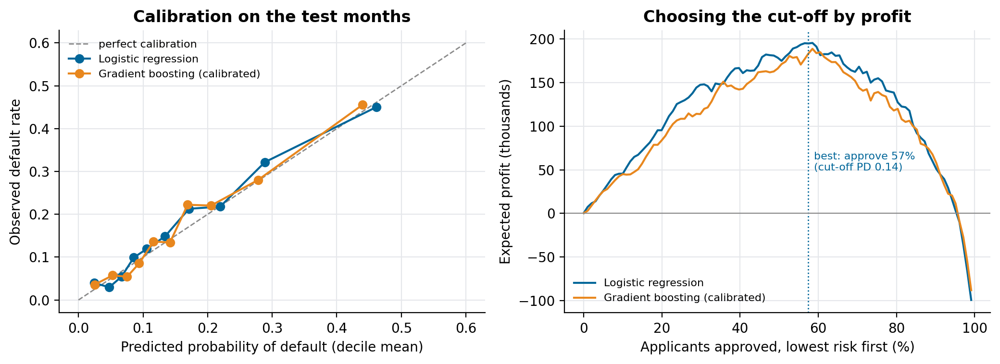
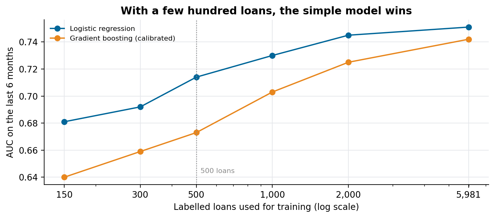

# How to predict loan default with a simple model

### A lender for small businesses with a few hundred labelled loans doesn't need deep learning to price risk. It needs a probability it can trust, a validation that respects time, and a cut-off chosen by money rather than by accuracy. The whole method, on synthetic loans you can rerun

A small-business lender lives on one number per applicant: the probability that this loan won't be paid. Approve too many risky ones and defaults eat the margin; approve too few and the business doesn't grow. Getting that number right matters more than which algorithm produces it.

We're building the data platform and risk engine for a lender that finances small businesses with short loans of up to about 5,000, often to companies that traditional banks turned down. It runs entirely on one server: MinIO as the lake, ClickHouse as the warehouse, Airflow for the pipelines, Metabase for reporting and a FastAPI service that scores applications. The client's data stays private. This article shows the modelling method on synthetic loans with the same shape, and the code is in [default-propensity-model](https://github.com/LucasRangelSSouza/default-propensity-model).

> **On 8,000 synthetic loans (18 months to train, the last 6 to test)**
> - A regularised logistic regression beat calibrated gradient boosting on every measure: AUC 0.751 against 0.739, KS 0.39 against 0.37.
> - With 500 loans to learn from, roughly what a young lender has, the gap widened: AUC 0.714 against 0.673.
> - Approving everyone lost money on the test months; approving the 57% with the lowest predicted risk turned the same portfolio into a profit.

## What the lender knows when someone applies

Every feature has to exist at application time, never after. In the synthetic data, as in the real one, that means:

- the business: age in months, sector, region, monthly revenue;
- the request: the ticket, and the ticket as a share of monthly revenue;
- the history: a bureau score, previous loans with this lender, previous late payments and days since the last loan;
- the channel the applicant came through.

Defaults in the synthetic data come from a known rule: bureau score, payment history and ticket size relative to revenue matter most, and a young business asking for a large ticket is much riskier than either alone. Knowing the rule lets you check what each model learns.

## Validate by time, not at random

A random split puts loans from the same month in training and test, and the model gets credit for recognising the month, not the applicant. Lenders change their policy, their channels and their customers over time, and the model will always score next month's applicants. So the split here is by origination date: train on the first 18 months, test on the last 6, which also had a slightly higher default rate (17% against 16%), as real portfolios drift.

## A probability, not a ranking

Two numbers decide whether a model is useful for credit. **AUC** (and its cousin **KS**) measures ranking: does the model put the defaulters above the payers? **Calibration** measures whether a predicted 20% really defaults about 20% of the time. A lender needs both: ranking to decide who gets approved, calibration to price the loan and to forecast losses.

Logistic regression produces calibrated probabilities by construction. Gradient-boosted trees rank well but their raw scores are not probabilities, so the boosting model here is wrapped in isotonic calibration, fitted on folds of the training period.


*Left: predicted against observed default rate by decile, test months. Right: expected profit as the lender approves more applicants, lowest predicted risk first.*

Both models end up well calibrated. The difference is in ranking, and it depends on how much data there is.

## With a few hundred loans, the simple model wins


*Each point is the mean AUC of five random training samples of that size, scored on the same six test months.*

Trees need data to find interactions, and they find noise when there isn't enough. A logistic regression with a few well-chosen features (a ratio like ticket to revenue does work a tree would need many examples to discover) learns the main effects from a few hundred loans. In this synthetic data the gap is largest exactly where a young lender is: about 500 labelled loans. Boosting catches up as the sample grows, and on the full 6,000 loans it is close, though still behind here.

That is why our plan starts with the logistic regression, with its coefficients in a table the credit analysts can read and challenge. The boosting model stays in the pipeline as a challenger, and replaces the incumbent only when it wins on the same out-of-time test.

## Choose the cut-off by money

Accuracy is the wrong target for credit. A paid loan earns a margin on the ticket; a default loses most of the ticket. In the synthetic economics (18% margin, 85% loss given default), one default wipes out the margin of almost five good loans. So the cut-off is chosen by sorting applicants from lowest to highest predicted risk and finding the approval rate that maximises expected profit:

```python
order = np.argsort(predicted_default)
gain = np.where(defaulted[order], -0.85 * ticket[order], 0.18 * ticket[order])
best = np.argmax(np.cumsum(gain))      # approve everyone up to this applicant
```

On the test months, approving everyone loses money. The best point approves 57% of applicants, those with a predicted default probability below 0.14. The curve is flat around the peak, which is useful: the policy can move a few points for commercial reasons without giving up much.

## What the platform does around the model

A model is the small part. The platform around it, as we designed it:

- **Ingestion** from each source (ERP, contract platform, credit bureaus, customer conversations) into raw files in MinIO, one Airflow pipeline per source.
- **A feature table** in ClickHouse with one row per application, built only from data available at application time, and versioned so a past decision can be explained with the data the model saw.
- **Scoring** through a FastAPI endpoint that returns the probability, the band and the main reasons, and logs every request.
- **Monitoring** in Metabase: approval rate, predicted against observed default by month of origination, and the drift of each feature.

## What we would do differently

- Write down the target before the first query: how many days late counts as default, and from which date. Changing the definition later silently changes every metric.
- Keep the rejected applications. Without them, the model only ever learns from people the old policy approved.
- Put the profit curve, not the AUC, in front of the business. The cut-off is a business decision, and the curve is how they can make it.

## Run it

```bash
git clone https://github.com/LucasRangelSSouza/default-propensity-model && cd default-propensity-model
pip install -r requirements.txt
python model.py            # metrics, learning curve and profit curve, written to results.json
python figures.py figures  # the figures
```
