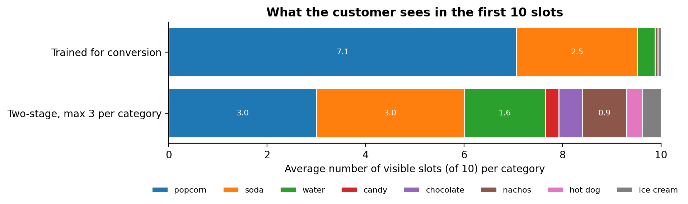
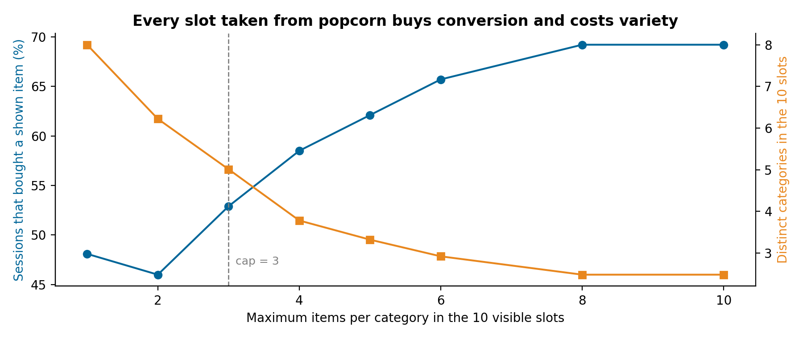

# Why your recommender only shows best-sellers

### A model trained for conversion learns to fill the carousel with the product everyone already buys. How we found it in a cinema chain's concession recommender, the two-stage design that limits it, and the trade-off you have to accept, rebuilt on synthetic sales

The recommender worked. Its offline conversion was good, the A/B logs looked healthy, and the carousel in the app was mostly popcorn. On average 9 of every 20 items it recommended were popcorn: large butter popcorn, large butter popcorn again in another combo, salted popcorn, mixed popcorn. Customers who were going to buy popcorn anyway saw popcorn; nobody saw the nachos.

We built the recommender for a cinema chain's concession stand, sold through kiosks and the app. This article explains why a model trained for conversion does this, the design we moved to, and the cost of moving, on synthetic sales generated to have the same shape. The client's data stays private; the simulation is in [recommender-category-cap](https://github.com/LucasRangelSSouza/recommender-category-cap), and every number below comes from it.

> **On the synthetic data**
> - Trained for conversion, the model showed popcorn in 7.1 of the 10 visible slots and only 2.5 categories per carousel.
> - A two-stage model with at most 3 items per category showed 5 categories and almost doubled purchases of shown items outside popcorn (0.17 to 0.33 per session).
> - Offline conversion fell from 69% to 53%. That fall is real, and the article is about deciding whether to accept it.

## Why the model does it

Conversion asks one question per session: did the customer buy at least one item we showed? When one category is in half of all purchases, the fastest way to make that answer "yes" is to show more of that category. Each additional popcorn variant catches a few more popcorn buyers, and a slot given to nachos catches fewer. The model isn't wrong. It is answering the question it was given.

The cost is invisible to that metric. Every slot the model spends on a fourth popcorn variant is a slot where the customer could have seen something they didn't know they wanted, and the metric never counts what wasn't shown.


*Synthetic concession sales, 15,000 held-out sessions. The conversion model fills 7 of 10 slots with popcorn; the two-stage model caps it at 3.*

## Measure what the carousel is for

We added a second metric next to conversion: **incidence**, the number of carousel items the customer bought, and with it the number of distinct categories shown. Conversion rewards one hit; incidence rewards the carousel for being useful more than once, and categories make the monoculture visible on a dashboard.

| Metric (10 visible slots) | Trained for conversion | Two-stage, max 3 per category |
|---|---:|---:|
| Sessions that bought a shown item | 69.2% | 52.9% |
| Shown items bought per session | 0.78 | 0.63 |
| Shown items bought outside popcorn | 0.17 | 0.33 |
| Distinct categories shown | 2.5 | 5.0 |
| Popcorn share of the slots | 70.7% | 30.0% |

## The two-stage design

Instead of scoring products directly, the model scores in two steps:

1. **Category model**: the probability that this session buys from each category, given the context (store, weekday, hour; plus the customer's history when they are identified).
2. **Item model**: within each category, the probability of each product.

The product score is the product of the two, and the carousel fills its visible slots in score order with **at most 3 items from one category**. The model still returns 20 items, so the app can scroll; the cap applies to the 10 the customer sees first.

```python
ordered = sorted(score, key=lambda item: -score[item])
visible, used = [], Counter()
for item in ordered:
    category = category_of[item]
    if used[category] < cap:
        visible.append(item)
        used[category] += 1
    if len(visible) == 10:
        break
```

Separating the stages also made the system easier to steer. Business rules (a cap, a seasonal category, a product out of stock) act on one stage without retraining the other.

## The trade-off, honestly


*Moving the cap from 10 to 1 trades conversion for variety. Between 2 and 4 the curves cross; we chose 3.*

Offline, the two-stage model converts less, and no amount of tuning hides that: when half the demand is one category, any slot taken from it costs some immediate hits. What it buys is exposure. Customers see categories they never saw before, and a customer who wanted popcorn still has three popcorn options on screen and the full menu one tap away.

Whether exposure pays off can't be measured offline, because offline data only contains what the old model chose to show. The plan is an A/B test that measures revenue per session, not conversion alone. That decision belongs to the business, and the dashboard now shows both curves so it can be made with numbers.

## The rest of the system

The chain's customers fall into two groups, and each needs a different model:

- **Identified customers** get a hierarchy: recommendations tied to the movie they are watching, then loyalty-programme rules, then a neural collaborative filtering model trained with negative sampling, then market-basket associations from their history, and finally the anonymous model as a fallback.
- **Anonymous customers** are a cold start with only three signals: store, weekday and hour. The model clusters identified customers into 10 behaviour groups with KMeans over 60 days, builds a synthetic average profile for the anonymous session, assigns it to the nearest group and recommends that group's most relevant products for the context.

All models run as managed online endpoints on Azure ML, with data prepared in Microsoft Fabric and pipelines in Azure DevOps. Monitoring of those endpoints has its own article, *How to monitor ML models in production*.

## What we would do differently

- Put a diversity metric on the dashboard from the first model. Conversion alone hid the problem for months.
- Decide the cap with the business before training. It is a product decision expressed as a number, not a hyperparameter to tune.
- Log impressions from day one. Without knowing what was shown, offline evaluation can only reward the old model's choices.

## Run it

```bash
git clone https://github.com/LucasRangelSSouza/recommender-category-cap && cd recommender-category-cap
pip install -r requirements.txt
python simulate.py          # the metrics table above
python figures.py figures         # the figures, including the cap sweep
```
