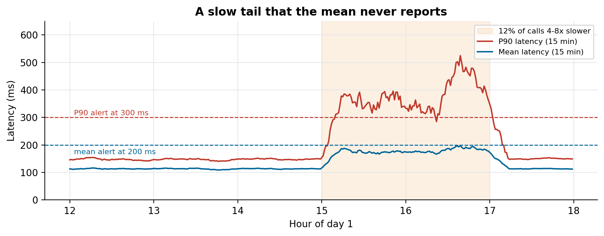
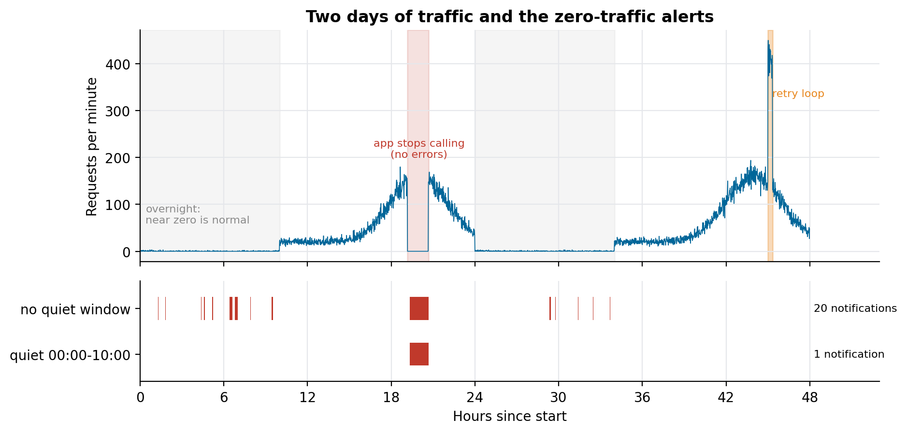

# How to monitor ML models in production

### The alerts that catch a model endpoint that stopped without an error: P90 instead of the mean, a zero-traffic rule with a quiet window, cost by endpoint, and a pipeline that tells you it failed. Rebuilt on synthetic traffic

The worst failure of a model in production makes no noise. The endpoint is healthy, the container is up, the error rate is zero, and nobody is calling it, because the app that should call it shipped a change. Or the model answers, slower for one call in eight, and the average latency on the dashboard barely moves.

We set up monitoring for eight recommendation endpoints of a cinema chain (the recommender from *Why your recommender only shows best-sellers*), serving the app and kiosks on Azure ML. This article is the set of rules that came out of it and why each one has the shape it has. The traffic in the figures is synthetic, generated with the same daily shape, and the rules run against it in [ml-endpoint-alerting](https://github.com/LucasRangelSSouza/ml-endpoint-alerting).

> **What the synthetic days show**
> - A slow tail (12% of calls four to eight times slower) pushed P90 latency past 300 ms for almost two hours; the mean never crossed its 200 ms alert.
> - The mean rule fired once, overnight, when a single slow call was most of the traffic.
> - A zero-traffic rule without a quiet window sent 20 notifications in two days, 19 of them for normal overnight silence. With a quiet window from midnight to 10:00 it sent one, for the 90 minutes when the app really stopped calling.

## Three layers, three audiences

We split monitoring into three layers because each one answers a different question and goes to a different person:

| Layer | Question | Where it goes |
|---|---|---|
| Operational | Is the endpoint answering, fast enough, and being called? | Team chat, immediately |
| Cost | How much has each endpoint cost so far this month? | Cost dashboard, reviewed weekly |
| Pipeline | Did the job that retrains and redeploys the models fail? | E-mail to both teams, immediately |

A single "health" dashboard would mix a problem that needs action in five minutes with one that can wait until Monday.

## Latency: alert on P90, not the mean

A slow model rarely gets slower for everyone. More often a fraction of calls slows down: a cold replica, a feature lookup that times out and retries, a request with an unusually long history. The mean dilutes that fraction with all the fast calls.


*Synthetic day 1. From 15:00 to 17:00, 12% of calls take four to eight times longer. P90 crosses 300 ms within about ten minutes; the mean peaks just under 200 ms.*

The mean also fails in the other direction. Overnight, with one or two calls a minute, one slow call is the whole average, and the mean rule fired at 06:37 on a night with nothing wrong. P90 over a 15-minute window needs a fraction of slow calls, which is closer to "customers are waiting".

We set P90 thresholds per endpoint, from each one's history: between 250 and 450 ms, higher for the orchestrators that call other models and lower for the simple anonymous-customer models.

## Traffic: alert on too much and on nothing

Requests per minute gets two rules with opposite directions.

**Too much** (above 250 to 350 requests per minute, depending on the endpoint) catches a client stuck in a retry loop or a campaign nobody announced. In the synthetic data it fired for the 20-minute burst on day 2.

**Nothing** is the rule that matters most and the one that needs most care. An endpoint that receives zero requests for ten minutes during opening hours is down from the customer's point of view, even if its health check is green. We gave it the highest severity of all the rules.


*The same zero-traffic rule with and without a quiet window. Without it, every quiet stretch overnight becomes a notification, and the team learns to ignore the channel.*

The catch is that zero traffic is normal at 4 a.m. Without a quiet window the rule sent 19 false notifications in two synthetic days, which is how a team learns to mute the channel and miss the one that counts. In Azure Monitor this is an alert processing rule: the alert still fires and is recorded, but the action group that posts to the team chat is suppressed between midnight and 10:00. The rule itself stays simple, and the knowledge about opening hours lives in one place.

Two details made the chat channel usable. The notification goes through a small Logic App that formats the payload into one line (endpoint, metric, value, threshold, what to check first), and it drops alerts in the "resolved" state, so each incident posts once.

The rules are short enough to keep in code. The repository evaluates this list against the synthetic traffic:

```json
{"name": "P90 latency > 300 ms", "metric": "p90_ms", "window_min": 15, "op": ">", "threshold": 300},
{"name": "RPM == 0, quiet 00:00-10:00", "metric": "rpm", "window_min": 10, "op": "==", "threshold": 0,
 "quiet_minutes_of_day": [0, 600]}
```

## Cost: a dashboard before an alert

Cost alerts in Azure hang off a budget, and nobody had set one yet, so we started with a cost view grouped by endpoint and kept the alert for when a budget exists. This is a deliberate order. An alert on a number nobody agreed to is noise; a weekly look at cost per endpoint already answers "which model is expensive" and gives the data to set the budget.

## Pipeline: the failure nobody saw for three days

Each model has a CI pipeline in Azure DevOps that retrains, evaluates and redeploys it. Early on, a run failed on the Friday of a long holiday weekend and nobody noticed until Monday. Now a failure in any stage sends an e-mail to both teams when it happens.

## Keep the request logs where you can query them

Alerts tell you something is wrong; logs tell you what. The endpoints write request logs as Parquet files in daily folders. A daily job loads yesterday's folder into a raw table with every column as text, so a malformed file can't fail the load, then a notebook cleans it into a silver table. Two rules keep reruns safe: the notebook deletes the day's rows before inserting them, and it deduplicates on the log ID. During the historical backfill, one old folder had a different schema; we left it out of the main load instead of bending the schema around it.

With the logs in a table, the questions after an alert become queries: which stores stopped calling, which requests were slow, what the model recommended during the incident.

## What we would do differently

- Write the zero-traffic rule with its quiet window on day one, before the first model goes live. It is the alert that catches the failures users notice first.
- Derive every threshold from history and write down how. "300 ms" with no reason gets changed the first time it fires.
- Agree on a cost budget with the client at the start, so the cost layer can alert instead of only display.

## Run it

```bash
git clone https://github.com/LucasRangelSSouza/ml-endpoint-alerting && cd ml-endpoint-alerting
pip install -r requirements.txt
python simulate.py     # which rules fired, and when
python figures.py figures    # the figures
```

Edit `rules.json` to try other windows and thresholds against the same two days.
