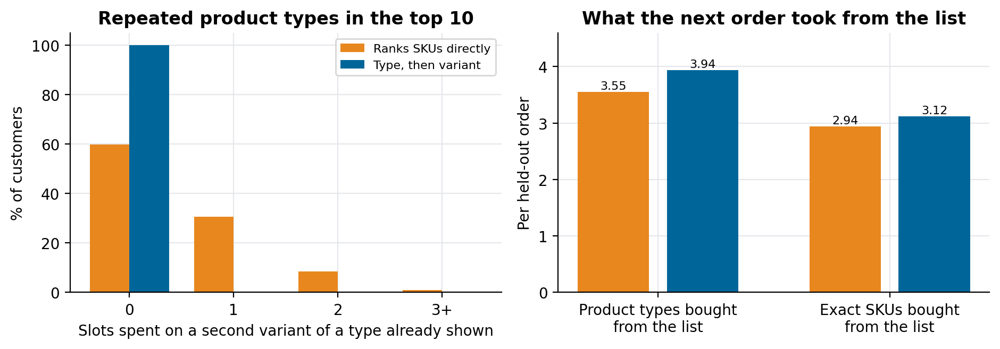
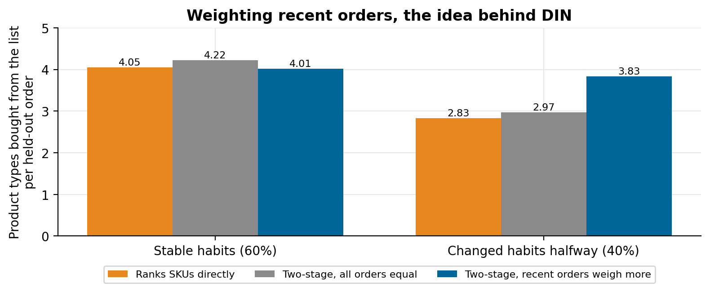

# A two-stage recommender for grocery e-commerce

### Why a grocery recommender suggests the 5-litre and the 2-litre oil side by side, and how splitting the decision in two fixes it: one model picks the product type, a second picks the variant. Built for a grocery shop, rebuilt on synthetic orders

Ask a standard recommender what a regular customer of an online grocery will buy next and it gives a sensible answer: olive oil. Then it gives it again, as a different bottle. The 1-litre, the 750 ml, the store brand. Each one is a separate SKU with its own purchase history, and a customer who has bought all three over a year looks, to the model, like someone who loves three products.

We built the recommender for an online grocery in Spain, a shop with about 600 SKUs and 2,000 registered customers, as part of the e-commerce platform a software company was building to sell to shops like it. The recommendations were computed in batch and delivered as JSON files, because the shop front wasn't ready to call an API yet. This article explains the two-stage design we used, on synthetic orders generated with the same shape; the code is in [two-stage-grocery-recommender](https://github.com/LucasRangelSSouza/two-stage-grocery-recommender).

> **On the synthetic orders (2,000 customers, last order held out)**
> - Ranking SKUs directly, 40% of the top-10 lists showed at least one product type twice.
> - Picking the type first and the variant second removed every repeat, and the held-out order bought 3.94 of the listed product types instead of 3.55.
> - Weighting recent orders more, the idea Deep Interest Network learns with attention, raised that number from 2.97 to 3.83 for customers whose habits changed, and cost a little (4.22 to 4.01) for customers whose habits didn't.

## Why the SKU model repeats itself

A grocery catalogue is a small number of things people need (oil, apples, rice, milk) sold in many variants: brand, size, pack. People are loyal to the thing and less loyal to the variant. They buy the big bottle when it's on offer and the small one when it isn't, the organic apples one week and the cheaper bag the next.

A model that scores SKUs sees each variant as an independent item. Every variant the customer has bought collects its own evidence, so a customer's staple types fill the top of the list several times over. The ten slots end up covering seven or eight needs instead of ten.


*Left: slots per list spent on a second variant of a type already shown. Right: what the held-out order bought from the list, counted by product type and by exact SKU.*

## Stage 1: which product type

The first model ranks product types, not SKUs. We built a new feature for it, the *primary product* (olive oil, apples), and trained it with negative sampling: for each real purchase we generated a few products from the same subfamily that the customer didn't buy, so the model learns why this oil and not that vinegar, instead of only learning what is popular. Context goes in as features: hour, weekday, month and region.

We tested several deep learning recommenders for this stage and kept Deep Interest Network (DIN) for single products. DIN's advantage is attention over the customer's recent orders: it learns that last month's purchases say more about next week than last year's. The synthetic data shows why that matters, with a much simpler stand-in. Recency weighting with a three-order half-life:

```python
for age, basket in enumerate(reversed(history)):   # age 0 = most recent order
    weight = 0.5 ** (age / half_life)
    for sku in basket:
        type_score[type_of(sku)] += weight
```


*Customers who changed habits halfway through their history gain the most; for stable customers, treating all orders equally is slightly better.*

The cost on stable customers is real and small. In a grocery, where habits shift with seasons, diets and household changes, we took that trade.

## Stage 2: which variant

Given that the customer will probably buy olive oil, the second model decides which bottle. If they have a usual variant, that is the strongest signal. If they have never bought the type, business rules come in: among the variants that sell nearly as well as the most popular one, we show the one with the best margin. A recommender is part of the shop, and the shop gets a say in which equally good option leads.

Each type appears once in the list, so the ten slots cover ten needs. The variant choice is also where the shop's rules live without touching the type model: an out-of-stock product hands its slot to the next one in the ranking.

## Baskets are a different problem

Weekly baskets (a box of vegetables, a breakfast pack) behaved differently from single products. There are few of them and people buy them in quantity, so we treated them separately: an implicit rating built from the volume bought (more units, more relevance) and DeepFM to predict it. The model learned that relation well, with a mean error around 0.09, but the same approach didn't work across hundreds of single products, which is what pushed us to the two-stage design above.

## New customers and the batch contract

A customer with no history gets popularity, but not a single global list. We clustered products by price and sales frequency, took the most popular items of each cluster so that one cluster couldn't fill the list, and narrowed by region and month where the data allowed. If a region had too little seasonal history, it fell back to that region's all-time best-sellers.

Everything ran in batch. Each run writes one JSON per tenant and per *slot* (a place on the site, such as the home page or the basket page), with a ranked list per customer. The contract was agreed before the model, so the shop front could be built against it in parallel:

```json
{"tenant": "demo-shop", "slot": "home_for_you", "model_version": "two_stage-v1", "customer_id": "c-0001",
 "items": [{"rank": 1, "sku": "t3v2", "product_type": "t3", "margin": 0.107}, ...]}
```

Training data came in as CSV files, went through Glue jobs into bronze, silver and gold layers, and a SageMaker pipeline retrained the models on top of the gold layer, all of it defined in Terraform.

## What we would do differently

- Define the product type in the catalogue on day one. We had to build the primary-product feature from names and subfamilies; a field maintained by the shop would have been cleaner.
- Hold out by time, not at random. A random split leaks future habits into training and hides exactly the change that recency weighting is for (see *How to evaluate a ranking model without leakage*).
- Count repeated types as a metric from the first model. Hit rate alone rewarded the repeats.

## Run it

```bash
git clone https://github.com/LucasRangelSSouza/two-stage-grocery-recommender && cd two-stage-grocery-recommender
pip install -r requirements.txt
python simulate.py      # metrics for the three models, and sample_output.json
python figures.py figures     # the figures
```
