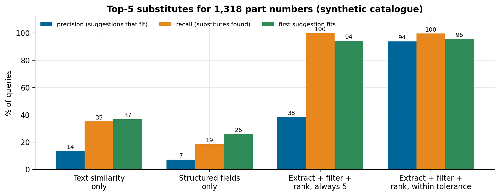

# How to find interchangeable parts with AI search

### Given a part number, return the five parts from any plant that can replace it. Why text similarity, embeddings included, finds parts that look alike and don't fit, and the pipeline that does better: extract the critical attributes, filter on them, rank what passes, and show fewer than five when fewer fit. With an evaluation on a synthetic catalogue

A machinery manufacturer with several plants carries the same component under many part numbers. Each plant catalogued its own, in its own words and sometimes its own language: "filter oil", "oil filter elem", "filtro de oleo". When a part runs out, or a supplier stops making it, someone has to find out whether another part number, maybe from another plant, does the same job. Today that means an engineer reading technical documents and drawings.

We scoped and built the approach for an interchangeability search engine for a vehicle and machinery manufacturer: given a part number, return a top 5 of parts that can replace it, with precision that can be measured. The first phase used a sample of 5,000 technical documents chosen for diversity, with continuous curation after go-live and an expected 5,000 to 8,000 new parts a year. This article explains the design and how to evaluate it, on a synthetic catalogue with the same kinds of mess; the client's documents and measured results stay private. The code is in [interchangeable-parts-search](https://github.com/LucasRangelSSouza/interchangeable-parts-search).

> **On the synthetic catalogue (1,750 parts, 1,318 with at least one true substitute)**
> - Text similarity alone: 14% of its suggestions fit, and it finds 35% of the real substitutes.
> - Structured fields alone are worse (7% and 19%), because the fields are empty for many parts.
> - Extracting the attributes from the text, filtering on the critical ones and ranking by dimensions finds 99.6% of the substitutes; returning only candidates within tolerance raises precision from 38% to 94%.

## Interchangeable is a stricter word than similar

Two parts are interchangeable when they do the same job and fit the same place: same family, same thread, same material class, critical dimensions within tolerance. A search engine that ranks by how alike two descriptions read will put an M20x1.5 oil filter next to an M22x1.5 one, because the descriptions differ by one character. To a mechanic, they're different parts.

That is why "embed every document and return the nearest five" doesn't solve this problem by itself. Embeddings, or the TF-IDF stand-in used here, are good at what the text is about and indifferent to the one number that decides fit. In the synthetic catalogue, text similarity got the first suggestion right 37% of the time.

## The data is messier than the schema

The catalogue has fields for thread, material and dimensions. In practice they're often empty: the information is in the description, in a drawing, or nowhere. A search that uses only the structured fields can't compare parts whose fields are missing, so it misses most substitutes, which is what the second bar group shows.


*Precision: share of suggestions that fit. Recall: share of real substitutes (up to five) found. Top-1: the first suggestion fits.*

## Extract, filter, rank

The approach that worked has three steps.

**Extract.** Normalise what each document says into attributes: the family from its aliases in each language, the thread in any of the ways people write it (`M20x1.5`, `M20 x 1,5`, `M20X1.5`), material aliases, and dimensions from the structured fields or, when those are empty, from the text. In the real system this step also reads drawings and tables in documents; in the synthetic one it is a few regular expressions:

```python
m = re.search(r"M(\d+)\s*[xX]\s*([\d]+[.,][\d]+)", text)
thread = f"M{m.group(1)}x{m.group(2).replace(',', '.')}" if m else None
```

**Filter.** Keep only candidates that agree on every critical attribute known on both sides. An attribute unknown on one side doesn't exclude a candidate; it ranks it lower, because a missing value is a question for an engineer, not a mismatch.

**Rank.** Order what passes by distance in the critical dimensions, then by text similarity, and return candidates only when their dimensions are within tolerance. Showing three suggestions when three fit is better than padding the list to five with parts that don't; in the synthetic catalogue that alone moved precision from 38% to 94% without losing recall.

The natural-language interface sits on top: an engineer can ask "what replaces PN-12345 in the plant in the south?" and the model turns it into the part number and filters, then explains the result with the attributes that matched. The language model never decides fit; the attributes do.

## Measure it with the people who know

Precision here has a precise meaning: of the suggestions shown, how many an engineer would accept. Our acceptance criterion for the first phase was at least 90%, measured against the manufacturer's specialists on a test plan written beforehand, not by eyeballing a demo. A synthetic catalogue like the one in the repository is useful before that, to check that each component of the pipeline does its part, and to see that recall and precision move separately: the cutoff step changes precision a lot and recall hardly at all.

Two decisions came from the client's constraints rather than from the method. Input quality was the client's responsibility, with our team cleaning what it could, because no extraction step recovers an attribute that isn't in any document. And during the first year the engine was hosted in our environment, with the option of a hybrid setup later, in which the search engine stays with us while drawings and data stay in the client's infrastructure.

## What we would do differently

- Write the list of critical attributes per part family with the engineers in the first week. It is the definition of the problem, and it differs per family.
- Measure extraction coverage before ranking quality. If threads are found for 60% of parts, no ranker can do better than that on threads.
- Make "fewer than five" the default from the start. A short list that is right is more useful than a full one that isn't.

## Run it

```bash
git clone https://github.com/LucasRangelSSouza/interchangeable-parts-search && cd interchangeable-parts-search
pip install -r requirements.txt
python search.py      # precision, recall and top-1 for the four retrievers
python figures.py figures   # the figure
```
