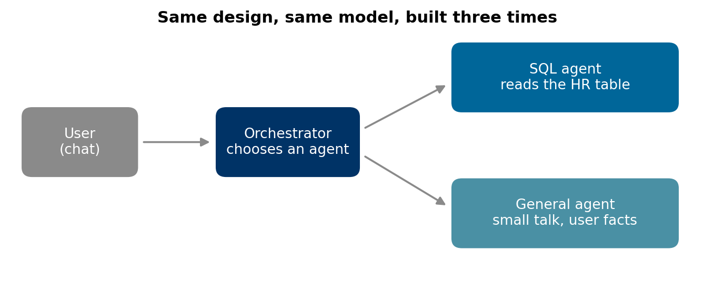
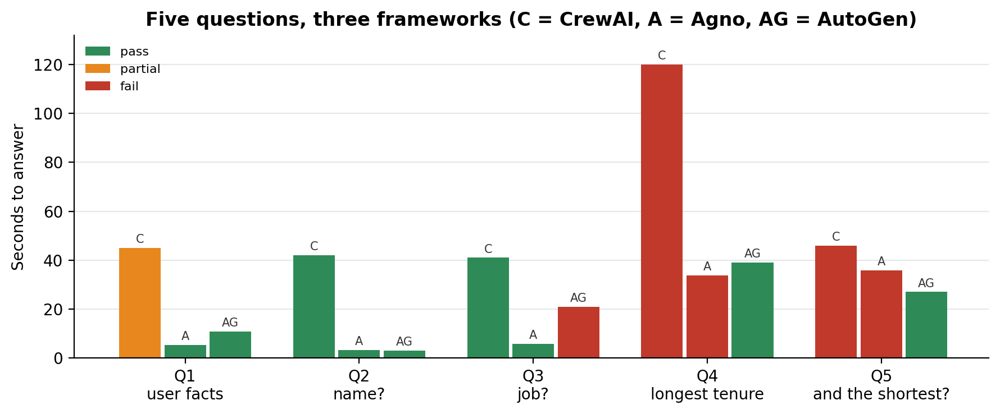

# CrewAI vs Agno vs AutoGen: which one for a chat product?

### We built the same three-agent chat in each framework in one week, asked all three the same five questions, and moved our product off the framework it started on. What we tested, what each one got wrong, and how to run the same test on your shortlist

Multi-agent frameworks are usually compared on features. The comparison that decided ours was five questions long, and the fifth was "and the shortest?".

We were building a chat product where business users ask questions about their company's data: a few specialised agents behind one conversation, some reading databases, some answering everything else. The first version was built on CrewAI and kept running into the same problem: the conversation didn't hold together. So we spent one week, 6 to 10 October 2025, building the same minimal architecture in CrewAI, Agno and AutoGen and testing it the way users would use it. This article is that test. The protocol, a synthetic HR table and the grader are in [agent-framework-chat-test](https://github.com/LucasRangelSSouza/agent-framework-chat-test), so you can run it on your own shortlist.

> **What the test showed**
> - AutoGen passed the two questions that need conversation context; CrewAI passed them only when the user added a trigger word, and Agno lost the context.
> - Agno was the fastest to set up (the minimal architecture took under a day) and the fastest on small talk, at 3 to 6 seconds.
> - CrewAI took about 40 seconds on every answer, and two minutes on the question it routed to the wrong agent.

## A framework for tasks vs a framework for chat

The difference that matters for a chat product is whether the framework assumes a fixed goal. CrewAI's model is a *crew*: agents with tasks that run in sequence or in parallel to finish a job, such as researching a topic and writing a report. That is a good fit for workflows. In a chat the goal changes with every message, and in CrewAI an agent can't be called on its own, only through a crew. Every question paid for the whole crew, and routing depended on the orchestrator spotting the right words.

## The test

The same design in every framework, with the same model (GPT-4o-mini) for every agent:


*An orchestrator that sends each message to a SQL agent (with LangChain database tools over an HR table) or to a general agent.*

And the same five messages, in order:

| # | Message | What it tests |
|---|---|---|
| Q1 | "My name is Ana, I work as an AI analyst, and I like pizza and technical reading." | Storing facts about the user; small talk |
| Q2 | "What is my name?" | Memory |
| Q3 | "What is my job?" | Memory, and not sending a personal question to SQL |
| Q4 | "Which employee in the HR database has been with the company longest?" | Routing to SQL without a magic word |
| Q5 | "And the shortest?" | A follow-up that only means something after Q4 |

Q5 is the question that separates a chat from a form. Users ask follow-ups constantly, and each one depends on the turn before.

We also judged six criteria: learning curve, documentation, integration with other tools and channels, community, whether agents can run on their own, and conversational ability.

## Results


*One run per framework. The CrewAI build was the product's existing architecture rather than the minimal one, so its times include more agents.*

**CrewAI.** The memory we had built extracted user facts correctly, and Q2 and Q3 were right. Routing was the weak point: the orchestrator sent Q4 to an HR-policy agent, which spent two minutes explaining it had no access to employee data. With the word "query" added to the message it went to SQL and answered in 39 seconds. Q5 worked the same way, only with the trigger word. Vague follow-ups such as "tell me more about that" lost the thread. Fixing that meant building and maintaining our own memory and routing, which is what we wanted the framework to do.

**Agno.** The quickest start by far: memory is a setting, tools need no decorators, and the minimal architecture ran in less than a day. Small talk took 3 to 6 seconds. It routed Q4 to SQL without a trigger word, but answered with the wrong employee, and its low verbosity made it hard to see the query it ran. Q5 lost the context entirely. The documentation was clear; the community was small.

**AutoGen.** The only one that held the conversation: Q5 came back with both ends of the ranking, in context, and "tell me more about that" stayed coherent. Its native chat memory and its explicit control over which agent speaks next did that work for us. It wasn't perfect: the orchestrator sent Q3 ("what is my job?") to the SQL agent, which returned an empty count, and Q4 came back as a raw tuple rather than a sentence. Both are prompt and formatting problems on our side of the line. Integration with GPT and Azure models was direct; Gemini needed a small manual adapter.

| Criterion | CrewAI | Agno | AutoGen |
|---|---|---|---|
| Learning curve | Low to moderate; the crew model and decorators take time | Low; minimal build in under a day | Moderate; more concepts, well documented |
| Documentation | Good, aimed at fixed workflows | Clear, few examples | Extensive, with official tutorials |
| Integration | Many model providers built in | No decorators; Telegram, Slack | Microsoft tools; GPT and Azure models directly |
| Community | Active | Small | Very active |
| Agents on their own | No, only inside a crew | Partly | Yes, with control over the message flow |
| Chat | No native conversation memory | Easy memory, context still lost | Native memory, held context |

We moved the product to AutoGen.

## How to run this test on your own shortlist

The value of the test is that it is small enough to build in each candidate in a day or two, and it hits the failure that matters for chat. To reuse it:

1. Build the same minimal architecture in every candidate, with the same model and the same tools. Don't test a framework through your existing product in one case and a fresh build in another unless you say so, as we did with CrewAI.
2. Keep the follow-up questions. Q2, Q3 and Q5 are worth more than any feature table.
3. Record the agent that answered, not only the answer. Routing errors look like model errors until you see which agent replied.
4. Grade against values computed beforehand. `make_db.py` creates the HR table and `grade.py` checks a transcript against it.
5. Run each question several times. We ran each once, which is enough to see a framework lose context and not enough to rank close latencies.

## What we would do differently

- Write the five questions before choosing the first framework. They would have shown the mismatch before the first version was built.
- Treat routing as its own component with its own test set. All three frameworks made routing mistakes, and none of them were framework bugs.
- Keep the agents framework-agnostic: tools and prompts in plain functions, the framework only for orchestration. The less code depends on the framework, the cheaper the next switch.

For a production design built on LangGraph with the same principle of a router and specialised agents, see *How to build a multi-agent platform with LangGraph*.

## Run it

```bash
git clone https://github.com/LucasRangelSSouza/agent-framework-chat-test && cd agent-framework-chat-test
pip install -r requirements.txt
python make_db.py                     # the synthetic HR table
python grade.py my_transcript.json    # grade your framework's five answers
python figures.py figures                   # the figures, from project_results.json
```
