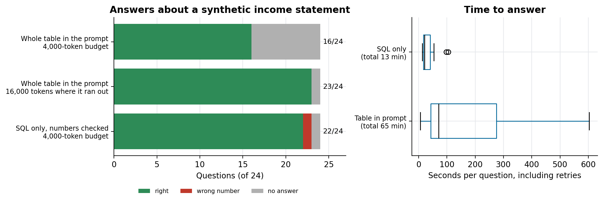

# How to stop AI agents from inventing numbers

### We asked a self-hosted model 24 questions about an income statement two ways: with the whole table in the prompt, and through SQL only. The model didn't invent numbers in either. It ran out of budget in one, and wrote two wrong queries in the other. What that means for financial agents, and the rules we build with

The fear with AI agents on financial data is a confident, wrong number: net revenue off by a few percent, in a sentence that reads perfectly. The usual answer is "never let the model compute; every number must come from a query". We built financial agents on that rule, and wanted to measure what it buys.

The test: a synthetic income statement (12 months, 4 business units, 12 accounts, 576 rows) as a small star schema, 24 questions with reference SQL written by hand, and the same self-hosted 27B model (an abliterated Qwen, the one in *How to self-host an uncensored LLM*) answering them two ways. Everything is in [grounded-finance-agents](https://github.com/LucasRangelSSouza/grounded-finance-agents), including both runs.

> **What happened**
> - With the whole table in the prompt and a 4,000-token budget, the model answered 16 of 24. The other 8 came back empty: it spent the budget reasoning through the rows. Given 16,000 tokens, it answered 23 of 24 correctly, but took 65 minutes for the set.
> - Through SQL only, with the same 4,000-token budget, it answered 22 of 24 in 13 minutes.
> - Neither approach invented a number. The two SQL errors were queries that computed the wrong thing: a change with the sign reversed, and an average over rows instead of months. A check that every number comes from the query can't catch that.

## Two ways to answer

**Table in the prompt.** The model receives all 576 fact rows as CSV (about 6,000 tokens) and the question, and answers.

**SQL only.** The model receives the schema and the question and writes one SQLite query; the code runs it, retrying once with the error if it fails (the job of a SQL-fixer agent); the model writes the answer from the returned rows; and a check rejects the answer if it contains a number that is not in those rows, replacing it with the rows themselves.

```python
allowed = [round(float(v), 2) for row in rows for v in row if isinstance(v, (int, float))]
stray = [n for n in numbers(answer) if not any(abs(n - a) <= max(0.01, abs(a) * 0.001) for a in allowed)]
if stray:
    answer = f"Query result: {rows}"   # never show a number the query didn't return
```

Every answer is graded against the reference result: within 0.5% for amounts, 0.3 points for percentages, and the sign has to match. A first version of the grader accepted the number with either sign, and it hid one of the errors below; a lenient grader is its own way of inventing numbers.


*Left: right, wrong and empty answers. Right: seconds per question, including the retries the table approach needed.*

## What the model got wrong

**With the table, nothing it answered.** Every answer that contained a number had the right one. Its failure mode was silence: summing hundreds of rows in its reasoning before answering, and hitting the token limit. With a larger budget it finished, at a cost of up to ten minutes for a single question, and one question still came back empty.

**With SQL, two queries.** Asked how much a cost changed between two periods, it subtracted in the wrong order and reported a fall of 84.96% where there was a rise. The answer was faithful to its query, so the number check passed it. Asked for the average monthly gross revenue of a unit, it wrote `AVG(value)` over every row of the year, which averages across accounts and months instead of months; the answering step then returned nothing. In both cases the error was in the meaning of the query, not in the arithmetic.

## What this means for financial agents

This is one model, one small table and 24 questions, so read it as a direction, not a ranking. Three things held up:

- **Putting the data in the prompt doesn't scale.** 576 rows cost 6,000 tokens and minutes of reasoning per question. A real general ledger has millions of rows; the table approach stops being an option long before the model stops being accurate.
- **SQL makes numbers traceable, not correct.** Every number in the SQL answers can be traced to a query and a row, and that is what lets a person audit it. Whether the query asked the right thing is a separate problem.
- **The hard part is the business arithmetic.** Both SQL errors were the kind of logic a finance analyst writes once and reuses: monthly averages, period-over-period change, margins. Leaving it to the model on every question is where errors come from.

## The rules we build with

We built a multi-agent assistant for financial questions (income statement, costs, personnel) on a lake with bronze, silver and gold layers in AWS Glue and Athena, all in Terraform. Its design rules, plus what this test adds:

1. **Every number comes from a query to the lake.** The model never sees the full data and never computes from memory.
2. **Business rules live in the data layer, not in the prompt.** Net revenue, operating margin, growth over a period and monthly averages are defined once in the gold layer, as a star schema with the income statement as its fact table. The agent queries `net_revenue`; it doesn't rebuild it. That removes exactly the class of error the SQL path made in the test.
3. **A dictionary of the company's own terms runs before routing.** Finance teams have internal names for standard concepts. A taxonomy file maps each nickname to its canonical term and definition, and the question is rewritten ("net revenue (internal term: ...)") before the planner decides which agent handles it, so a nickname doesn't send the question to a general-knowledge agent.
4. **A failing query goes to a SQL-fixer agent** that sees the error and repairs it, instead of the answer guessing around it.
5. **What the test adds: show the query, and keep a fixed set of questions with known answers that runs on every change.** The two SQL errors here would be caught by that set, not by the number check, and a visible query lets the reader spot a reversed subtraction. In *How to build a RAG agent over your own data* the same idea is a 60-question test.

## What we would do differently

- Write the reference questions before the first prompt. They define what "right" means for the business, and they caught more than any runtime check.
- Build the metric layer first. Every metric defined in the gold layer is a class of SQL the model never has to get right.
- Grade strictly from the start. Our own grader passed a wrong sign until we read the answers one by one.

## Run it

```bash
git clone https://github.com/LucasRangelSSouza/grounded-finance-agents && cd grounded-finance-agents
pip install -r requirements.txt
python dre.py                                    # builds dre.sqlite and prints the expected answers
LLM_BASE_URL=... LLM_API_KEY=... LLM_MODEL=... python run.py results/my_run.json
python run.py --retry-empty results/my_run.json  # re-ask the empty table answers with a larger budget
python figures.py figures
```
