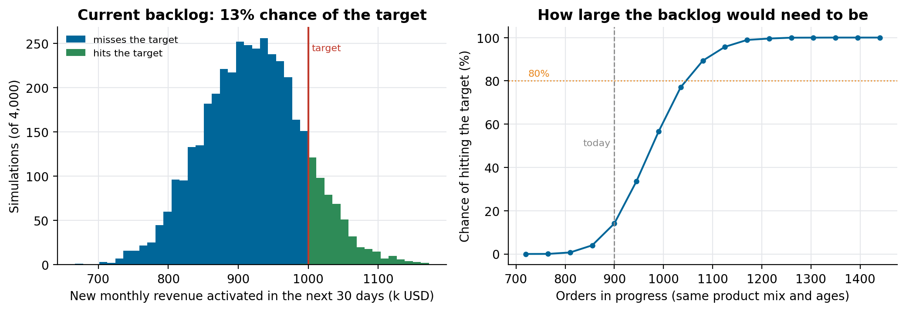
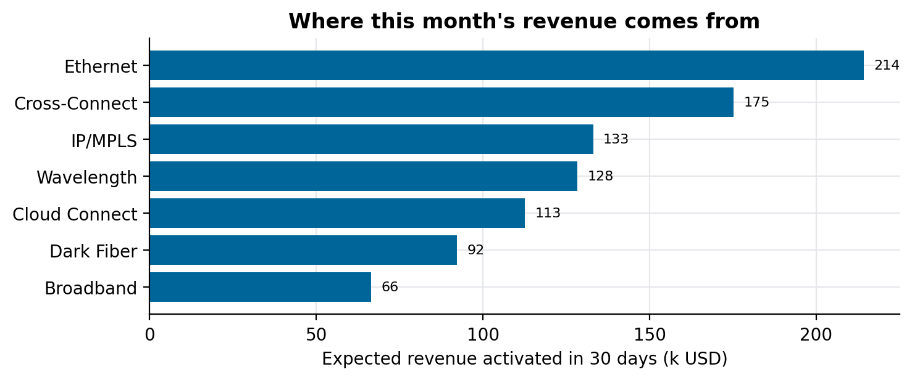

# Will we hit the target this month? Forecasting with AI agents

### A telecom operator asked three questions about its backlog of service orders: why the monthly revenue target keeps slipping, what this month will deliver, and how big the backlog would need to be. How we answered them with precomputed tables, a probability for each order and a language model that only explains. Rebuilt on synthetic orders

A telecom operator only earns the monthly revenue of a new fibre link or IP service once the service is activated. Sales close the contract; then the order goes through circuit design, account management, field work, third-party carriers and activation, sometimes for months. Every month leadership looks at the orders in progress and asks whether they add up to the target.

The client came to us with three questions, and asked for them to be answered by AI:

1. Why aren't we hitting the monthly revenue target?
2. What will this month deliver, given the orders in progress?
3. How many orders in progress would we need to hit it, with the product mix we sell?

We built that proof of concept in about two weeks. The useful decision was what *not* to ask the language model to do. This article shows the method on synthetic orders with the same shape; the code is in [backlog-revenue-forecast](https://github.com/LucasRangelSSouza/backlog-revenue-forecast).

> **What the synthetic backlog shows (900 orders in progress, 6,000 completed)**
> - The orders in progress are expected to activate about 921k of new monthly revenue in the next 30 days, between 829k and 1,013k in 80% of simulations, against a target of 1,000k: a 13% chance of hitting it.
> - The same mix would need about 1,035 to 1,080 orders in progress, 15% to 20% more, for an 80% to 90% chance.
> - Every number comes from tables and a simulation; the model's job is to pick the right one and explain it.

## Questions that are features, and questions that are queries

The client's question list had dozens of items. Sorting them was the first deliverable. Some were lookups ("which country has the most orders in delivery?", "what is the average delivery time per product?"). Some were features in disguise: "alert when an order waits for the customer for more than 15 days" is a scheduled job with a threshold, not a question. We answered the lookups and the three strategic questions in the proof of concept, and wrote the rest down as product features with their own estimates. Saying this early kept a two-week project from turning into a vague chatbot.

## Two snapshots and the clocks inside an order

The data came as two tables: a snapshot of every order in progress on a given day, and the orders completed over a period, with revenue, product, country, dates and the history of delay reasons. Tasks and sub-flows carried their own start and end dates.

Most of the work was turning those dates into clocks. Each role in the delivery chain (circuit design, account management, service delivery, each technology, activation, billing notice) has a target time, and each order's actual time per stage can be computed from the right pair of timestamps. Where a stage's computed time came out negative, meaning the role didn't wait for the previous one, we set it to zero. The result was, per order, which stage it is in, how long each stage took, and which targets it broke.

Business rules went into the data, not the prompt. Revenue has two views, with and without a customer-category filter the business uses, so every answer shows both. Dependencies between orders (an order waiting for another one in the same sale, or in a different sale) became a small graph per order, used when explaining a delay.

## What this month will deliver

An order activates this month or it doesn't, and the chance depends on what kind of order it is and how long it has already been open. A Cross-Connect open for 40 days is probably close; a Wavelength open for 40 days probably isn't. So for each order in progress we looked at past orders of the same product (and country, when there were enough) that were still open at the same age, and counted how many activated in the next 30 days:

```python
open_at_age = [r["days"] for r in same_product if r["days"] > age]
p = sum(d <= age + 30 for d in open_at_age) / len(open_at_age)
```

No model training, and every probability can be explained with a count. Summing over orders gives the expected revenue; drawing each order's outcome thousands of times gives the spread, and with it the chance of hitting the target.


*Left: 4,000 simulated months from the current backlog. Right: the chance of hitting the target if the backlog were larger, keeping the same mix of products and ages.*

The right-hand curve answers the third question. Scaling the backlog is a simplification (new orders arrive young, not at the ages of today's), so we presented it as an order of magnitude to plan sales and delivery capacity, not as a promise.


*Where the month's revenue comes from. Short products deliver most of it; long ones carry revenue that mostly lands in later months.*

## Why the target slips

The first question has no single number for an answer. We combined three things the agent could read: the stages and roles where orders break their target times most often, the delay reasons recorded by the team, and a linear regression (ordinary least squares) of delivery time on order attributes such as product, technology, dependencies and stage durations, to see which ones move it most. One month in the history had hit the target, and comparing it with the others was the most persuasive piece: which products and stages were different that month.

## Which orders to push

A priority score ordered the backlog for the teams. It combined three parts: how strongly the order's country and product are associated with high-revenue orders (weight of evidence, with high revenue defined as above a fixed threshold), worth 30% and 20%, and urgency, how little time it has left compared with the usual duration of its product, worth 50%. The list came in two versions: the orders that can still activate within 30 days, and all of them.

## Where the agent fits

The language model sits on top of all this, and it has three jobs: decide what kind of question it received (a concept, a lookup, one of the three strategic questions, a priority list, the diagnosis of one order), fetch the right precomputed table or run the right query, and write the answer in plain language with the numbers from the table. It never computes a forecast itself. The tables (monthly revenue history in both views, revenue in progress, average times per task and sub-flow, the comparison with the month that hit the target, the regression results) are rebuilt when the data is, so the same question gets the same number.

That design is also why the answers could be checked. When a number looked wrong, we could find the table it came from, and the error was either in the data or in a rule, both fixable.

## What we would do differently

- Write the probability method first and the agent second. The forecast was the hard part, and it needed no model.
- Ask for one more snapshot. Two snapshots a month apart would have let us check the 30-day forecast against what activated, instead of only against history.
- Turn the alerts into a job from day one. They were the most requested items, and they're the simplest to build.

## Run it

```bash
git clone https://github.com/LucasRangelSSouza/backlog-revenue-forecast && cd backlog-revenue-forecast
pip install -r requirements.txt
python forecast.py      # expected revenue, chance of the target, priority list
python figures.py figures     # the figures
```
