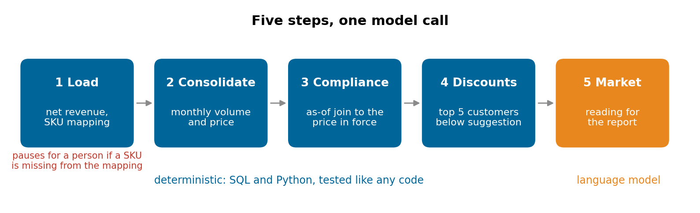
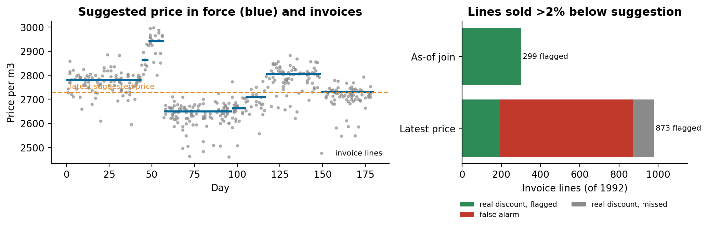

# When only one of your AI agents needs an LLM

### A pricing review for a sugar and ethanol producer was designed as five AI agents. Four of them turned out to be arithmetic, and the hard part was a date. What we kept deterministic, why the as-of join mattered more than the model, and the data platform underneath, rebuilt on synthetic invoices

The brief was an agent system. Every week an analyst rebuilt the same review by hand, in a spreadsheet and then a slide deck: which products sold below the suggested price, which customers got the deepest discounts, how the realised mix of sugar and ethanol compared with the plan, and what the market was doing. The prototype the client had built modelled this as five agents in sequence, each with a language model behind it.

We worked on turning that prototype into a system for a sugar and ethanol producer. Reading the five steps closely changed the design: four are calculations with exact answers, and only the market reading needs a model. This article is about that split, the date logic that the calculations depend on, and the data platform we built for it. The invoices and prices below are synthetic, generated with the same shape; the code is in [pricing-asof-join-pipeline](https://github.com/LucasRangelSSouza/pricing-asof-join-pipeline).

> **What the synthetic run shows (1,992 invoice lines, six months, five products)**
> - Comparing each line with the suggested price in force on its invoice date flags the 299 lines that really sold more than 2% below suggestion.
> - The shortcut of comparing every line with the latest suggested price flags 873: 679 of them false alarms, and it misses 105 real ones.
> - The pipeline pauses for a person when an invoice has a SKU nobody mapped, instead of guessing which product it is.

## Five steps, four of them arithmetic


*Steps 1 to 4 are SQL and Python with one right answer each. Step 5 writes the market commentary.*

1. **Load.** Turn invoice lines into net revenue: gross revenue minus the taxes on the invoice, plus the tax credits and state incentives that apply to one of the plants. A formula, with the rates read from the ledger.
2. **Consolidate.** Realised volume and price per product per month, against the plan and the latest forecast. A `GROUP BY`.
3. **Compliance.** Each line against the suggested price, flagging sales more than 2% below it. A join and a comparison.
4. **Discounts.** The five customers with the largest total discount below suggestion. A sort.
5. **Market.** A reading of sugar and ethanol prices and what they suggest for the production mix. This one benefits from a language model: it summarises reports and quotes in prose for a slide.

A language model in steps 1 to 4 adds cost, latency and a chance of a wrong number, and removes nothing. The same review run twice must give the same flagged lines, and an auditor must be able to trace each one to a row. So those steps became plain code, tested like any code, and the model stayed where judgement and prose are the job. The orchestration still matters (steps run in order, state passes between them, the run can pause and resume), and LangGraph handles that well whether a node calls a model or a function.

## The hard part was a date

The suggested-price table isn't one price per product. The commercial team revises it every few weeks, and each revision is a new row with its own start date. An invoice from March has to be compared with the price that was in force in March, not with today's.

That is an as-of join: for each invoice line, the latest price version whose start date is on or before the invoice date.

```python
def asof_price(versions, sku, day):
    starts = [d for d, _ in versions[sku]]          # version start days, sorted
    return versions[sku][bisect_right(starts, day) - 1][1]
```

In SQL it is a join on product with `start_date <= invoice_date`, keeping the latest match per line (`QUALIFY ROW_NUMBER() ... = 1` in BigQuery). Joining to the latest price is shorter, and it's wrong in both directions:


*Left: one product's suggested price over six months (blue) and its invoices (grey). Right: lines flagged as more than 2% below suggestion by each join.*

When prices rose after a sale, the shortcut flags old sales as discounts they never were; when prices fell, it hides real ones. In the synthetic run that is 679 false alarms and 105 misses out of 1,992 lines, and the "top five discount customers" list changes accordingly. No model fixes this, and a model reading the spreadsheet would make the same mistake more quietly.

## Pause instead of guessing

Step 1 maps every invoice SKU to a product, a category, a pack and a weight. When a SKU isn't in the mapping (a new pack, a renamed code), the run stops and asks a person, rather than dropping the line or letting a model guess what it is:

```python
unknown = sorted({line["sku"] for line in lines if line["sku"] not in MAPPING})
if unknown:
    return {"paused": True, "reason": "SKUs not in the mapping", "skus": unknown}
```

The same pause applies when the data source fails. A missing price or product is a question for the business, and the answer goes into the mapping, so the next run doesn't stop for it again.

## The data platform underneath

Volume was small (about two thousand invoice lines in the first extract), and the difficulty was elsewhere: several ledger and pricing exports with headers on different rows, columns that came empty, and a prototype that read local spreadsheets first and only used the database if they were missing, so it could look as if it worked without ever touching the real data. Our part of the project was the platform that feeds the steps:

- A medallion lakehouse in BigQuery (raw, trusted, analytics), with every table and column described, so the people writing the steps can read what each field means.
- Transformations in Dataform with assertions, provisioned with Terraform, deployed by CI/CD on every push, with production deploys behind an explicit switch.
- A daily schedule. Its first run failed because the job that compiles the transformations and the job that runs them were scheduled for the same minute, and the run started before the compilation existed. Ten minutes between them fixed it.
- Synthetic rows in the analytics layer marked with an `is_mock` column, for the sources that weren't connected yet, so nobody mistakes a placeholder for a real number.

## What we would do differently

- Classify every step before choosing tools: one right answer means code, judgement or prose means a model. We'd do it on the first day, from the analyst's spreadsheet.
- Ask how each reference table changes over time. "Is there one price per product, or a history of prices?" would have surfaced the as-of join before the first comparison.
- Remove local fallbacks from anything that runs against production. A pipeline that silently reads a file instead of the database passes every demo.

## Run it

```bash
git clone https://github.com/LucasRangelSSouza/pricing-asof-join-pipeline && cd pricing-asof-join-pipeline
pip install -r requirements.txt
python pipeline.py       # the pause, then both joins compared
python figures.py figures      # the figures
```
